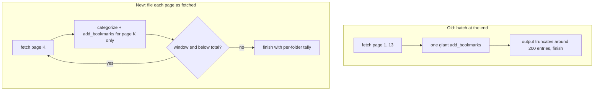

2026-08-02

# EinkBro: agent bookmark filing rebuilt to survive 650-link lists

## What was broken

Real-world test of the new bookmark-categorization agent: a subscriptions page
with ~650 channel links. The agent paged through all links fine, but filed
only the first ~200 bookmarks and declared the task finished. Asking it to
"do the rest" made things stranger: it re-fetched everything from offset 0 and
then failed without adding anything.

## Root cause — two limits stacked

**The 200-bookmark stop.** The system prompt instructed the agent to file
everything with ONE `add_bookmarks` call at the end. At 650 entries that call
is ~25-30k output tokens of JSON arguments — beyond what a model emits in a
single response. The model produced roughly 200 entries (about a typical
output budget), the call succeeded for those, and it called `finish`
believing the batch was complete. The failure was invited by the prompt's
own "ONE call" design, not by the tools.

**The broken resume.** "Do the rest" requires computing *650 minus the 200
already added* across ~100KB of accumulated history — models are unreliable
at that kind of set difference, so the model re-grounds by re-fetching from
offset 0. That would have been harmless (`add_bookmarks` skips URLs that are
already bookmarked), but re-paging 13 pages alone exhausted the agent loop's
`MAX_AGENT_ITERATIONS = 12` before a single new bookmark was filed.

## The fix

Commit `bb913df05` reworks the workflow around the fetch loop instead of a
final batch:

- Each 50-link page is categorized and filed immediately — one bounded
  `add_bookmarks` per page (~6KB of arguments), with the next page's fetch
  allowed in the same turn. The prompt forbids `finish` while the last
  window is short of the stated total.
- Resume is now a documented protocol, not an accident: re-walk the pages
  from offset 0 and re-send the adds — a page answering "skipped 50 already
  bookmarked" was already done and costs nothing. The added/skipped counts
  in the tool result are what make this work.
- `MAX_AGENT_ITERATIONS` raised 12 → 40. Bulk runs legitimately need
  ~15 turns for 650 links; `finish` still ends runs early, so the cap
  bounds cost rather than correctness.

Verified with a generated 150-link fixture
(`test_server/subscriptions_many.html`, three pages): the agent interleaved
fetch and file (three separate "added 50" rounds), finished with a correct
25-per-topic tally, and a follow-up "continue" message re-walked all pages,
reported "skipped 50" three times, and confirmed completion instead of
starting over and dying.

The general lesson for agent tool design here: any tool a model must feed
from its own output needs bounded-size calls, and any long-running workflow
needs a resume story that relies on cheap idempotent re-execution rather
than on the model remembering what it already did.
