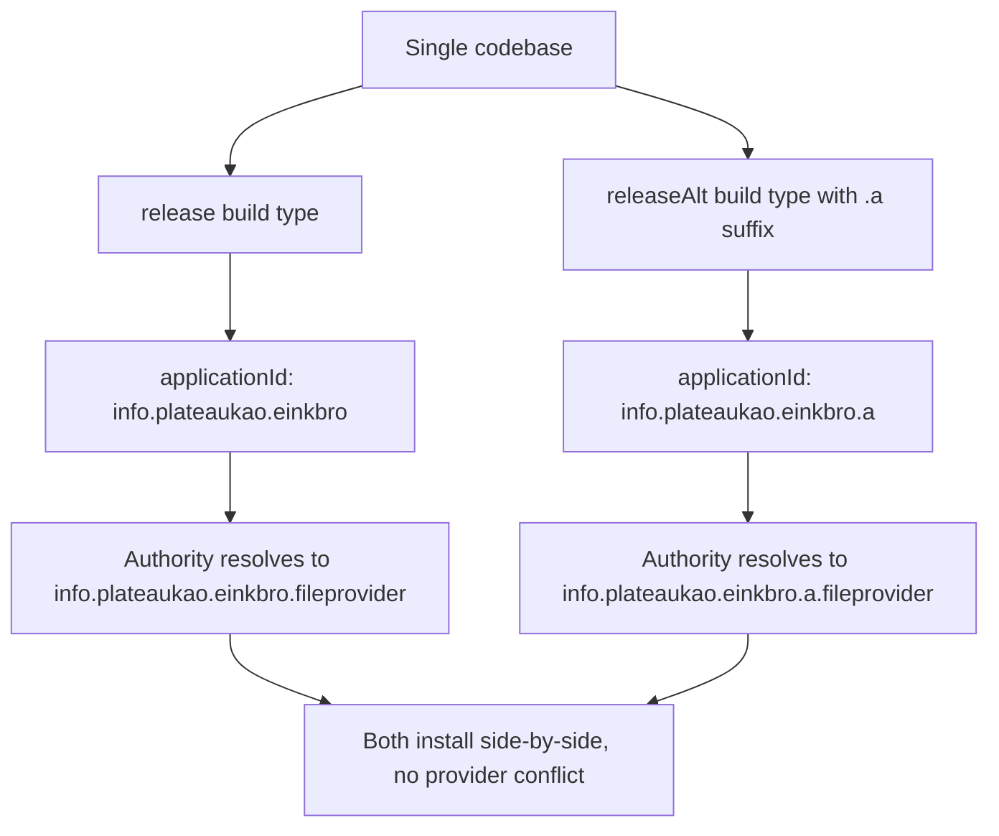

2026-06-25

# EinkBro: a side-by-side `releaseAlt` build under a separate application id

## What it does and why

EinkBro now ships a second installable variant, `releaseAlt`, whose
applicationId is `info.plateaukao.einkbro.a`. Because Android keys an installed
app by its applicationId, the `.a` build installs and runs *alongside* the real
`info.plateaukao.einkbro` instead of replacing it. That makes it possible to keep
a stable copy and a test copy on the same device at once — useful on e-ink
hardware where re-flashing and side-loading is slow and you want to compare an
in-progress build against the shipped one.

## How it was built

The variant is a new build type, not a product flavor, specifically so the
existing `assembleRelease` workflow (and the `/release` skill / `bri` helper that
drive it) stays exactly as it was — no variant names change, nothing has to be
re-pointed.

```kotlin
create("releaseAlt") {
    initWith(getByName("release"))   // copy minify, shrink, proguard, signing
    applicationIdSuffix = ".a"        // -> info.plateaukao.einkbro.a
    versionNameSuffix = "-a"
    matchingFallbacks += "release"    // route the :ad-filter dep to its release variant
}
```

`initWith` clones the whole release configuration, so the alt build is a true
release (minified, shrunk, optimized proguard, same injected signing) — only the
id differs. `matchingFallbacks` is required because the `:ad-filter` library
module has no `releaseAlt` build type; without it the dependency resolver can't
pick a library variant.

### The provider-authority constraint

The one thing that blocked a clean side-by-side install was the `FileProvider`:
its authority was hardcoded in the manifest as
`info.plateaukao.einkbro.fileprovider`. Two installed apps cannot register the
same provider authority on one device — the second install fails with
`INSTALL_FAILED_CONFLICTING_PROVIDER`. The fix is to make the authority track the
applicationId via AGP's manifest placeholder:

```xml
android:authorities="${applicationId}.fileprovider"
```

AGP substitutes the *final* applicationId, suffix included, so the alt build gets
`info.plateaukao.einkbro.a.fileprovider`. The Kotlin call sites already built the
authority at runtime from `packageName` / `BuildConfig.APPLICATION_ID` plus
`.fileprovider`, so once the manifest stopped hardcoding it the manifest and
runtime agree for any applicationId — no code changes were needed.



## Making the release pipeline provide it

So the alt build is actually distributed, not just buildable locally, the GitHub
Actions build now runs `assembleRelease assembleReleaseAlt` in one pass
(`-PuniversalApk` applies to both) and uploads the universal alt APK as a build
artifact. The local `/release` skill mirrors this: it builds the alt variant
alongside the main one and attaches `app-universal-releaseAlt.apk` to the GitHub
release. A single universal alt APK is enough — it installs on any ABI, and the
side-by-side build is a convenience/testing artifact rather than a per-device
store listing.
