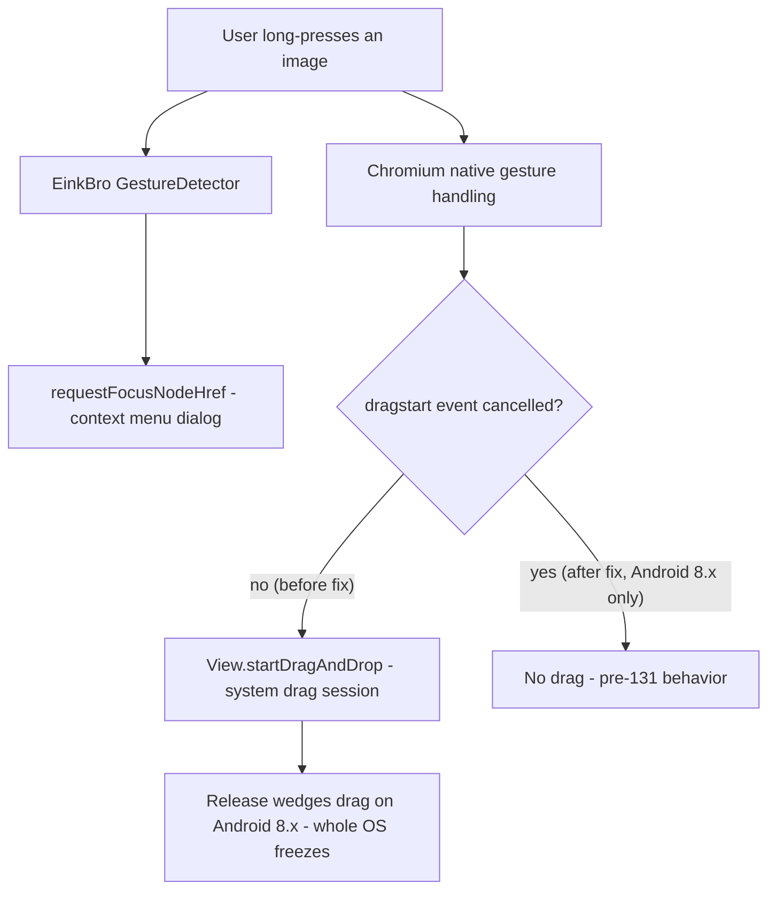

2026-08-11

# EinkBro: Long-pressing an image froze entire Android 8.x devices

## What was broken

Issue #629: on a Tecno B1F (Android 8.1 Go, WebView 138), long-pressing any
image to open the context menu froze the whole operating system — no touch, no
buttons, hard reboot required. Not reproducible on the maintainer's Hisense A7
(Android 9) or on emulators.

## Root cause

Not an EinkBro logic bug — a known, unfixable upstream regression. WebView 131+
turns a long-press on an image into a **system drag-and-drop session** (the
image becomes a floating drag ghost). On Android 8.x, releasing that drag
wedges the session at the window-manager level and the entire UI freezes until
a forced reboot. The chromium android-webview-dev thread "Severe freeze bug -
drag image in WebView freezes entire UI (Android 8.1, Chrome 131+)" confirms:
WebView ≤ 130 is fine, 131+ freezes, all third-party WebView apps are affected
(Chrome itself is not), and since WebView for Android 9 and below is
end-of-life at 138, Google will never ship a fix.

EinkBro is exposed because its long-press context menu is driven by its own
`GestureDetector`, which observes the touch stream without consuming it — so
chromium *also* processes the same long-press and starts the lethal drag
underneath the dialog. (Browsers that consume the long-press never trigger the
drag, which is why e.g. Via survives.)

## The fix

The first attempt — overriding `startDragAndDrop()` on `EBWebView` and
returning `false` on old API levels — does not compile: the method is `final`
on `View`, so the drag cannot be refused on the Android side.

Instead the drag is cancelled **renderer-side**: Blink always fires a
cancelable `dragstart` DOM event before starting any drag, so a document-start
script that calls `preventDefault()` stops chromium before it ever asks the OS
for a drag session. The script (`assets/disable_drag_start.js`) is installed
via `WebViewCompat.addDocumentStartJavaScript` — the same pattern already used
for the autoplay blocker and Web Speech polyfill — which guarantees it runs
before any page script and in **every frame** (images inside iframes would
otherwise still trigger the drag).

Gating:

- Installed only on Android 8.x (`SDK_INT <= O_MR1`); newer Android keeps
  full drag behavior, so nothing changes on healthy devices.
- No fallback for WebViews without `DOCUMENT_START_SCRIPT` support (< 91):
  those predate the 131+ regression, so they don't need the blocker.

Cost: pages on Android 8.x lose HTML5 drag interactions entirely — acceptable,
since any drag on those devices risks freezing the phone, and touch-based
HTML5 drag UIs are marginal there anyway. The long-press context menu is
unaffected: it never uses drag-and-drop.

Commit: `17a089e1d`, released in v16.2.2.
