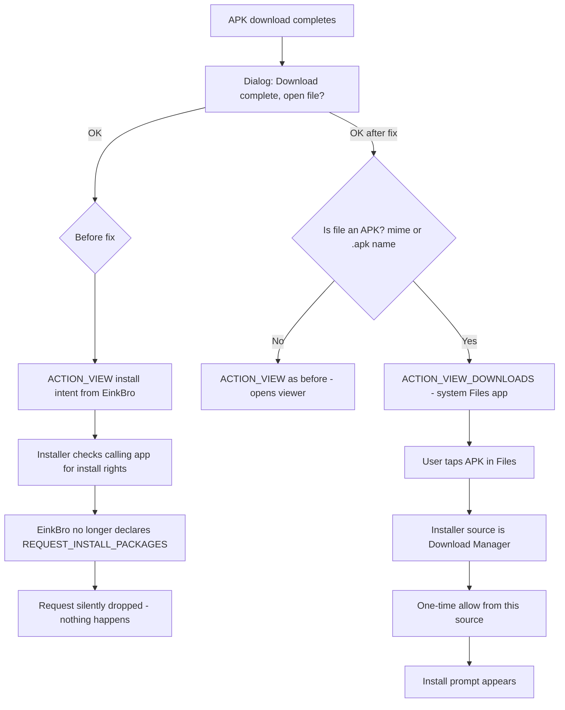

2026-08-10

# EinkBro: APK downloads hand off to the system Files app

## What was broken

After downloading an APK in EinkBro, tapping OK on the "Download complete, open file?" dialog did nothing — no installer, no error, no toast. Every other file type still opened fine.

## Root cause

The OK button fires a normal `ACTION_VIEW` intent with the DownloadManager content URI and the APK MIME type, and the system package installer activity does launch. But since Android 8, an install started by an app is an "unknown sources" request attributed to the calling app's UID, and it can only proceed if that app holds the "Install unknown apps" toggle — which is only grantable to apps declaring `REQUEST_INSTALL_PACKAGES` in their manifest.

EinkBro deliberately dropped that permission in v16.0.0 as part of removing all self-update machinery for Google Play compliance. With the permission gone, EinkBro can never be granted install rights, and on current Android versions the installer finishes silently instead of showing the old "For your security…" dialog. The `startActivity` call itself succeeds, so the error toast never fires either — hence a tap that visibly does nothing.

No intent variant routes around this: an intent chooser still resolves to the same installer with the same source attribution, and the `PackageInstaller` session API requires the same permission. The attribution is the OS's anti-sideloading design.

## The fix

Keep the permission out (the v16.0.0 decision stands — reintroducing it would mean a Play Console sensitive-permission declaration and review risk) and route APKs to an app that does hold install rights: the system Files app.

In `DownloadHelper.createDownloadReceiver`, when the completed download is an APK, the OK button now fires `DownloadManager.ACTION_VIEW_DOWNLOADS` instead of the doomed install intent. The system Downloads UI opens with the fresh APK at the top; the user taps it there, and the Files/Download Manager app becomes the install source. Android asks once for "allow from this source" for that system app, then shows the normal install prompt. Non-APK downloads keep the direct `ACTION_VIEW` behavior.

APK detection checks the MIME type (`application/vnd.android.package-archive`) *or* a `.apk` suffix on the download's local filename (queried via `DownloadManager.COLUMN_LOCAL_URI`), because servers frequently mislabel APKs as `application/octet-stream`.

## Alternatives considered

- **Re-declare `REQUEST_INSTALL_PACKAGES`**: Play policy actually permits it for browsers (Chrome and Firefox declare it; the ban is on self-updating, which stays removed), but it reverses the deliberate v16.0.0 cleanup and reintroduces listing risk.
- **GitHub-builds-only permission** via a `releasePlay` manifest overlay with `tools:node="remove"`: better UX for sideloaders, but splits behavior between builds; can be revisited if the extra tap proves annoying.

Verified end to end on the emulator through the real browser download flow: dialog OK opens the Files app at Downloads, and tapping the APK there reaches the standard install prompt. No permission changes, no new strings, identical behavior in Play and GitHub builds.
