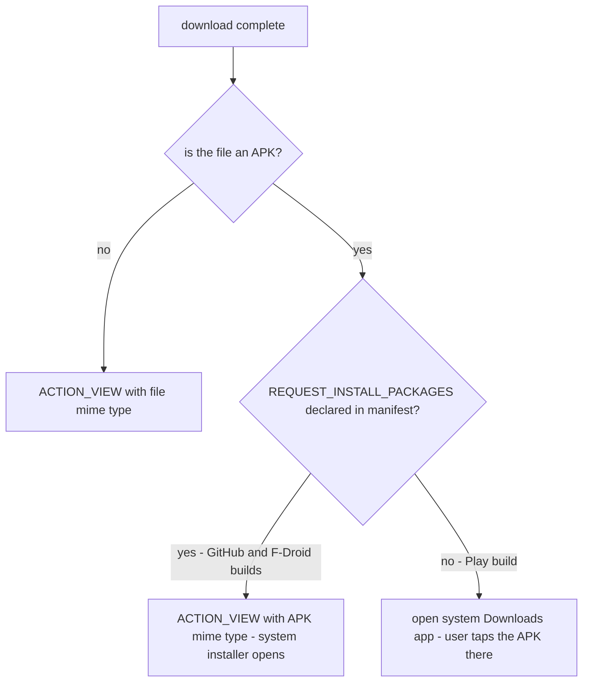

2026-09-03

# Direct APK Install Restored (Play Build Excluded)

## What it does and why

Downloading an APK in EinkBro used to dead-end: the download-complete
dialog's OK could only open the system Downloads app, and the user had to
find the file there and tap it again to install. That workaround existed
because `REQUEST_INSTALL_PACKAGES` was dropped in v16.0.0 alongside the
self-update removal — and without the permission declared, the package
installer silently ignores install intents from the app.

Installing an APK the *user* downloads while browsing is a standard browser
capability (Chrome and Firefox both do it) and is distinct from the
self-update flows that stay banned. The permission is back in the main
manifest, so tapping OK on the download-complete dialog now launches the
system installer directly. The intent forces the APK mime type because
servers frequently serve APKs as `application/octet-stream`. On first use
the system installer itself walks the user through the one-time
"install unknown apps" grant — no in-app handling needed.

## Keeping the Play build clean

Google Play gates `REQUEST_INSTALL_PACKAGES` behind a Play Console
declaration and review. Rather than go through that (or risk the listing),
the Play build simply keeps the old behavior:

- `app/src/playRelease/AndroidManifest.xml` removes the permission with
  `tools:node="remove"`, so the merged Play manifest never declares it
  (verified in the merged-manifest output).
- `DownloadHelper` decides at runtime by checking whether the permission is
  *declared* in the installed package — no build-type string coupling, and
  declared is sufficient because the installer handles the grant flow.

The project CLAUDE.md note was rewritten to match: self-update remains
forbidden in every build, user-downloaded APK install is sanctioned, and the
permission must never reach the playRelease build without going through the
Play Console declaration first.

Verified end to end on the emulator: downloaded an APK, tapped OK on the
completion dialog, and the system PackageInstaller opened with its install
prompt.
