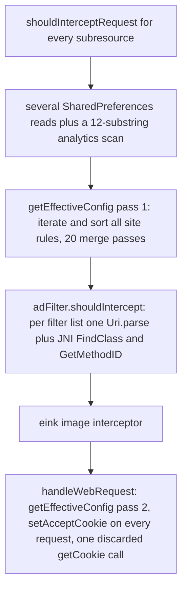

2026-09-03

# Architecture study: memory, page-load speed, and APK size

A full-codebase review of EinkBro looking for architecture-level wins in three areas: memory consumption, web content loading speed, and APK size. This ADR records the findings and the action plan chosen from them. Items marked **selected** are being implemented; the rest are recorded as known debt.

## Memory findings

1. **Tab architecture keeps every tab fully alive** (deferred — not selected now). `BrowserContainer` is an uncapped `LinkedList`; the only `WebView.destroy()` paths are tab close/clear. Background tabs are not even paused by default (`enableWebBkgndLoad` defaults to true; `pauseTimers` is commented out in `EBWebView`). Once shown, a tab stays attached as a GONE child of `mainContentLayout`, keeping its Chromium compositor alive, and every WebView gets a forced `LAYER_TYPE_HARDWARE` — about 10.5 MB of GPU texture each on a 1404x1872 panel. Tab restore is URL-lazy but not instance-lazy: N saved tabs means N live WebView instances at cold start. With 15-20 tabs this plausibly reaches several hundred MB RSS. The eventual fix is tab hibernation (serialize background tabs via `saveState`, rebuild on activation); it is the largest single lever but also the most invasive, so it is deferred.

2. **Unbounded full-page screenshot bitmap** (**selected: remove the feature**). `SaveScreenshotTask` allocates `Bitmap.createBitmap(width, contentHeight)` with no cap on content height; a long article is a single allocation in the hundreds of MB — a deterministic OOM. The task turned out to have no callers anywhere in the app, so the fix is deletion of the dead code path rather than tiling.

3. **Backup builds the entire database as in-memory JSON** (**selected**). `BackupUnit` materializes every table into `org.json` trees, Base64-inflates every favicon blob by a third, and holds about three simultaneous copies before writing. Plan: omit favicon binaries from the backup entirely (they are re-fetchable from the web) and refactor the export to stream to the output file instead of building one giant string.

4. **All favicon blobs resident on the heap forever** (**selected**). `BookmarkManager` (a Koin application-scoped single) runs `SELECT * FROM favicons` at startup into a `MutableList` that is never released — 10-40 MB on a mature install — and then answers lookups with a linear scan per page commit. Plan: query by host on demand through Room, keep only the existing bounded bitmap LRU in front of it.

5. **`onTrimMemory` only trims the one cache that is already bounded** (recorded, partially improved by item 4). Under memory pressure nothing frees WebViews, favicon blobs, or the static string caches (`FileHelper.fileCache`, `UserScriptManager.requireCache`, the app-scoped suggestion record list).

6. Smaller leaks recorded for later: the preloaded WebView is never destroyed in `BrowserActivity.onDestroy`; `EBWebView.destroy()` does not null `webViewCallback`; the `AdBlock`/`Javascript`/`Cookie` singletons try to load asset host files that do not exist and silently stay empty.

## Loading-speed findings

The per-subresource request path does far more than an ad-block lookup today:

1. **Cold start blocks the main thread twice** (**selected**). Ad-filter processed blobs (multi-MB) are read and native-parsed synchronously in `Application.onCreate`, and tab restore then constructs every saved tab's `EBWebView` synchronously, decoding the saved-album JSON four separate times. Plan: move filter loading to a background dispatcher with `shouldIntercept` degrading to "do not block" until loaded, decode the saved-tab list once, and construct background tabs' WebView instances lazily.

2. **About 196 KB of JS is compiled on every page load regardless of need** (**selected**). `extended-css.min.js` plus `scriptlets.min.js` are evaluated at `onPageStarted` on every page, even when the site has no cosmetic or scriptlet rules. Plan: check rule presence first and inject only when the site actually has matching rules.

3. **Per-request overhead in the hot path** (**selected**). `getEffectiveConfig` is O(all site rules) with heavy allocation and is called twice per request (plus six times per CSS update); `CookieManager.setAcceptCookie` — a process-global native call — runs per request; a synchronous `getCookie` result is fetched and discarded; the adblock JNI entry does `FindClass`/`GetMethodID` on every call and each client re-parses the document URL with `Uri.parse`. Plan: memoize the merged domain config per (host, path) with invalidation on rule writes, hoist the cookie toggle out of the request path, delete the dead `getCookie`, cache the JNI class/method IDs once at load, and hoist the host extraction out of the per-client loop.

4. **`onPageFinished` fires about a dozen `evaluateJavascript` round-trips and repeats up to 4-5 times on some sites** (**selected**). The Google-serif font path additionally injects four CSS `@import` fetches of CJK web fonts after layout, forcing a second full layout. Plan: guard the post-processing against repeated `onPageFinished` firings for the same document, batch the small scripts, and move font/style injection earlier so the first layout is the right one.

5. **Tab switching re-parents the WebView** (**selected**). Every switch detaches and re-attaches the Chromium view, then re-runs rule scans and JSON decode/encode of the album list. `shouldOverrideUrlLoading` also deep-copies the whole back/forward list just to Log.d it. Plan: toggle visibility instead of re-parenting, drop the redundant per-switch work, and delete the debug back/forward-list dump.

6. **DEEP e-ink image mode proxies every image synchronously** (**selected**). Each image is downloaded with a bare `HttpURLConnection` on a WebView network thread — losing HTTP/2 multiplexing and connection reuse — and the disk cache re-lists and stats the whole cache directory on every store, and rebuilds a `MessageDigest` plus 32 `String.format` calls per key. Plan: reuse a shared HTTP client with connection pooling, compute cache keys cheaply, and amortize disk-cache trimming instead of doing it per store.

## APK size findings (4.4 MB arm64 release)

Measured composition: `classes.dex` 57 percent, `resources.arsc` 24 percent (about 85 percent of that is the 30 bundled locales — already solved on Play via AAB language splits), native libs 6 percent.

| Change | Estimated saving | Decision |
|---|---|---|
| Exclude epub4j's unused W3C DTD java-resources (`dtd/`) via packaging excludes | 86 KB | selected |
| Replace pdfbox-android (371 KB dex serving two call sites in the save-as-PDF merge path) with a minimal COS-level page-append plus outline writer | about 170 KB | selected |
| Drop ConstraintLayout — the project has zero XML layouts; it is used only programmatically to position the toolbar | about 90 KB dex plus arsc entries | selected |
| gzip the ad-filter module's inlined JS (scriptlets, extended-css) into assets, dropping the Mezzanine kapt dependency | about 60 KB plus a larger on-device dex win | selected |
| Rewrite TTS notification off `MediaSessionCompat` onto the framework `MediaSession` (available since minSdk 24) | about 25 KB | selected |
| Drop navigation-compose (one `NavHost` in `HighlightsActivity`) for a plain state switch | about 24 KB | selected |
| Add `-Wl,--pack-dyn-relocs=android` to the adblock-client link flags (valid from API 23; the NDK only auto-enables it at API 30+) | about 30 KB per ABI | selected |
| Hygiene: dead `viewBinding = true`, `releaseDebuggable` referencing a nonexistent `proguard-rules.pro`, empty `res/menu/`, redundant xmlpull keep rules | small | selected |
| Convert the 106 material-icons-extended icons (185 KB dex) to XML vector drawables | about 70 KB | rejected — current form is easier to maintain |
| Prune bundled locales in the APK channels | about 30 KB per locale | policy call, deferred |

Two recorded observations that need no code change: pdfbox's own consumer keep-rule pins about 29 KB of tagged-PDF classes (disappears with pdfbox itself), and the GitHub download page should point users at per-ABI APKs rather than the universal one (740 KB of unused native code).

## Execution order

Memory items first (screenshot removal, backup streaming without favicons, on-demand favicon queries), then the loading-speed items (startup, injection gating, request-path memoization, page-finished consolidation, tab switching, DEEP image mode), then the size items, with the pdfbox replacement last since it is the largest isolated piece. Unit tests plus lint gate each step.
