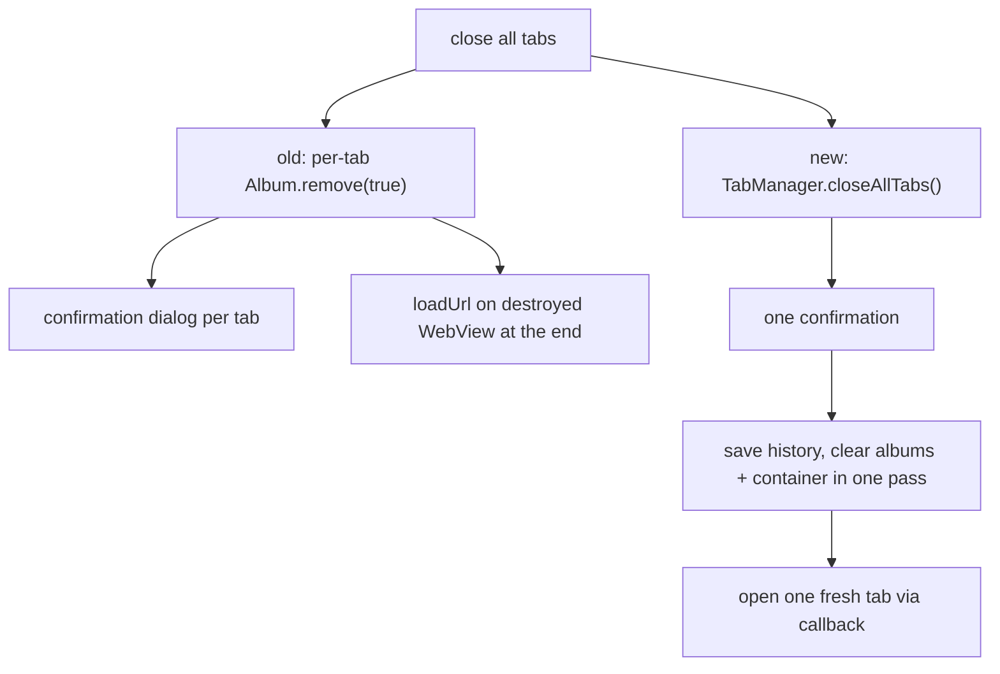

2026-07-07

# EinkBro: close-all-tabs as a single batch operation

## What was broken

The overview panel's "close all tabs" ran
`hide(); closeAllTabs(); addEmptyTabAction()` where `closeAllTabs()`
iterated `Album.remove(true)` — i.e. the full single-tab removal pipeline,
once per tab. Consequences:

- With "confirm before closing tab" enabled, the user got **one
  confirmation dialog per open tab**, while the replacement empty tab had
  already been created before any confirmation resolved.
- On the last removal, `BrowserContainer.remove()` destroys the WebView,
  and `TabManager.removeAlbum`'s empty-container fallback then called
  `state.ebWebView.loadUrl(favoriteUrl)` — a load on a just-destroyed
  WebView.

## The fix

`TabManager.closeAllTabs(onAllClosed)` asks the confirmation **once**,
saves history for all tabs when `isSaveHistoryWhenClose` is on, clears the
album view-model and `BrowserContainer` (which now detaches before destroy,
from the earlier lifecycle fix), nulls the current controller, persists the
tab list, and only then invokes the callback that opens the single fresh
tab. Cancelling the confirmation leaves the session untouched — previously
the new empty tab appeared regardless. The wiring goes
`BrowserActivity → ChromeSetupDelegate → OverviewDialogController` as a
`closeAllTabsAction` lambda, replacing the controller's private per-tab
loop.

## Verification

Emulator: with three tabs open, the panel's close-all icon closes all
three and produces exactly one fresh tab showing the empty "Search or type
URL" state; process alive, no crash.
