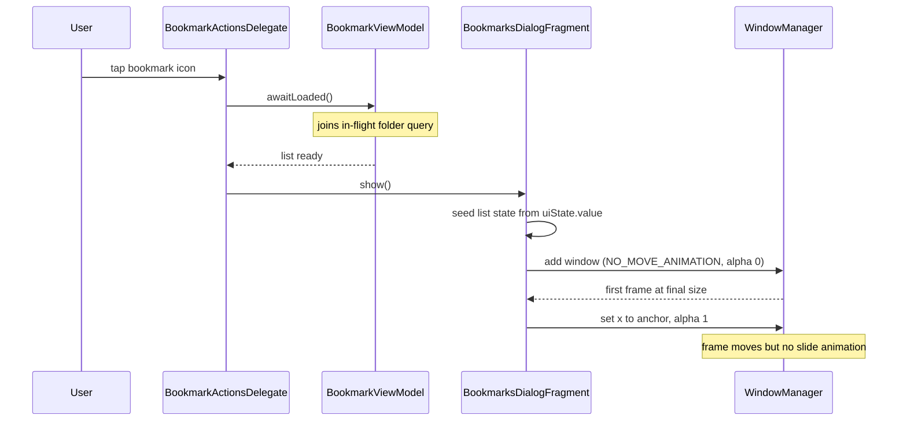

2026-08-22

# Bookmark dialog: stop the window sliding into place on open

## What was broken

Opening the bookmark list on an e-ink device showed a visible "shift": the
dialog appeared as a small panel at the bottom-left of the screen, then grew
and slid over ~250 ms to its final size and position next to the toolbar
icon. The effect was more noticeable the more bookmarks the user had, which
initially read as "the list is slow to launch, can the UI be cached?".

## Root cause

Profiling with `atrace` and a 30 fps screen recording showed the list itself
is not the problem: `LazyVerticalGrid` only composes the visible rows, and the
open takes ~180 ms on the emulator with 31 or with 3031 root bookmarks. The
slide was two things stacked on top of each other:

1. **The dialog was shown before its data existed.** `BookmarksDialogFragment`
   was `show()`n immediately on tap, while `BookmarkViewModel`'s folder query
   was still running (the ViewModel reloads the root folder every time the
   dialog closes). The first frame therefore composed the empty "no
   bookmarks" panel; when the query finished, the wrap-content window grew
   to its real height. A bigger bookmark table means a longer query, so the
   race was hit more often with many bookmarks.
2. **WindowManager animates window moves.** The dialog window is
   bottom-anchored and wrap-content, so a height change moves its top edge;
   `ComposeDialogFragment` also repositions the window horizontally over the
   toolbar anchor after the first layout. Each of those is a frame move, and
   WindowManager plays its own ~250 ms move animation for app windows on
   every move. That animation is separate from the enter/exit animation the
   code already disables with `windowAnimations = 0`, so the slide survived
   that setting. On an e-ink panel an interpolated slide is a smear of
   partial refreshes.

## Fix

- `BookmarkViewModel` keeps a handle to its current load job and exposes
  `awaitLoaded()`. `BookmarkActionsDelegate.openBookmarkPage()` awaits it
  before calling `show()`, so the dialog's first frame is already the full
  list. The fragment also seeds its Compose list state from
  `uiState.value` in `beforeComposing()` rather than waiting for the first
  `collect` emission, which removed a one-frame empty-state flash.
- `ComposeDialogFragment` now sets WindowManager's
  `PRIVATE_FLAG_NO_MOVE_ANIMATION` on the dialog window. The flag is hidden,
  so it is set through reflection on `LayoutParams.privateFlags` (a
  long-standing unsupported-but-accessible field); Android 14 added the
  public theme attribute `android:windowNoMoveAnimation`, which
  `PhoneWindow` maps to the same flag, so the app's `dialogTheme` now also
  sets that in `values-v34`. Either path alone is enough on API 34+; the
  reflection path covers the Android 11-13 e-readers. Verified on the
  emulator via `dumpsys window` showing `pfl=NO_MOVE_ANIMATION` on the dialog
  window, and the dialog now appears in a single recorded frame.

Because the flag is applied in the shared `ComposeDialogFragment` base
class, the same slide is also gone for every other Compose dialog (menus,
folder navigation inside the bookmark list, anything that changes height
while open).

## Not done

An earlier attempt disabled the reorderable library's per-item
`animateItem` modifier; that targets the drag-to-reorder placement
animation, not the launch, and was reverted.
