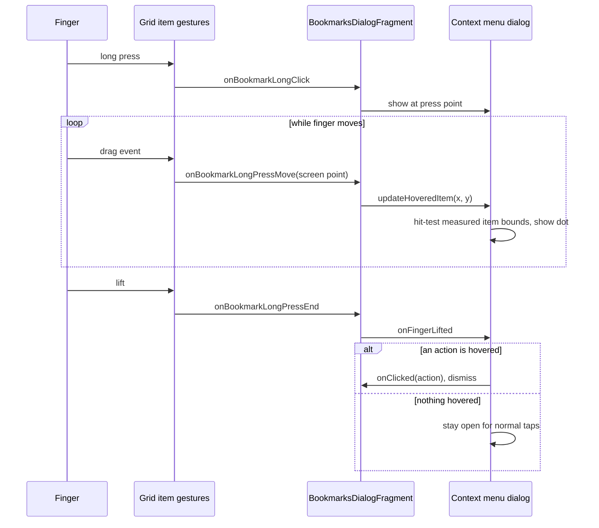

2026-07-22

# Bookmark grid drag-to-action and bounds-based context-menu hit-testing

EinkBro's "1 touch to url action" setting lets a long press on a web link open the context menu and — with the finger still down — slide onto an action and lift to trigger it, saving a second tap on E-ink screens. This change extends that interaction to bookmarks in grid view, slims the bookmark context menu down to just its action row, and replaces the hover hit-testing in both menus with measured screen bounds.

## What it does

- Long pressing a bookmark grid item (with the setting on) opens the context popup anchored at the finger. Moving the finger highlights the action under it with a small dot; lifting triggers the highlighted action. Lifting without hovering anything keeps the popup open for normal taps — the same semantics as the url flow.
- The bookmark context menu no longer shows the bookmark title row, keeping only the actions (new tab, background tab, split screen, edit, delete). The history long-press menu shares this dialog, so it loses the title line too.
- The hover dot gets 2dp top padding so it floats clear of the dialog border instead of touching it.

## How it works

Grid items get a third gesture branch (after sort mode and the plain default): when the setting is on, a `detectDragGesturesAfterLongPress` block shows the menu on long press and streams finger positions to it, while a separate `detectTapGestures` block keeps tap-to-open working. `BookmarksDialogFragment` holds a reference to the active popup and routes move/lift events into it — mirroring how `ChromeSetupDelegate` drives the url context menu from the WebView's touch listener.

A Compose subtlety makes the two detectors compose cleanly: when a long-press drag completes, `detectDragGesturesAfterLongPress` consumes the up event, which cancels the tap detector's gesture — so a long press never also fires the tap.

## Hit-testing: measured bounds instead of layout math

The url context menu used to determine the hovered item by recomputing its own layout by hand — item widths chosen by screen width, heights by icon visibility, separator offsets — with comments admitting the numbers were approximate. It ignored row scrolling and the second row's centered, filtered layout, and would silently drift whenever the layout changed.

Both menus now record each action item's actual screen rect via `onGloballyPositioned`/`positionOnScreen` as they lay out, and `updateHoveredItem()` simply hit-tests the raw pointer position against those rects. The ~60-line manual calculation was deleted, and `ContextMenuItem` gained an optional `modifier` parameter so callers attach the bounds reporter without wrapper boxes. Because bounds are re-reported on every layout pass, the approach stays correct under row scrolling, item filtering, and future layout changes.
