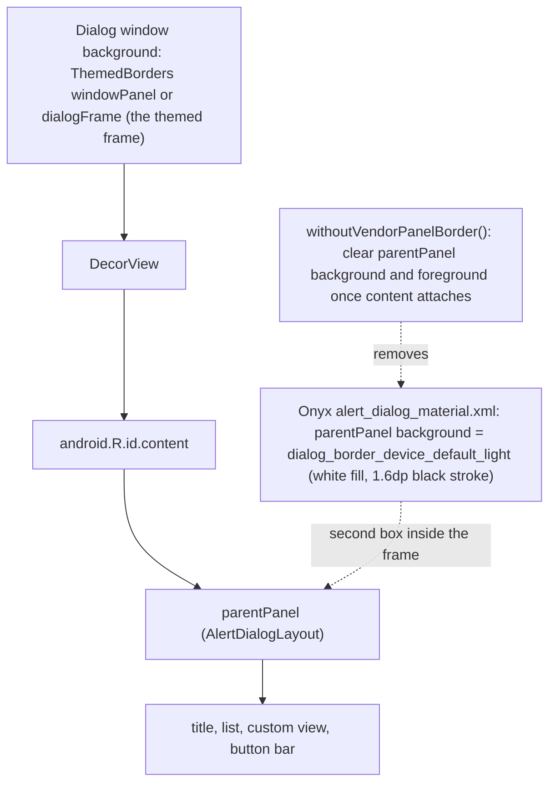

2026-09-04

# EinkBro: strip the Boox ROM's built-in AlertDialog border

## What was broken

On Onyx Boox devices, every framework `AlertDialog` in EinkBro showed two borders: the themed window frame the user picked (stamp, dashed, sticker, and so on) and, hugging the content inside it, a black rounded rectangle that no EinkBro theme draws. With a fill theme selected, the inner box also painted a white rectangle over the frame's gradient or pattern fill. Compose dialogs and the DialogFragment-based dialogs were fine; only dialogs built with `android.app.AlertDialog` were affected.

## Root cause

The inner border is not a window or `DecorView` decoration, and it is not something EinkBro's theme XML asks for. Pulling `framework-res.apk` from a GoColor7 (Android 12, Onyx firmware 4.2) and decoding it with apktool showed that Onyx edits the framework's `alert_dialog_material.xml`: the `AlertDialogLayout` with id `parentPanel` gets `android:background="@drawable/dialog_border_device_default_light"`, a shape with a white solid fill, 7.4dp corners and a 1.6dp black stroke. The DeviceDefault variant of the layout uses a matching `foreground`. It is Onyx's e-ink stand-in for the window shadow, which is invisible on an e-ink panel.

Because it lives on the content panel rather than the window, EinkBro's `Window.setBackgroundDrawable(...)` cannot replace it; the themed frame and the vendor box are drawn by two different views.

## Fix

`ThemedBorders.kt` gains `withoutVendorPanelBorder()`. Once the dialog's content views exist (they are only inflated during `show()`, so the hook runs on decor attach, or immediately if the dialog is already showing), it looks up `parentPanel` by resource name in the `android` package, falling back to the first child of `android.R.id.content`, and clears both its background and foreground. Stock Android leaves that panel undecorated, so the call is a no-op everywhere except ROMs that decorate it. The shape carries no padding, so clearing it does not shift the layout.

`withThemedFrame()` now takes the frame drawable as a parameter (defaulting to `windowPanel`) and runs frame, vendor-border strip and button tint together. The eight dialogs in `DialogManager`, `ListSettingDialog` and `OpenWithDialog` that set `windowPanel` or `dialogFrame` on the window by hand were switched to `withThemedFrame(...)`, so every framework dialog goes through the one path. The attach-time hook shared by the strip and the button tint moved into a private `onContentAttached` helper.

## Verification

Installed a signed arm64 build over the app on the GoColor7 and opened a single-choice list dialog and an OK/Cancel text-input dialog through the UI. Both show only the themed frame; the button bar keeps its accent tint. `./gradlew testDebugUnitTest lintDebug` passes.

Two device notes for future work: `adb pull` from the Boox returns nothing inside the sandbox (use `adb exec-out cat`), and `am start` on non-exported activities is denied, so settings screens have to be reached through the UI.
