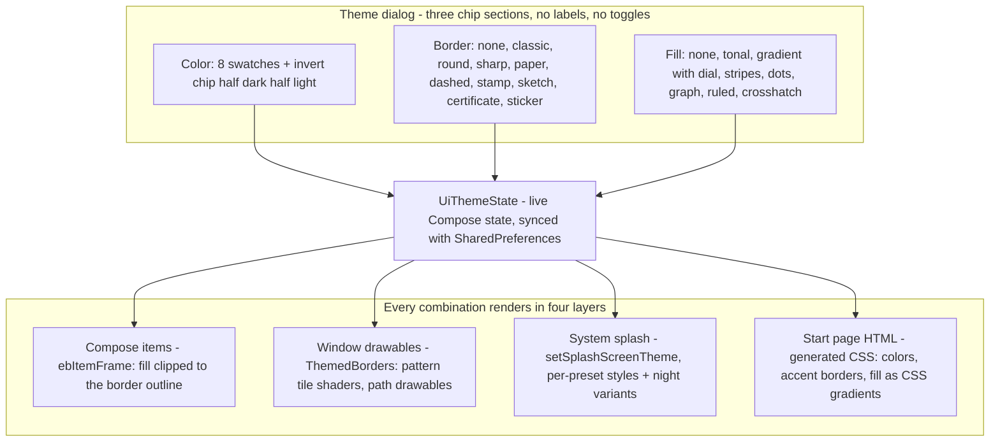

2026-08-29

# EinkBro: Border × Fill theming, pattern fills, and themed splash + start page

The theming system's final round before the 16.5.0 release, spanning three
commits: the single "Style" dimension split into independent **Border** and
**Fill** choices, five repeating **pattern fills**, and the theme reaching the
two surfaces the app does not draw itself — the **system splash screen** and
the WebView-rendered **start page**.

## Border × Fill instead of bundled styles

Styles originally bundled edge and interior into one choice. Splitting them
gives a matrix: any border (None, Classic, Round, Sharp, Paper, Dashed, Stamp,
Sketch, Certificate, Sticker) pairs with any fill (None, Tonal, Gradient with
the direction/level dial, or a pattern). Both persist independently and the
legacy single-style preference migrates to the pair on first read. The dialog
became three label-free chip sections — the invert toggle turned into a
half-dark/half-light chip in the Color grid, and the "none" chips carry a
diagonal strike-through.

The subtle work was making arbitrary combinations render correctly: fills must
clip to the border's actual outline (stamp scallops, sketch wobble), not to a
plain rounded rect — in Compose via `Shape.createOutline` + `clipPath`, and in
the window drawables by painting the fill through the same path with a paint
shader. Sticker items draw shadow, fill, and outline entirely inside their own
bounds so neighboring settings tiles never crop them.

## Pattern fills

Stripes, dots, graph paper, ruled lines, and crosshatch. One Compose painter
draws them clipped to the frame shape; window drawables render the same
patterns as a small bitmap tile applied as a repeating `BitmapShader`, which
works uniformly across plain boxes, layered borders, and the stamp/sketch path
drawables. Review tuning mattered more than the drawing: lines dropped to a
12 percent accent blend (16 in dark) and spacing grew about 50 percent after
the first version made content hard to read — the picker chips keep a stronger
blend so they stay distinguishable at chip size.

## Splash screen and start page

- **Splash (Android 12+).** The system draws the launch splash before the app
  runs, from a theme registered with `setSplashScreenTheme`. A splash style per
  preset color (night variants in `values-night-v31`) sets the theme background
  and shows the launcher foreground tinted with the text color — tinting the
  adaptive-icon bitmap produces a clean monochrome silhouette. The custom color
  maps to the preset with the nearest hue; grayscale picks map to Classic.
- **Start page.** The built-in start page is HTML in a WebView, so the renderer
  now injects a generated style block: theme background and text colors, accent
  wordmark / search-bar / tile borders, and the selected fill translated to
  CSS — a `linear-gradient` at the dial's angle and level, or
  `repeating-linear-gradient` / `radial-gradient` equivalents of the patterns.
  A user-set background image still takes precedence. Two traps surfaced here:
  Kotlin string templates escaped as literal `${...}` produced invalid CSS that
  silently no-opped, and a `background` shorthand marked `!important` resets
  `background-size`, so the dots' tile size needed `!important` as well.

## Outcome

Shipped as v16.5.0. The entire theming system — colors, borders, fills, dials,
invert, splash, start page — costs roughly 60 KB of APK relative to v16.4.1.
