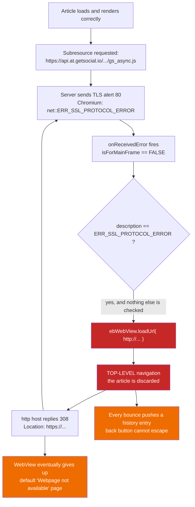

2026-08-16

# A third-party script with broken TLS could navigate the whole tab away

## What was broken

A user reported that a WordPress news article would not load in EinkBro. The page
was fine — `curl` fetched it as a 200 with 479 KB of HTML, and on the emulator
logcat showed the article's real title committing successfully. The article
rendered, and then EinkBro threw it away and replaced it with a "Webpage not
available" error page for a URL the user had never asked for:

```
https://api.at.getsocial.io/get/v1/8a387935/gs_async.js
net::ERR_SSL_PROTOCOL_ERROR
```

That is a GetSocial share widget the page embeds via `<script src=...>`. Its host
genuinely has broken TLS — `openssl s_client` gets `tlsv1 alert internal error`
(alert 80) with no certificate presented at all.

The damage went past the swapped-out page. Each iteration of the retry pushed a
history entry, so the back button could not escape: seven presses were still on
the error page, and it took roughly forty to get out of the tab.

## Root cause

`WebErrorPagePresenter.onReceivedError` opened with an https-to-http downgrade
retry:

```kotlin
// if https is not available, try http
if (error?.description == "net::ERR_SSL_PROTOCOL_ERROR" && request != null) {
    ebWebView.loadUrl(request.url.buildUpon().scheme("http").build().toString())
    return
}
```

The intent is reasonable: a site whose certificate is broken may still serve
plain http, so try that before giving up. The defect is that the guard is only
`request != null`.

Since API 23, `WebViewClient.onReceivedError` fires for *every* resource the page
loads — images, scripts, iframes — not just the main document. And
`ebWebView.loadUrl()` is a **top-level** navigation. So any single subresource
anywhere on the page with a bad certificate would navigate the entire tab to that
subresource's URL. Nothing about this was specific to the site the user reported;
it would happen to any page embedding an asset from a TLS-broken host.

What turned a one-shot bug into a loop is that the offending host answers plain
http with `308 Permanent Redirect` straight back to https. So the downgrade
bounced:



Two smaller defects hid in the same block. The unconditional early `return` sat
above both the `Log.e` line and the `showErrorPage` call, so for this entire error
class EinkBro's own `error_page.html` — friendly reason text, Retry button, the
`einkbro://retry` flow — was dead code, and users saw Chromium's default error
page instead. And `buildUpon().scheme("http")` applied to a URL that was *already*
http produces the same URL, so a main-frame http page failing this way would
reload itself forever.

## The fix

The retry now has to clear three gates before reaching `loadUrl()`:

- **`isForMainFrame`** — the actual bug. A subresource can no longer steer the tab.
- **`scheme == "https"`** — closes the http-reloads-itself self-loop.
- **one downgrade per address** — a `downgradedKey` field holding the scheme-less
  form of the URL, so `http://x` and `https://x` collapse to one entry and the
  308 bounce cannot re-trigger.

The one-shot guard needed a release condition, or a site that legitimately works
over http would only ever downgrade once per process. Clearing it on page *finish*
turned out to be wrong: during a bounce, `onPageFinished` fires for both the http
and https forms, and the http one differs from the stored https URL, which would
clear the guard and restart the loop. Keying scheme-less and clearing from
`onPageStarted` only when the new URL has a *different* key avoids that — the
bounce keeps the same key throughout and stays blocked, while any real navigation
elsewhere releases it.

Dropping the early `return` also lets `showErrorPage` run for SSL protocol errors,
which is what makes the custom error page reachable at last.

## Verification

On the emulator, against the reported article:

- Top-level navigations to the script URL went from about ten to zero. The SSL
  error is logged once and ignored, and the article renders — headline, byline,
  publish date, body.
- Navigating *directly* to the broken URL, so it really is the main frame, logs
  exactly two errors: the first downgrades to http, the 308 bounces back, the
  second hits the guard and falls through. It terminates instead of spinning.
- That fall-through now shows EinkBro's own page — "Can't reach this page",
  "There's a problem with the site's security certificate.", Retry button — rather
  than the WebView default.
- Six back presses closed both test tabs and left the app, against roughly forty
  needed to escape a single poisoned tab beforehand.
