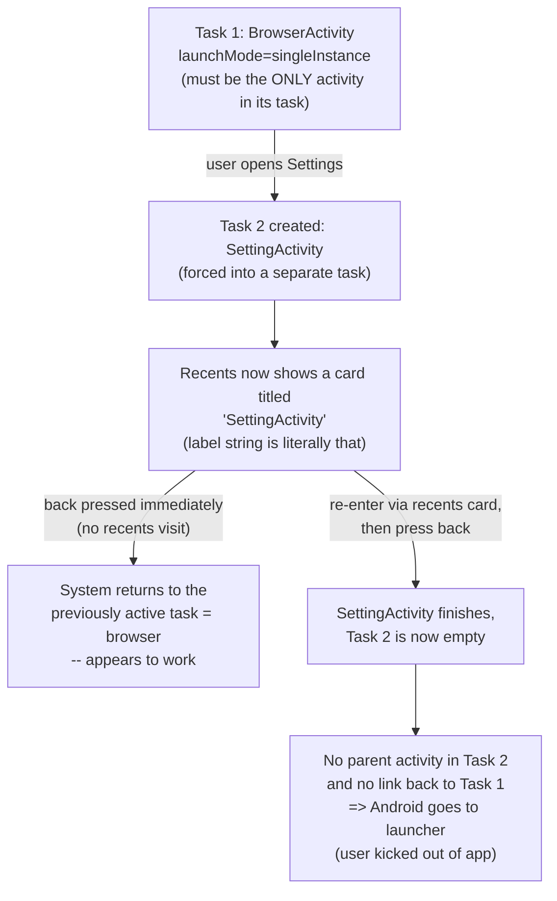
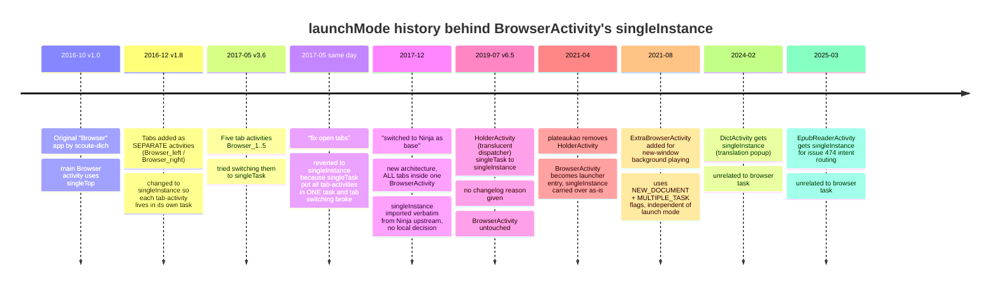

2026-07-05

# EinkBro: BrowserActivity singleInstance → singleTask (issue #612)

## What was broken

Issue #612: open Settings, go to recents, re-enter the app, press back — and you're dumped at the launcher instead of back in the browser. Recents also showed a second card titled "SettingActivity" instead of one EinkBro card.

## Root cause

`BrowserActivity` was declared `android:launchMode="singleInstance"`. That mode means the activity must be the *only* activity in its task, so every sub-activity it launches (SettingActivity and all the settings sub-screens) is forced into a **separate task**:



The direct flow (open Settings, press back right away) only *appears* to work because the system happens to return to the previously active task. Once the user detours through recents, that linkage is gone: the Settings task's back stack contains only SettingActivity, so back empties the task and Android goes home.

## Why singleInstance was there — a history dig

Tracing every commit that ever touched the browser activity's `launchMode` shows the value was never a decision made for the current architecture:



The only documented reason for preferring `singleInstance` over `singleTask` — the 2017 "fix open tabs" same-day revert — belonged to a design where each tab was its own activity and needed its own task. That architecture died with the Ninja migration in December 2017: since then all tabs live inside one `BrowserActivity`, and `singleInstance` was simply inherited from Ninja upstream and carried through every refactor untouched.

## The fix

Change one attribute on `BrowserActivity`:

```xml
android:launchMode="singleTask"
```

`singleTask` keeps everything the app actually wants — a single browser instance, external VIEW/SEND intents delivered via `onNewIntent()` — while letting SettingActivity and the other sub-screens stack on top of BrowserActivity in the same task. Recents shows one EinkBro card, and back from Settings naturally returns to the browser.

The new-window / background-playing feature is unaffected: `IntentUnit.launchNewBrowser()` starts `ExtraBrowserActivity` with `FLAG_ACTIVITY_NEW_DOCUMENT | FLAG_ACTIVITY_MULTIPLE_TASK`, which creates its own document task regardless of the browser's launch mode.

One behavior nuance of `singleTask`: if an external link arrives while Settings is on top, Android clears the activities above BrowserActivity to deliver the intent — Settings closes and the link opens. Reasonable for a browser.

## Verification (emulator)

- Settings and BrowserActivity now share one task (`dumpsys activity activities` shows both records under the same task id).
- The exact issue repro — Settings → recents → re-enter → back — lands back on the browser, not the launcher; recents shows a single card titled EinkBro.
- An external VIEW intent is delivered to the existing BrowserActivity instance (task brought to front, no new instance) and the page opens in a new tab; the same works when Settings is on top (Settings is cleared first).
- Long-pressing "+" in the tab overview still opens `ExtraBrowserActivity` in its own separate task.
