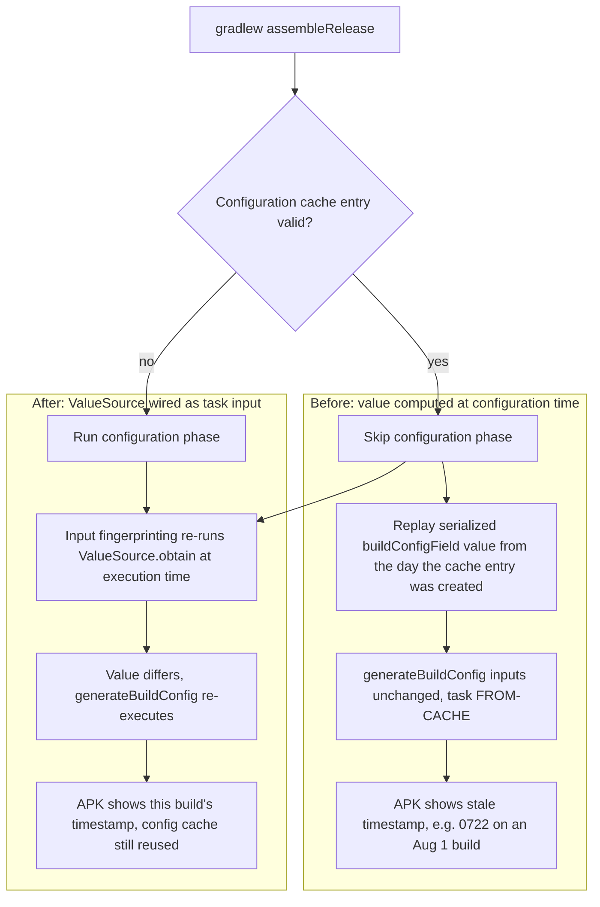

2026-08-01

# EinkBro: About-screen build timestamp frozen by Gradle's configuration cache

## What was broken

The Settings About screen shows ` v15.18.0 (MMddHHmm)` where the parenthesized part is `BuildConfig.lastCommitTime`. A release built and installed on August 1 displayed `0722` — a timestamp from July 22, ten days stale. The app code itself was current; only the displayed timestamp lied.

## Root cause

Despite its name, `getLastCommitTimeStamp()` in `app/build.gradle.kts` never read git — it formatted `Date()` ("now", Asia/Taipei), or `SOURCE_DATE_EPOCH` when set (F-Droid reproducible builds). The real problem was *when* it ran: it was called inside `defaultConfig { buildConfigField(...) }`, i.e. at **configuration time**.

Gradle's configuration cache serializes the entire configured task graph — including that already-interpolated string. When a later build prints `Reusing configuration cache.`, the configuration phase never re-runs, so the timestamp captured on the day the cache entry was created is replayed verbatim. `generateReleaseBuildConfig` then sees unchanged inputs and resolves `FROM-CACHE`, baking the stale value into the APK. The build log confirmed it: the generated `BuildConfig.java` contained `lastCommitTime = "07220010"` — the moment that particular cache entry was first stored.

## Fix

Move the computation to execution time so every build — local or remote — re-evaluates it, without giving up configuration-cache reuse:

- A `BuildTimeValueSource : ValueSource<String, None>` holds the same logic (MMddHHmm, Asia/Taipei, `SOURCE_DATE_EPOCH` override).
- It is wired through the AGP variant API instead of `defaultConfig`:

  ```kotlin
  androidComponents {
      onVariants { variant ->
          variant.buildConfigFields?.put(
              "lastCommitTime",
              providers.of(BuildTimeValueSource::class.java) {}
                  .map { BuildConfigField("String", "\"$it\"", "build timestamp") }
          )
      }
  }
  ```

The provider is only read during task-input fingerprinting, never at configuration time. Gradle therefore re-runs `obtain()` on every build, notices the value changed, and re-executes `generateBuildConfig` — while the configuration cache entry itself stays valid and reused. This is the documented pattern for "current time"-like values under the configuration cache: a value read at configuration time becomes a cache-invalidating configuration input, but a value read as a task input does not.



Verified by running consecutive builds: the value tracked the wall clock minute by minute while each run printed `Reusing configuration cache.`, and a run with `SOURCE_DATE_EPOCH` set produced the epoch-derived value, so reproducible builds remain deterministic.

## Notes

- The field keeps the (misleading) `lastCommitTime` name so the single consumer in `SettingComposeUi.kt` needed no change; it has always meant "build time".
- Touching the build script forced a Kotlin DSL recompile, which surfaced that `packagingOptions` is deprecated at error level in AGP 8.13 — renamed to `packaging` in the same commit.
- Cost of the fix: `generateBuildConfig` (and downstream compile of the few files referencing `BuildConfig`) re-runs each build. Configuration-cache reuse — the expensive part — is unaffected.
