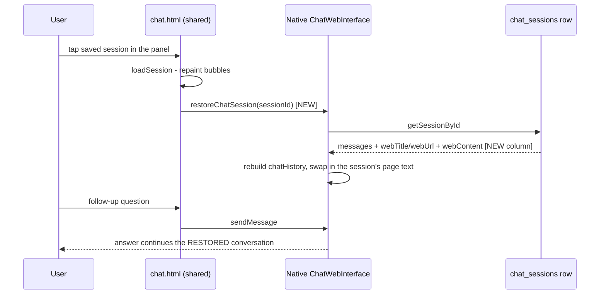

2026-08-03

# EinkBro (Android + iOS): restoring a chat session now restores the LLM's context too

Follow-up to the shared-chat.html port (see `einkbro-ios-chat-html-shared-ui.md`): the two restore bugs that ADR flagged as "deliberately inherited from Android" are now fixed — once, in the shared page and its bridge contract, landing in both apps in the same shape. iOS commit `6f8b047` (einkbro-ios), Android commit `069767de9` (einkbro). This is also the moment `chat.html` became truly byte-identical across the two repos: the Android commit adopts the shared file (bundled `marked.min.js`, awaited bridge calls) alongside the fix.

## What was broken

Tapping a saved conversation in the session panel only repainted the DOM. Two pieces of native state silently kept their old values:

1. **`chatHistory`** — the message list actually sent to the LLM stayed whatever the hosting tab had accumulated. Restore last week's session about page B while chatting about page A, ask "continue where we left off", and the model continues **A**, not the conversation on screen.
2. **The injected page text** — every turn re-sends the page content captured when the *tab* was created, so a restored session about a Wikipedia article was answered against, say, the Google homepage.

A third, iOS-only paper cut: the per-session Open URL / Delete buttons were revealed by CSS `:hover`, so on iOS the first tap on a card acted as hover (showing the buttons) and only a second tap switched sessions — while on Android the tap-through was so immediate that Delete was effectively unreachable.

## The fix

- **New bridge method `restoreChatSession(sessionId)`**, fired at the end of `loadSession` — one call site that covers session-switch, delete-fallback, and (harmlessly) new-session creation, since a fresh session has no stored row and the native side no-ops. The native handler reloads the row, rebuilds `chatHistory` from the stored `{content, isUser}` messages, and swaps in the session's `webTitle`/`webUrl`/`webContent`.
- **`chat_sessions.webContent` column** (iOS DB v7→v8, Android v13→v14, both `ALTER TABLE … DEFAULT ''`). The page text is written **natively only** — it can be hundreds of KB and never changes after creation, so shipping it through the JS bridge on every save would be waste. Save logic: an existing row keeps its stored copy; a new row is seeded from the tab's capture. This also sidesteps a race where the page's redundant save-on-switch could have overwritten the restored session's content with the tab's.
- **Sessions saved before the column existed** restore with blank `webContent`; the request builder now skips the page-content message entirely instead of sending an empty code block — honest "no context" beats wrong context.
- **`@media (hover: none)`** keeps the session-card action buttons always visible on touch screens: one tap switches sessions on iOS, and Delete / Open URL become reachable on both platforms.

## Verification — and an accidental upgrade

Driving the iPhone 16 simulator surfaced a surprise: replies were coming back as real, correct summaries despite a deliberately invalid test key. The resolution: `xcrun simctl spawn <udid> defaults write` operates on a **non-sandboxed preferences plist that a sandboxed app never reads** — the app's real `NSUserDefaults` live in its container (`…/Library/Preferences/<bundle-id>.plist`), which held a valid OpenAI key from earlier manual testing. Every "placeholder key" manipulation had been a no-op against a junk plist.

The upshot: the whole flow got verified against the **live OpenAI API** rather than just the error path — streamed markdown replies rendering in the shared page, `webContent` populating per session in sqlite, app-relaunch survival, single-tap session switching, and a context-aware follow-up ("who founded it?" answered correctly from the restored conversation). The v7→v8 migration ran live on the simulator's existing database. Android was verified to compile (`:app:compileDebugKotlin`, KSP schema `14.json` emitted); its runtime behavior is the same page + a mechanically identical bridge, but hasn't been driven on a device this session.

Worth remembering for future simulator work: **to inspect or edit what an iOS app actually reads from `NSUserDefaults`, go through the container plist, not `simctl spawn defaults`.**
