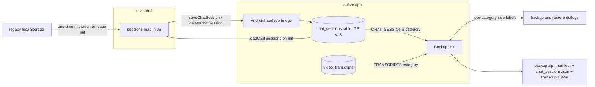

2026-07-31

# Chat sessions in Room; transcripts and chat history join backup with per-category sizes

EinkBro's AI-generated data was only partially covered by backup/restore. Saved GPT
queries were exported, but Gemini video transcripts (expensive to regenerate — each
transcription costs minutes and API quota) and the chat-with-web conversation history
were not. Worse, chat history wasn't even in app storage: `chat.html` kept its sessions
in the WebView's `localStorage` under the `file://` origin, which meant the
"clear IndexedDB on exit" option silently wiped all chat history on every exit — that
option deletes `app_webview/*/Local Storage` wholesale, since the chat UI shares an
origin store with ordinary web pages.

This change makes all of it durable and portable:

- **Chat sessions move to a native `chat_sessions` Room table** (DB v13). The chat page
  now loads and saves sessions through four `AndroidInterface` bridge methods
  (`loadChatSessions`, `saveChatSession`, `deleteChatSession`, `deleteAllChatSessions`)
  instead of `localStorage`. A one-time migration on page init imports any sessions an
  older version left in `localStorage`, then removes the old keys.
- **Two new backup categories**: `TRANSCRIPTS` (video_transcripts) and `CHAT_SESSIONS`,
  exported as `transcripts.json` / `chat_sessions.json` in the backup zip and restored
  with the same replace semantics as the other tables. Google Drive sync picks them up
  automatically since it reuses the same category set.
- **Per-category size labels in both dialogs**, so the user can decide whether bulky
  data is worth including.

## Design decisions

**Persist through the bridge, not by backing up WebView storage.** Teaching BackupUnit
to read the WebView's LevelDB was rejected: it's a binary, Chromium-version-dependent
format, mixed with every website's data, and unsafe to copy while the WebView runs.
Moving persistence to Kotlin gives per-session rows instead of one growing JSON blob
under a single `localStorage` key, and backup inclusion becomes a ~20-line,
`json.has()`-guarded addition like any other table.

**The `messages` column stays an opaque JSON string.** The chat page is the only
reader/writer of message content, so Kotlin stores the array verbatim and never parses
it — no serialization schema to keep in sync across the bridge.

**Empty sessions never reach the database.** The page creates a session per opened chat
tab; only sessions with at least one message are persisted, so the DB doesn't
accumulate "No messages" rows from pages opened but never chatted on.

**New categories are offered only when they contain data**, and the Drive upload uses
the same filtered set, so an empty category is never advertised in a backup manifest.
Old app versions restoring a newer zip simply skip unknown category names — the
manifest parser already ignored them.

**Two different size sources, one dialog.** Backup sizes are estimated from the live
database with `SUM(LENGTH(...))` queries (plus per-row JSON overhead; favicon blobs get
a 4/3 base64 factor) — nothing is serialized twice just to be measured. Restore sizes
are counted from the zip's actual uncompressed entries during the same single pass that
reads the manifest; `ZipEntry.size` is unreliable on a stream, so the bytes are counted
while draining each entry. Because the scan now reads the whole file, it moved off the
main thread onto the IO dispatcher.

## Gotcha discovered along the way

`location.reload()` on `chat.html` is a no-op — the WebViewClient blocks reloading the
chat page (it "has no standalone meaning" without its injected content). The
localStorage migration therefore runs when a chat tab is opened, which is the only way
the page ever initializes anyway; it just makes the migration untestable via a CDP
`location.reload()`.
