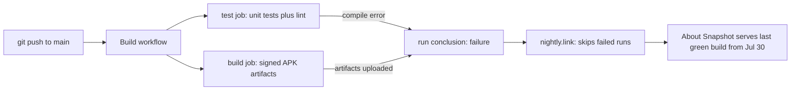

2026-08-02

# EinkBro: CI red for two days, About-screen Snapshot serving a stale build

## What was broken

The About screen's "Update with Snapshot" item was silently serving a two-day-old
build (15.18.0 from Jul 30) even though several newer commits — including the
Android 14 download-dialog fix — had been pushed to main. Nothing looked wrong
from the app's side; the snapshot just never advanced.

## Root cause

The snapshot updater downloads the CI artifact through nightly.link, which only
resolves the **latest fully successful** run of the Build workflow. The workflow
has two independent jobs: `build` (signed release APKs, uploaded as artifacts)
and `test` (locale check, unit tests, lint). A backup refactor (`b793bc058`)
renamed `BackupUnit.getAvailableCategories` to `getAvailableCategoryOptions`
(now returning per-category byte sizes for the restore dialog) but left the unit
tests calling the old API. `compileDebugUnitTestKotlin` stopped compiling, the
`test` job failed on every push, and each run's overall conclusion went red —
so nightly.link kept pointing at the last green run. The `build` job kept
succeeding the whole time, which made the breakage easy to miss: fresh APKs
were being produced on every push, but nothing ever served them.

## The fix

Commit `41b1fa31d`: update the three `BackupUnitJsonTest` tests to the renamed
API, asserting the new list-of-pairs shape (category with uncompressed byte
size, e.g. a 2-byte `bookmarks.json` yields `BOOKMARKS to 2L`, and a category
listed in the manifest with no zip entry yields size 0). Full
`testDebugUnitTest` passes locally; with the run green again, nightly.link
resumes serving the newest artifacts.

Worth remembering: a red `test` job doesn't stop artifacts from being built,
but it does stop them from ever reaching users via the snapshot link — the
staleness is invisible unless you check the served APK's versionCode.
