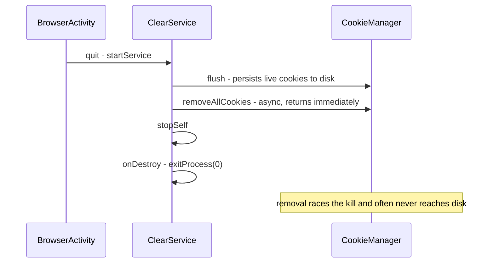
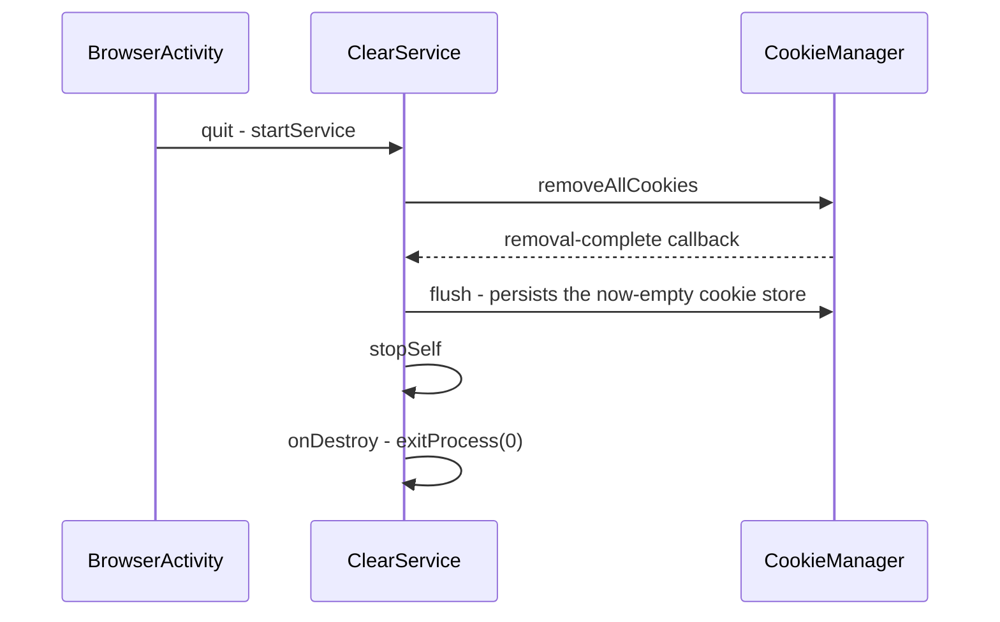

2026-07-15

# Clear-on-exit didn't clear cookies or site storage (issue #512)

## What was broken

With "Clear Cookies" + "Clear on app exit" enabled, users stayed logged in
to websites after quitting EinkBro (issue #512). Two independent defects
combined to produce the symptom:

1. **Cookie clearing raced process death.** Whether cookies actually got
   removed depended on timing — on a fast emulator with many tabs open the
   clear usually won; on a quick exit (close last tab, Menu → Quit) it lost
   and cookies survived. Both outcomes were reproduced on the same build.
2. **The "Clear Indexed Databases and Local WebView Storage" toggle was a
   complete no-op on modern WebView**, so sites that keep login tokens in
   localStorage stayed logged in deterministically, regardless of cookies.

## Root cause 1: flush-before-async-remove, then exitProcess

`ClearService` is started from `BrowserActivity.onDestroy` and kills the
whole process when done (`onDestroy` → `exitProcess(0)`, needed to tear down
WebView threads). The old `clearCookie()` called `CookieManager.flush()`
**first** — persisting the still-logged-in cookies to disk — and then
`removeAllCookies {}`, which is asynchronous. `stopSelf()` ran immediately
after, so the process was hard-killed while the removal was still in flight,
and the removal often never reached the persistent cookie database. On next
launch WebView reloaded the old cookies from disk.

## Root cause 2: site storage deleted from paths that no longer exist

`clearIndexedDB()` deleted `app_webview/IndexedDB` and
`app_webview/Local Storage`. Modern WebView keeps all site storage under the
`app_webview/Default/` profile directory (`Cookies`, `IndexedDB`,
`Local Storage`, `Service Worker`, ...), so the old paths simply don't exist
and nothing was ever deleted.

## The fix

- `BrowserUnit.clearCookie()` is now a suspend function: it calls
  `removeAllCookies`, then `flush()` **inside the completion callback** (the
  order the WebView docs require to guarantee persistence), and only resumes
  once done.
- `ClearService` runs the whole clear in a coroutine and calls `stopSelf()`
  (→ `exitProcess`) only after everything finishes. The cookie wait is capped
  with a 5-second timeout so quitting can never hang. `clearHistory` is now
  awaited too instead of being fire-and-forget into a doomed process. The
  service also returns `START_NOT_STICKY` so the system can't resurrect this
  one-shot service with a null intent after the process exits.
- `clearIndexedDB()` deletes `IndexedDB` and `Local Storage` under both the
  legacy `app_webview/` and the modern `app_webview/Default/` locations.

## Verification

Reproduced and verified on the emulator with the reporter's exact settings
(clear cache/cookies/indexedDB on, clear history off). A test page sets a
persistent cookie plus a localStorage token; after quitting and relaunching,
the old build showed both values intact, the fixed build showed both empty —
in the same fast-exit scenario, run twice. `test_server/state_set.html` and
`state_read.html` are committed as a regression pair.
