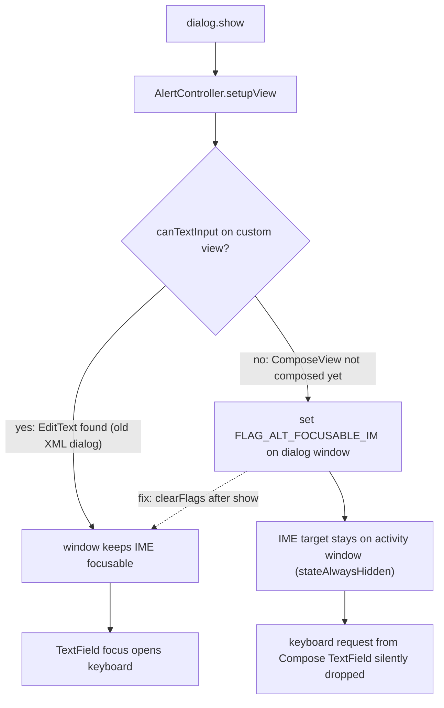

2026-07-14

# EinkBro: keyboard could not open in the image "Save as" Edit dialog

Issue #610: after long-pressing an image on a web page and choosing "Save as", the Edit dialog appears with the filename fields, but tapping them never opens the soft keyboard — the name cannot be changed.

## Root cause

The dialog's text fields moved from an XML layout with real `EditText`s to Compose `OutlinedTextField`s inside a `ComposeView`, set as the custom view of a classic appcompat `AlertDialog` (commit `e966166eb`, first shipped in v15.10.0).

When an `AlertDialog` is shown, appcompat's `AlertController.setupView()` calls `canTextInput(customView)`, which walks the view tree calling `onCheckIsTextEditor()` to decide whether the dialog contains text input. A `ComposeView` has not composed its content at that point — and Compose's `AndroidComposeView` returns false anyway while no text input session is active — so appcompat concludes the dialog has no text input and sets `FLAG_ALT_FOCUSABLE_IM` on the dialog window.

That flag excludes the window from IME targeting. The IME target therefore stays on the activity window underneath, whose manifest `windowSoftInputMode` is `stateAlwaysHidden`. When the Compose text field later requests the keyboard, the request is silently dropped.



Diagnosis was confirmed at the window level on a live repro: `dumpsys window` showed `fl=ALT_FOCUSABLE_IM` on the dialog window, and `dumpsys input_method` showed `mInputShown=false` with `mServedView` still pointing at the WebView while the dialog was open. The flag-setting branch was verified in the decompiled appcompat 1.7.1 bytecode (`Window.setFlags(131072, 131072)` after `canTextInput` returns false).

## Fix

Clear the flag after the dialog is shown (`e1442e50a`). A small extension in `DialogManager.kt`:

```kotlin
fun Dialog.allowImeForComposeContent() = apply {
    window?.clearFlags(WindowManager.LayoutParams.FLAG_ALT_FOCUSABLE_IM)
}
```

applied to the two dialogs whose text fields live in Compose:

- `showSaveFileDialog` — the reported bug
- `showInstapaperCredentialsDialog` — identical latent bug; its username/password fields could not be typed into either

Other Compose-backed `AlertDialog`s without text fields are unaffected and keep the default behavior. Dialogs using plain `EditText`s (`TextInputDialog`) never had the problem, because `canTextInput` detects them.

Verified end-to-end on an emulator: before the fix, tapping the Title field left `mInputShown=false`; after it, the keyboard opens, the field takes focus, and typed characters land at the cursor.

The issue also requests a feature (choosing the download location and renaming before the download starts); that is intentionally out of scope for this fix.
