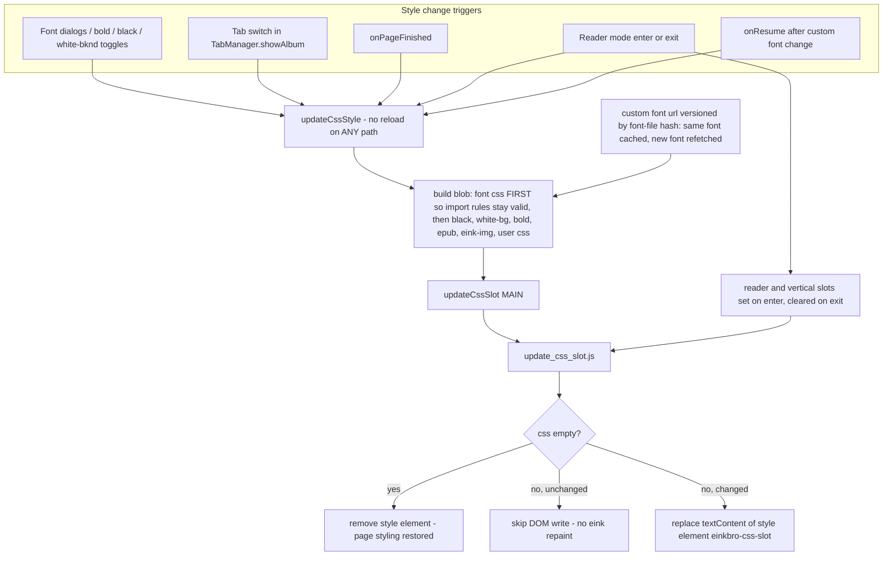

2026-07-12

# EinkBro: managed CSS slots — font and style changes without page reloads

Users reported that choosing a new font type sometimes did nothing, and reverting to the original font always forced a full page reload. Both symptoms traced back to the same design flaw in how EinkBro injected CSS into the WebView: every style change appended a **new anonymous `<style>` tag** to `<head>`, and nothing was ever removed.

## What was broken, and why

The append-only injection produced a family of failures, each looking like "the font setting is broken" from the user's side:

- **Switching away from a CUSTOM font silently failed.** The custom-font CSS targets `html body *` (specificity 0-0-2) while every other font type targets `* ` (0-0-0), all `!important`. Appending the new font's rule couldn't beat the stale custom rule still sitting in `<head>`, so nothing visibly changed until a reload.
- **Google-font types died whenever black-font was enabled.** The web fonts load via `@import url(fonts.googleapis.com/…)` inside the injected style, but the blob concatenated the black-font CSS *first*. CSS requires `@import` to precede all other rules, so the browser silently discarded the import — common on e-ink devices where black-font is a popular setting.
- **The reader font stuck after exiting reader mode.** Leaving reader mode restored `body` from a cached copy but left the reader-font `* { font-family … !important }` style in `<head>`.
- **Background tabs never picked up font changes.** Only the foreground tab's WebView was updated on a preference change.
- **Every "off" path needed a reload.** System-default font, bold off, black off, white-background off — all fell back to `webView.reload()` because appended styles couldn't be taken back.
- A small real bug on top: the `readerCustomFontInfo` setter checked `fontType` instead of `readerFontType` when deciding to flag a pending custom-font refresh.

## The fix: ID-addressed style slots

A new `update_css_slot.js` asset (and `WebViewJsBridge.updateCssSlot(slot, css)`) gives every styling concern a stable `<style id="einkbro-css-<slot>">` element. Updating a slot **replaces** its content; empty CSS **removes** the element, restoring the page's own styling; identical CSS **skips the DOM write entirely**, which matters on e-ink where every repaint is visible. Slots: `main` (the recomputed font/style blob), `reader`, `vertical`, `highlight`, `translation`.

With replacement semantics, the individual bugs fall out by construction:

- The CUSTOM-font specificity trap is gone — old rules are replaced, not shadowed.
- `updateCssStyle()` now builds the font CSS *first* in the blob, so `@import` rules are valid regardless of which other styles are enabled.
- Exiting reader mode clears the `reader`/`vertical` slots and recomputes the `main` slot with the normal-mode font.
- `TabManager.showAlbum` re-applies the current config on every tab switch; the no-op guard makes this free when nothing changed.
- Reverting anything just clears (part of) a slot — every `reload()` fallback in the preference listener and menu handler was deleted.

Two adjacent cleanups rode along. The custom font's synthetic URL (`mycustomfont…`, served through `shouldInterceptRequest`) was cache-busted by an incrementing counter on *every* style update, forcing pointless font refetches; it is now versioned by a hash of the configured font file — same font hits the cache, a new font file forces a refetch, and the `onResume` handler for custom-font changes became a plain style update instead of a reload. And the font-boldness slider previously injected its own bold CSS that — once the reload fallbacks were removed — nothing could ever clear; it now routes through the same `updateCssStyle()` recompute, which also makes it respect per-site boldness overrides.

## Verification

Driven end-to-end on the emulator via UI automation plus Chrome DevTools Protocol assertions against the live DOM. A single page session survived the full cycle — serif → google-serif → default, black font on/off combined with a web font (the `@import` stays an active CSSOM rule now), reader mode enter / different reader font / exit, bold on/off — with a JS marker proving the page was **never reloaded once**, and the style count in `<head>` never exceeding one slot element.

## Deferred

Installing the style applier via `addDocumentStartJavaScript` would remove the brief flash of un-styled text on page load, but the CSS depends on per-URL domain overrides that aren't known at registration time — left as a follow-up.
