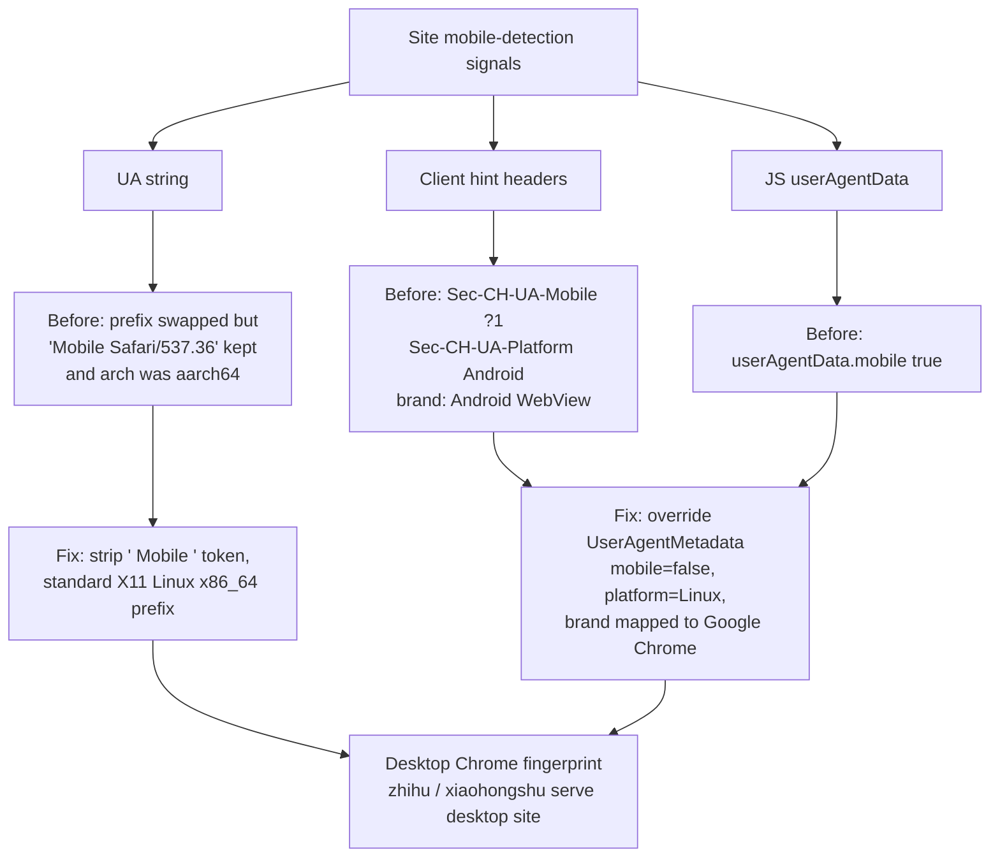

2026-07-14

# EinkBro: Desktop Mode Presents a Complete Desktop Chrome Fingerprint

**Issue:** [#498](https://github.com/plateaukao/einkbro/issues/498) — desktop mode had no effect on zhihu.com and xiaohongshu.com; both kept serving the mobile "open in App" page. VIA browser's desktop mode worked on the same phone, so it was an EinkBro problem, not a device problem.

## What was broken

Desktop mode was implemented as a user-agent *prefix* swap: replace `Mozilla/5.0 (Linux; Android 14; ...)` with `Mozilla/5.0 (X11; Linux <os.arch>)` and reload. That left three independent ways for a site to still identify the browser as an Android phone — and sites that aggressively funnel mobile users into their native apps check all of them:

1. **The UA string still contained `Mobile`.** Only the parenthesized prefix was replaced, so the suffix `Chrome/150.0.7871.46 Mobile Safari/537.36` survived. A server-side regex for `Mobile` — the most common mobile check — still matched. The prefix also embedded the device's real CPU arch (`aarch64`), itself a mobile tell, where real desktop Chrome reports `x86_64`.

2. **UA client hints still said Android.** Overriding the UA string via `WebSettings.setUserAgentString` does *not* stop Chromium WebView from sending the low-entropy client hint headers with system-default values on every request: `Sec-CH-UA-Mobile: ?1`, `Sec-CH-UA-Platform: "Android"`, and a `Sec-CH-UA` brand list containing `"Android WebView"`. On the JS side, `navigator.userAgentData.mobile` stayed `true`. A site never has to parse the UA string at all to detect mobile.

3. **New tabs used stale settings.** `TabManager` speculatively pre-creates the next tab's WebView ~500 ms after each tab add. That pooled WebView snapshots the config at creation time, so a tab opened *after* toggling desktop mode carried the previous mode's UA until something reloaded its preferences.

This explains the confusing symptom pattern in the issue thread: baidu worked (it evidently only checks the prefix tokens) while zhihu/xiaohongshu didn't, and other minimal browsers whose desktop mode emits a clean desktop UA worked fine.

## The fix

Three files, one commit (`b0fdbf642`):

- **`WebViewConfigApplier.updateUserAgentString()`** now also strips the `" Mobile "` token in desktop mode, producing exactly the shape real desktop Chrome sends: `Mozilla/5.0 (X11; Linux x86_64) AppleWebKit/537.36 (KHTML, like Gecko) Chrome/<ver> Safari/537.36`.

- **New `updateUserAgentClientHints()`** uses the androidx.webkit `UserAgentMetadata` API (`WebViewFeature.USER_AGENT_METADATA`, available since webkit 1.10, project is on 1.11) to override the client hints in desktop mode: `mobile=false`, `platform="Linux"`, `architecture="x86"`, `bitness=64`, empty model, and the `"Android WebView"` brand rewritten to `"Google Chrome"` (the brand list is sent on every request, so leaving it would give the platform away just like the UA string). The system default metadata is cached per WebView and restored when desktop mode turns off.

  A deliberate subtlety: the metadata is left completely untouched until desktop mode is first enabled. When only the UA *string* is overridden, WebView keeps high-entropy hints empty — a privacy-friendly default. Calling `setUserAgentMetadata` even with default values would start actively populating them, so the override is gated behind a per-WebView "have we ever overridden" flag.

- **`TabManager.addAlbum()`** refreshes the user agent on the preloaded WebView when consuming it, so tabs opened after a toggle no longer inherit the stale mode.

- **`BrowserUnit.UA_DESKTOP_PREFIX`** became a constant `Mozilla/5.0 (X11; Linux x86_64)` instead of embedding `System.getProperty("os.arch")`.

## Verification

Driven headlessly on the emulator via CDP-over-adb against a local header-echo server (served through `adb reverse` so `localhost` counts as a secure context and client hints are actually sent). In desktop mode the full fingerprint — UA string, all `Sec-CH-UA-*` request headers, and `navigator.userAgentData` — is now indistinguishable from desktop Chrome on Linux. Both sites from the issue then serve their desktop layouts (zhihu's desktop login page; xiaohongshu's desktop explore feed with no app banner). Toggling desktop mode off at runtime restores the exact Android/mobile defaults, including in freshly opened tabs exercising the preloaded-WebView path in both directions.

One part of the report was out of scope: a third-party "JumpTo APP" launcher on the reporter's phone hijacking link navigation is not something the browser can prevent.
