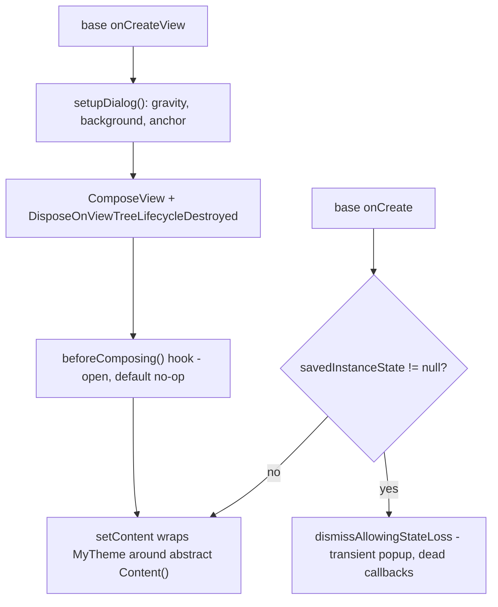

2026-07-07

# EinkBro: ComposeDialogFragment owns theme, composition strategy, and restore guard

## Why

A UI audit of the 24 Compose dialog fragments found the base class doing too
little, so every subclass re-solved the same problems:

- `composeView.setContent { MyTheme { ... } }` was copy-pasted 26 times.
- No fragment set a `ViewCompositionStrategy` (zero uses in the app);
  the default is adequate for the dismiss path but not for fragment-view
  teardown paths that skip window detach.
- None handled process-death restore. Every one of these dialogs takes
  required constructor parameters — lambdas, ViewModels, in one case a live
  WebView — so `FragmentManager` reflectively re-instantiating them after a
  low-RAM kill throws `Fragment.InstantiationException`. Today this is
  masked in `BrowserActivity` by a deliberate `super.onCreate(null)` that
  discards all fragment state — a hack that also throws away state other
  components might legitimately want restored.

## The new contract

Subclasses now implement a single `@Composable Content()`; the base owns the
theme wrap, the composition strategy, and the restore guard. Fragments that
had statements before `setContent` (BookmarksDialogFragment seeds state and
launches its uiState collection job; FontBrowserDialogFragment sets
`shouldShowInCenter` and the folder uri) moved them into the
`beforeComposing()` hook. Local vals that were only read inside the old
composition lambda moved inside `Content()`.

Two fragments needed individual treatment: `TranslateDialogFragment`
overrides `onCreateView` (anchor positioning + starting the translation) but
calls through to super, so it only needed the `Content()` conversion; and
`TextEditorDialogFragment` turns out not to extend `ComposeDialogFragment`
at all — it got its own restore guard since its constructor lambdas have the
same process-death problem.

Dropping restored dialogs (rather than recreating them) is correct behavior
here: they are transient popups, and a restored instance would hold dead
callbacks into a destroyed activity. The guard runs after instantiation, so
for these constructor-parameterized classes the first line of defense under
`BrowserActivity` remains its `onCreate(null)`; the base-class guard covers
any host that does restore fragment state, and any future no-arg dialog.

## Verification

Emulator, debug build: menu dialog (28 actions), font-size dialog, and the
bookmarks dialog (the `beforeComposing()` user — folder grid populated from
its collection job, favicons rendered) all open and render correctly after
the migration; full project compiles with zero errors; 27 files changed with
net −34 lines.
