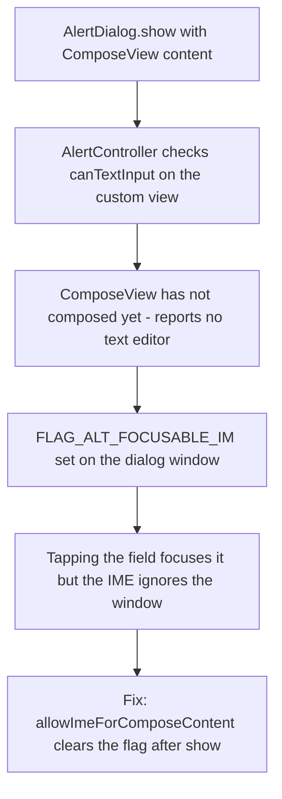

2026-08-08

# Dialog text fields: keyboard never opened, caret invisible

After installing the release build of the new start-page customization on a
real phone, the "Edit title" dialog could not be edited at all: tapping the
text field never brought up the keyboard. Once that was fixed, a second issue
surfaced — the caret was invisible when the field had focus. Both were
verification blind spots: the emulator tests typed with `adb shell input
text`, which injects key events and bypasses the IME entirely, so neither bug
could show up there.

## Bug 1: the soft keyboard never opened

This is a known trap in this codebase: `AlertController` decides at show time
whether its custom view contains a text editor, but a `ComposeView` composes
later, so dialogs whose fields live in Compose are wrongly excluded from IME
targeting. The existing `Dialog.allowImeForComposeContent()` helper (already
chained by the Instapaper login dialog) clears the flag; the new
`StartPageConfigDialog` and the older `StartPageItemDialog` "enter manually"
flow were missing it.

## Bug 2: the caret was invisible

`OutlinedTextField`'s cursor color defaults to `MaterialTheme.colors.primary`,
and the app's dark palette sets `primary = Color.Black` — a black caret on the
dialog's black surface. The field was focused and the caret blinking, just
unseeable. The app's other input dialogs (font browser, task input, text
editor) already set `cursorColor = MaterialTheme.colors.onBackground` for this
reason. The fix applies the same to every dialog that only set `textColor`:
both start-page dialogs, the filename dialog, and the Instapaper login.

## Process change

Verification now must exercise the real IME path: after an `adb shell input
text` sanity check, tap the field and confirm the soft keyboard opens, the
caret is visible (captured across blink phases), and typing works through the
keyboard. Key-event injection is not how users type, so it cannot be the only
evidence a text field works.
