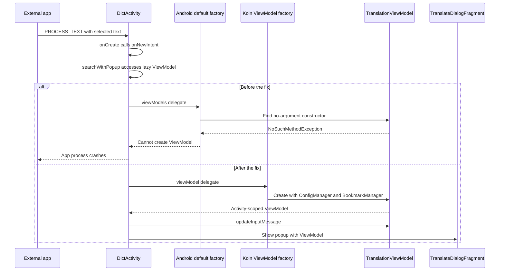

2026-09-26

# EinkBro: fix external translation popup crashes by using Koin's ViewModel factory

## What was broken

On the connected P7 running Android 14, EinkBro 16.7.0 crashed when an external app opened the dictionary activity and the request took the translation-popup path. The installed app was the local package `info.plateaukao.einkbro`, version code `160700`, targeting API 36. The failure happened during activity startup, before the user could use the popup.

The device's crash buffer contained three identical failures on September 26 at 13:24:39, 13:26:14, and 13:26:26. All three were main-thread exceptions in `DictActivity`:

```text
FATAL EXCEPTION: main
Process: info.plateaukao.einkbro
Unable to start activity ... activity.DictActivity
Caused by: RuntimeException: Cannot create an instance of class a6.z0
Caused by: NoSuchMethodException: a6.z0.<init> []
```

The obfuscated name alone could suggest a shrinking problem, but the source and local release mapping pointed to `TranslationViewModel`. The locally available mapping used a different R8 map ID from the installed APK, so it was corroborating evidence rather than an exact retrace of that binary. The source-level call chain and missing no-argument constructor establish the cause independently.

## Why this entry point failed

`DictActivity` handles both Android's `ACTION_PROCESS_TEXT` and ColorDict's `SEARCH` / `PICK_RESULT` intents. Its `onCreate()` forwards the initial intent to `onNewIntent()`. For process-text requests, either `externalSearchWithGpt` or `externalSearchWithPopUp` enables the popup; otherwise the activity forwards the text to `BrowserActivity`. ColorDict requests use the popup when `externalSearchWithGpt` is enabled and otherwise forward to the browser.

The crash was in the shared popup path. `searchWithPopup()` first calls `translationViewModel.updateInputMessage(text)` and then creates `TranslateDialogFragment` with that ViewModel. Accessing the lazy property is therefore the first operation that requires the ViewModel to exist.

Before the fix, the property used Android's default factory:

```kotlin
import androidx.activity.viewModels

private val translationViewModel: TranslationViewModel by viewModels()
```

However, the ViewModel has two required constructor arguments:

```kotlin
class TranslationViewModel(
    private val config: ConfigManager,
    private val bookmarkManager: BookmarkManager,
) : ViewModel()
```

There is no no-argument constructor for the default factory to call. The resulting reflection failure propagates through `searchWithPopup()`, `onNewIntent()`, and `onCreate()`, and Android reports that it cannot start the activity.

Koin already knows how to create this object. `EinkBroApplication` registers `viewModel { TranslationViewModel(get(), get()) }`, and `BrowserActivity` already obtains its own instance through Koin's ViewModel delegate. `DictActivity` bypassed that registered factory. The failure was a mismatch between the delegate and the constructor, not a reason to add a constructor keep rule or make the required dependencies optional.

## The fix and resulting flow

The fix replaces the Android delegate with Koin's delegate:

```kotlin
import org.koin.androidx.viewmodel.ext.android.viewModel

private val translationViewModel: TranslationViewModel by viewModel()
```

Koin resolves `ConfigManager` and `BookmarkManager` from the application's existing dependency container and creates the activity-scoped ViewModel. The activity continues to own the ViewModel through its normal lifecycle; the popup receives the same instance that was used to set its input text. No new factory or dependency registration is needed.



This addresses every request that reaches `searchWithPopup()`, including both initial startup and a new intent delivered to the existing activity. The existing preferences still choose between showing the popup and forwarding a request to the browser.

## Local build and signing

The corrected `release` variant was built for `arm64-v8a`, including R8 minification, using the signing configuration from `~/bin/bri`: `~/browser.keystore`, alias `browser`, supplied through Gradle's `android.injected.signing.*` properties. The build completed successfully.

The resulting APK's SHA-256 signing certificate matched the installed application's certificate:

```text
85ca929ba5b709f910b7513fd5be1045f0cebf1ad091ab7123ede3380905ba65
```

The APK was installed with `adb -s b59a752d install -r`, updating the existing app without uninstalling it or clearing its data. This is the local device signing path. The Play upload key in `~/.secrets/einkbro-keystore.properties` belongs to the Play build workflow and is not the key to use for these installs.

The new project `AGENTS.md` records the user's explicit requirement: never install Play Store builds (`playRelease`, package suffix `.g`) on local devices. Use the local release variant and bri's keystore instead.

## Verification on the P7

After installation, a cold launch of the previously failing entry point used this request:

```bash
adb -s b59a752d shell am start -W \
  -n info.plateaukao.einkbro/.activity.DictActivity \
  -a android.intent.action.PROCESS_TEXT \
  --es android.intent.extra.PROCESS_TEXT verification
```

Android returned `Status: ok` and `LaunchState: COLD`. The app started as PID `23200`. A sim-use UI inspection showed the translation popup, including its Translate, Word, Explain, Copy text, and Close controls. This exercises the lazy ViewModel access that previously crashed during startup.

A subsequent `colordict.intent.action.SEARCH` request with `EXTRA_QUERY=verification` was delivered to the running activity. With the device's current preferences, it took the forwarding path; the final sim-use inspection showed the browser toolbar. The same app process remained alive, and the crash buffer filtered to PID `23200` contained no entries.

The verification proves that process-text popup creation succeeds in the signed, minified release and that the subsequent dictionary request completes. It does not establish successful translation service responses, every provider, the ColorDict GPT-popup branch, or activity restoration after process death. Those behaviors were not changed or fully exercised in this check.

## Files and takeaway

- `app/src/main/java/info/plateaukao/einkbro/activity/DictActivity.kt`: switch to Koin's ViewModel delegate.
- `AGENTS.md`: record the local signing and installation requirements.
- `EinkBroApplication.kt` and `BrowserActivity.kt`: existing registration and working usage consulted during diagnosis; unchanged by this fix.

A ViewModel with required constructor dependencies must be obtained through the factory that supplies them. An entry point that forwards requests can appear healthy until a preference selects a branch that first accesses its lazy ViewModel. Testing the external popup directly matters because opening the main browser does not exercise this activity's factory.

Implementation: [3794877c4](https://github.com/plateaukao/einkbro/commit/3794877c4), `fix(dict): inject translation ViewModel through Koin`.
