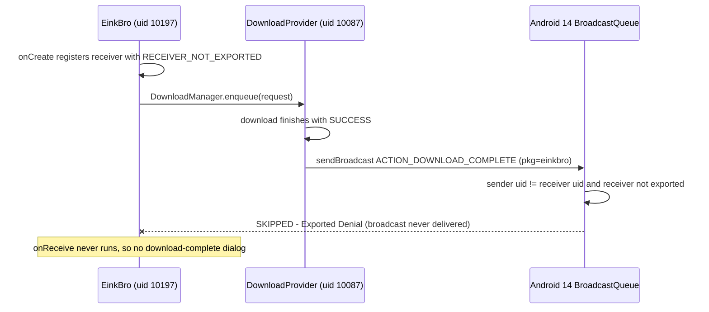

2026-08-01

# EinkBro: download-complete dialog silently gone on Android 14+

## What was broken

After a file finished downloading, EinkBro no longer showed the "download
complete — open it?" dialog. The download itself succeeded (the file landed in
`Download/` and the system notification appeared), but the app acted as if it
never heard about it. The dialog still worked on older e-ink devices, which made
it look like a recent regression — it wasn't.

## Root cause

The dialog is shown by a `BroadcastReceiver` listening for
`DownloadManager.ACTION_DOWNLOAD_COMPLETE`, registered in
`BrowserActivity.onCreate` with `ContextCompat.RECEIVER_NOT_EXPORTED`. That flag
was chosen back in January 2024 by the same commit that bumped targetSdk to 34
(`d6b7ca0ee`), because Android 13+ requires every runtime receiver to declare an
export state.

The subtlety: `ACTION_DOWNLOAD_COMPLETE` is not a system broadcast. It is sent
by the DownloadProvider *app* (`com.android.providers.downloads`), which runs
under its own uid. A `NOT_EXPORTED` receiver only accepts broadcasts from the
app itself or the system uid — so starting with Android 14, the OS drops the
broadcast at enqueue time without any visible error. `dumpsys activity
broadcasts history` shows it verbatim:

```
SKIPPED ... reason: skipped by policy at enqueue: Exported Denial:
sending Intent { act=android.intent.action.DOWNLOAD_COMPLETE pkg=info.plateaukao.einkbro }
from com.android.providers.downloads (uid=10087)
due to receiver ... not specifying RECEIVER_EXPORTED
```

So the bug sat latent for two and a half years: devices on Android 13 and older
kept delivering the broadcast, and only testing on an Android 14 emulator
surfaced it. Nothing in the app changed — the test environment did.



## The fix

Commit `978b08d70`: register the receiver with `ContextCompat.RECEIVER_EXPORTED`
instead. This is the standard remedy for this well-known `DownloadManager`
gotcha, and it is safe here because the receiver never trusts the incoming
intent: it ignores the broadcast payload entirely and re-queries
`DownloadManager` using the download id the app stored when it enqueued the
request. A spoofed broadcast can at worst make the app re-check its own
download.

Verified on the Android 14 emulator: the same test download that previously
showed `SKIPPED — Exported Denial` in the broadcast history now shows
`DELIVERED`, and the full download → dialog → open-file flow works again.

The fix matters doubly for the new Google Play build (`playRelease`), which
targets SDK 35 — every Play user is on the enforcement side of this behavior.
