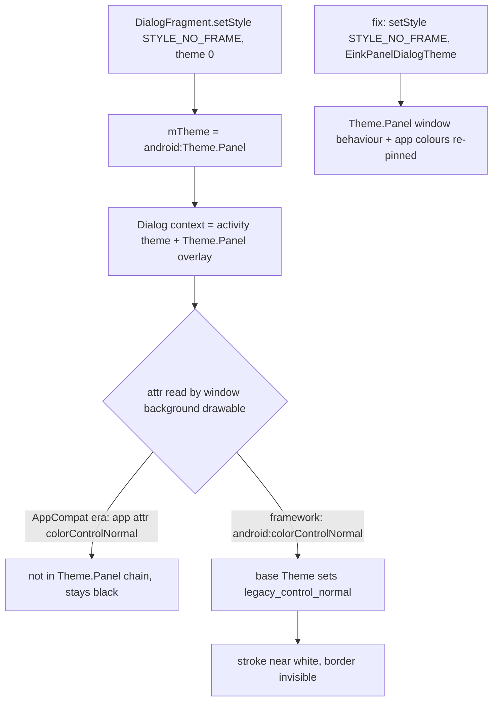

2026-08-23

# EinkBro: drop AppCompat in favour of framework Material (APK -9%)

Third cut in the APK-size series, after Material Components and WorkManager.
AppCompat showed up as about 200 KB of dex, but the app's use of it was thin:
framework-equivalent replacements existed for every call site, and the real
surprise was how much more than 200 KB it took with it. The arm64 release APK
goes from 4.79 MB to 4.38 MB, `classes.dex` from 5.58 to 5.26 MB, and
`resources.arsc` from 1.16 to 1.05 MB; the APK's entry count drops from 653
to 368 once AppCompat's drawables, layouts and themes are no longer packaged.

## What AppCompat was doing

The app has no XML layouts (all UI is Compose), so AppCompat was not
inflating anything. The full list of uses was: `androidx.appcompat.app
.AlertDialog` in nine dialog classes, `AppCompatDialogFragment` as the base of
`ComposeDialogFragment` and the text editor, `AppCompatActivity` for
`DictActivity`, two `AppCompatImageButton`s in the translation panel, one
`ContextThemeWrapper`, `AppCompatDelegate.setDefaultNightMode(FOLLOW_SYSTEM)`,
and `Theme.AppCompat.DayNight.*` as the parent of the app and dialog themes.

Each has a framework counterpart available on minSdk 24: `android.app
.AlertDialog`, `androidx.fragment.app.DialogFragment`, `FragmentActivity`,
`ImageButton`, `android.view.ContextThemeWrapper`, and `Theme.Material.Light
.NoActionBar` in `values/` with `Theme.Material.NoActionBar` in
`values-night/`. Day/night never depended on AppCompat: the app already
keeps its dark variant in `values-night/` and lets the system `uiMode` pick
it, which is exactly what `MODE_NIGHT_FOLLOW_SYSTEM` amounts to.

Theme attributes move to the `android:` namespace (`colorPrimary`,
`colorControlNormal`, `dialogTheme`, `buttonBarPositiveButtonStyle`,
`backgroundTint`), and the 87 vector drawables that tint with
`?attr/colorControlNormal` now read `?android:attr/colorControlNormal`.

## Why merely removing the references was not enough

After the code and theme swap the dex still held 131 AppCompat classes
(Toolbar, ActionMenuView, MenuBuilder, ...). Nothing in the app referenced
them; they were in R8's `seeds.txt` because AGP generates keep rules for
every View class named in any merged layout, AppCompat's own `abc_*.xml`
layouts included. The resource shrinker removes those layouts afterwards,
but by then R8 has already kept the classes. So AppCompat has to leave the
classpath entirely: it is excluded from `constraintlayout` and
`koin-android`, removed from `adblock-client` (which declared it but never
used it), and the unused `koin-android-compat` dependency goes with it. That
second step was worth another about 120 KB of dex and all of the resource savings.

## The dialog border that disappeared

The first emulator pass looked fine until the menu dialog came up without its
rounded black border, and every other Compose dialog (font picker, touch
area, translate panel) had lost it too. The window background is
`background_with_border_margin.xml`, whose stroke colour is the
`colorControlNormal` attribute.

`DialogFragment.setStyle(STYLE_NO_FRAME, 0)` does not mean "no theme": the
androidx implementation substitutes `android.R.style.Theme_Panel` when the
theme argument is zero. `Theme.Panel` inherits from the legacy base `Theme`,
which defines `colorControlNormal` as `@color/legacy_control_normal`, and the
dialog's `ContextThemeWrapper` applies that whole chain on top of the
activity theme. AppCompat's attribute lived in the app's namespace and was
never touched by that overlay, so the old setup worked by accident. The fix
is an explicit `EinkPanelDialogTheme` (parent `android:Theme.Panel`) that
re-pins `android:colorControlNormal`, `colorPrimary`, `colorAccent` and the
text colours, with a `values-night/` variant, passed to `setStyle` by
`ComposeDialogFragment` and `TranslateDialogFragment`.

Two smaller theme details from the same pass: `Theme.Material.Light.Dialog
.Alert` is a full theme rather than an overlay, so `TouchAreaDialog` must
re-pin `android:colorAccent` or radio buttons come out Material teal; and
`Widget.Material.Button.ButtonBar.AlertDialog` is a private platform style,
so the dialog buttons use the public `Widget.Material.Button.Borderless`.

## Verification

`./gradlew test` passes (230 tests). On the emulator: toolbar and menu icons
are tinted black, the menu and font dialogs have their border in both day
and night mode (the night check was a cold start, since the app's dark-mode
setting defaults to "disabled" and deliberately ignores live `uiMode`
flips), the framework AlertDialogs (bookmark-folder text input with the soft
keyboard, App-language radio list) match the previous look, and logcat shows
no errors.

## Where this leaves the APK

4.38 MB, down from 6.19 MB at the start of the series (-29%). The dex is
now Compose (about 1.3 MB), the app's own code (about 1 MB), pdfbox + fontbox (350 KB,
Save-as-PDF), OkHttp + okio (195 KB, needed for the Edge TTS WebSocket and
SSE streaming) and Kotlin/coroutines runtime. No single-purpose library is
left to remove.
