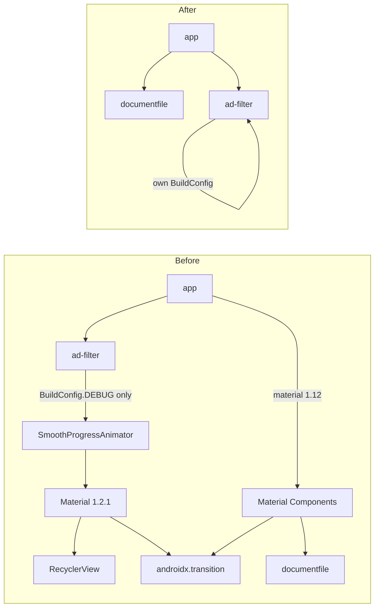
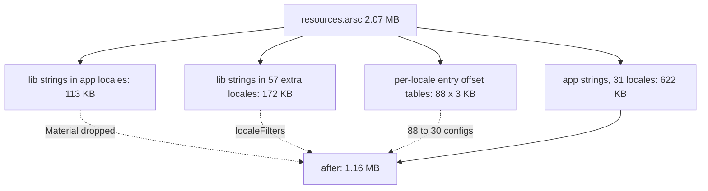

2026-08-22

# EinkBro: drop Material Components and library-only locales (APK -21%)

An APK Analyzer pass on the arm64 release build (6.19 MB) was meant to find
"library-level cuts" - whole dependencies, or big chunks of one, that R8 cannot
strip because something still references them. It found that Material
Components was on the classpath twice, that nothing needed it, and that the
2.07 MB `resources.arsc` was mostly strings the UI never shows.

Result: **6.19 MB -> 4.89 MB** for the arm64 release APK.

| | before | after |
|---|---|---|
| `classes.dex` (raw / deflated in APK) | 6.22 / 2.97 MB | 5.77 / 2.75 MB |
| `resources.arsc` (stored, uncompressed) | 2.07 MB | 1.16 MB |
| locale configs in the resource table | 88 | 30 |
| entries in the APK | 1038 | 657 |

A note on reading APK Analyzer: `classes.dex` is *deflated* inside the APK
(52%), so its 6.2 MB "raw" size is the on-disk cost after install, not the
download cost. `resources.arsc` really is stored uncompressed - targetSdk 30+
requires it so the platform can mmap it - so every byte there is download.

## What was keeping Material Components alive

`apkanalyzer dex packages --proguard-mapping` on the release build showed
`com.google.android.material` at 178 KB of dex and `androidx.recyclerview` at
96 KB, although the app has no XML layouts and no RecyclerView anywhere.
Following the references:

**In `app`**, `material:1.12` served exactly three things: a
`HelperUnit.setBottomSheetBehavior()` helper with no callers, the parent of the
`TouchAreaDialog` / `MyButtonStyle` dialog styles, and an unreferenced
`CustomSnackbar` style. The dialog styles now parent
`Theme.AppCompat.DayNight.Dialog.Alert` and
`Widget.AppCompat.Button.ButtonBar.AlertDialog`; the rest is deleted, along
with a stale `res/styles.xml` sitting outside `values/` that AAPT never
compiled. RecyclerView was being kept only because Material's own
date-picker layouts reference it.

**In `ad-filter`**, the dependency was subtler. `ScriptInjection.kt` imported
`io.github.edsuns.smoothprogress.BuildConfig` - the `BuildConfig` of the
`SmoothProgressAnimator` AAR - just to read `DEBUG` and decide whether to
uncomment the `{{DEBUG}} console.log(...)` lines in the injected JS. A
prebuilt AAR's `BuildConfig.DEBUG` is always `false`, so that logging had
never been enabled in any build, and the import cost a second copy of
Material (1.2.1), RecyclerView and `androidx.transition`. The module now
enables `buildFeatures.buildConfig` and reads its own flag, which also means
the JS debug lines finally switch on in debug builds.

Two things had been reaching the app transitively through Material and are
now declared directly: `androidx.documentfile` (SAF folder access for fonts,
Supernote storage and EPUB export) and the `backgroundColor` theme attribute
read by the bordered drawables and `MainContentLayout`, now declared in
`attrs.xml`. `FabImageViewController` switched from
`androidx.transition.TransitionManager` to the framework class of the same
API (minSdk 24 is well past its API 19 introduction), so that library goes
too.

## What was filling resources.arsc

The resource table carried 88 locale configurations although the app is
translated into 31. The other 57 came from AppCompat and Material: the
strings for date pickers, time pickers, chips, badges and so on, translated
into every locale Google ships. Each such config is not just its string
bytes - every config chunk of the `string` type carries an entry-offset
table for all ~780 string entries (about 3 KB), whether or not that locale
defines them.

`androidResources.localeFilters` now lists the 31 locales that exist under
`values-*/` (and that the in-app language picker offers). This only affects
library strings: the app's own translations were already limited to those
locales, and a device set to an unlisted language fell back to English for
the app's UI anyway. The list has to be kept in sync with `values-*/` and
`TranslationLanguageDialog.showAppLocale()`.

This is the sideloaded-APK equivalent of the Play language splits an AAB
gets automatically, and it helps the GitHub and F-Droid builds, which the
AAB machinery never touches.

## Verification

`./gradlew test` passes (230 tests). On the emulator the two re-parented
dialog styles were exercised: the list dialog behind Settings > App language
and the text-input dialog behind bookmark-folder creation both render in the
bordered black-on-white style, the soft keyboard opens on the input field and
text typed through it lands, and switching the app locale to a translated
language and back resolves the right strings. The `backgroundColor` attr
resolves with no `ResourceType` warnings in logcat.

## What is left on the table

The dex breakdown after this change, by library: Compose (~1.3 MB across
ui/foundation/material/runtime/animation), pdfbox + fontbox (350 KB,
deliberate - the Save-as-PDF feature), `androidx.work` (161 KB, used only by
ad-filter's filter-list downloader and replaceable with a coroutine), OkHttp
(120 KB), AppCompat widgets (112 KB). WorkManager is the next realistic cut;
the rest is feature cost.
