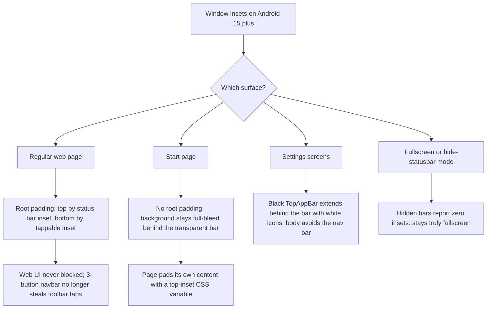

2026-08-09

# EinkBro: system bars overlapped all UI after targetSdk 36 (edge-to-edge enforcement)

## What was broken

On phones running Android 15 or newer (reported on Pixel devices running
Android 17, issue #628), EinkBro 16.1.x drew everything underneath the system
bars:

- The start page's search box jumped to the top of the screen when focused and
  landed underneath the status bar clock.
- Every settings screen (main settings, site settings, highlights, and the nine
  list/config screens) rendered its header under the status bar.
- Web pages started at the very top of the screen, hiding site headers.
- With classic 3-button navigation, the bottom toolbar sat underneath the
  navigation bar, so every tap aimed at the toolbar hit Back/Home/Recents
  instead — the app was effectively unusable (the trigger for issue #628).

E-ink readers and anything below Android 15 were unaffected, which is why the
regression went unnoticed until the app returned to the Play Store and phone
users installed it.

## Root cause

Version 16.1.0 bumped `targetSdk` from 34 to 36. Starting with Android 15,
apps targeting SDK 35+ get **enforced edge-to-edge**: every window is laid out
behind the system bars, `android:statusBarColor` is ignored (the bar is always
transparent), and `setDecorFitsSystemWindows(true)` — the mechanism the app
relied on to keep content below the bars — becomes a no-op. At targetSdk 36
there is no opt-out attribute anymore. Nothing in the app applied
`WindowInsets` itself, so nothing kept content out of the bar areas.

## The fix — three different strategies for three kinds of surface

A single blanket "pad everything below the bars" was tried first and rejected:
it put a flat strip on top of the start page, whose custom background image is
meant to fill the whole screen. Each surface type wants a different
relationship with the transparent bars:

### Browser window (`ChromeSetupDelegate.updateTopInsetForPage`)

The existing `setOnApplyWindowInsetsListener` now pads the browser root:

- **top** by the status bar inset — but only when the current tab is *not* the
  start page, so regular pages sit below an opaque-looking bar while the start
  page stays immersive;
- **bottom** by the `tappableElement` inset — 3-button navigation reports its
  bar height there (it is opaque and consumes taps), while the gesture pill
  reports zero, so gesture users keep the full-bleed look they had before.

The check also runs from the existing global-layout listener, because tab
switches and navigations all end in a layout pass, and the padding must follow
whichever page is current. Hidden bars report zero insets, so fullscreen mode
and the hide-statusbar setting behave exactly as before; on pre-15 devices the
decor still consumes the insets before they reach the root, making the whole
path a no-op there.

### Start page (`start_page.html` + `BookmarkRenderer` + `NinjaWebViewClient`)

The page keeps drawing behind the transparent status bar so a custom
background image fills the screen. Its content pads itself with a
`--top-inset` CSS variable: the body in normal state, and
`calc(var(--top-inset) + 16px)` for the search-focused state that pins the
search box to the top.

The value is injected twice on purpose. The template render bakes in an
initial value, but a tab restored at activity startup renders **before the
view tree is attached**, when `rootWindowInsets` is still null and reads as
zero — that exact case shipped broken in the first attempt at this fix. So
`onPageFinished` re-applies the definitive value with a one-line
`evaluateJavascript`, at which point the view is guaranteed attached.

### Settings screens (`ListScaffold`, `SettingActivity`, `HighlightsActivity`)

The Material 2 `TopAppBar` gets `windowInsets = AppBarDefaults.topAppBarWindowInsets`,
so its black background extends up behind the status bar and its content sits
below it — the bar area is the same color as the header, no seam. Because
black now sits under the transparent status bar in both themes, a small
`SystemBarIconsForBlackTopBar` composable (in `MyTheme.kt`) switches the
status bar icons to white — gated to Android 15+, since older devices still
honor the theme's white status bar and would get white-on-white icons
otherwise. One shared `Modifier.scaffoldEdgeToEdgePadding()` keeps the
scaffold body clear of the navigation bar. Fixing `ListScaffold` once covered
nine screens; only `SettingActivity` and `HighlightsActivity` needed the same
treatment for their own scaffolds.

## Verification

On an Android 16 emulator (same enforcement as the reporting devices): start
page normal and search-focused states, cold-start tab restore, regular pages,
main settings, site settings — in dark and light themes, and with both gesture
and 3-button navigation. The 3-button case specifically confirmed the toolbar
is tappable above the navigation bar, which was the core of issue #628.
