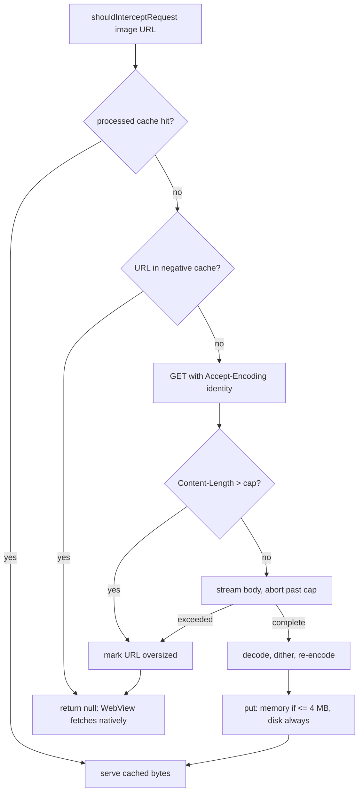

2026-08-22

# EinkBro: byte-accurate e-ink image cache and a cap on intercepted image downloads

Commit `bda79d3f3`.

## What was broken

Deep e-ink image mode routes every image request through `EinkImageInterceptor`,
which downloads the image itself, dithers it, re-encodes it and hands the bytes
back to the WebView. Two memory problems sat in that path.

**The memory cache was not measured in bytes.** `EinkImageCache` declared
`LruCache<String, ByteArray>(16 * 1024 * 1024)` and the comment said "16 MB".
Android's `LruCache.sizeOf()` defaults to `1` per entry, so the budget was
sixteen million *entries*, not sixteen megabytes. Each `EBWebViewClient` also
constructed its own `EinkImageCache` over the same disk directory, so the
(unbounded) memory tier was duplicated per tab, and nothing released it under
memory pressure.

**Downloads were unbounded.** The interceptor read each body with
`connection.inputStream.readBytes()` before decoding, with no Content-Length
check and no streaming limit. A very large, or deliberately hostile, image
would be buffered whole; two WebView resource threads doing that at once
double the peak.

## The fix

### Cache

- `sizeOf()` now returns `value.size`, so the 16 MB budget is real.
- Entries above a quarter of the budget (4 MB) are written to disk but not
  kept in memory: one large dithered PNG would otherwise evict the whole
  working set for a single image.
- The cache is a Koin `single`, injected into `EBWebViewClient`, so all tabs
  share one memory tier.
- `EinkBroApplication.onTrimMemory` forwards to `EinkImageCache.trimMemory`:
  `RUNNING_LOW`/`UI_HIDDEN` trim to a quarter, `BACKGROUND` and
  `RUNNING_CRITICAL` evict everything; `onLowMemory` evicts everything. The
  hook lives on the Application rather than the Activity because the cache is
  process-wide and the Activity may already be gone when the system asks for
  memory back. Eviction is cheap because the disk tier keeps every entry.

### Interceptor

- The request sends `Accept-Encoding: identity` instead of forwarding the
  WebView's `gzip, deflate, br`. A compressed body would defeat both the size
  cap and `BitmapFactory`.
- `Content-Length` is checked first; when it exceeds the cap the connection is
  dropped before any body is read. Chunked or unknown-length bodies are
  streamed with the same cap enforced as bytes arrive.
- The cap scales with the device: `maxMemory / 16` clamped to 10-25 MB, so a
  tablet with a large heap accepts bigger photos than a small e-reader. The
  source byte count, not the decoded bitmap, is the dominant per-request cost,
  because decoding already downsamples to the screen's long edge.
- On rejection the interceptor returns `null` and the WebView fetches and
  renders the image natively, unprocessed. Rejected URLs go into a 512-entry
  negative cache; without it, every page load would re-download a chunked
  oversized image up to the cap before giving up. Content-Length rejections
  cost only headers, but the negative cache covers both.

## Verification

A local test server served four variants of the same JPEG: a normal one with
Content-Length, a normal one chunked, a 32 MB one with Content-Length and a
32 MB one chunked. On the emulator the two normal images were fetched once by
the interceptor (`Accept-Encoding: identity`), processed and cached; the
Content-Length-oversized one was dropped before the body was read; the chunked
oversized one was aborted at the cap; both oversized images were then fetched
natively by the WebView and rendered untouched. After `am send-trim-memory
RUNNING_CRITICAL` the cache logged `cached=2561024 bytes`, exactly the two
processed files, and a later fresh page load served both normal images from
disk while the oversized ones skipped the interceptor entirely via the
negative cache.

## Not changed

The interceptor still serves synchronously from `shouldInterceptRequest`
(which runs on a WebView background thread) behind the existing two-permit
semaphore. Deferring the work to a background warm-up was considered and
rejected: deep mode would then show unprocessed images on every first view and
download each image twice.
