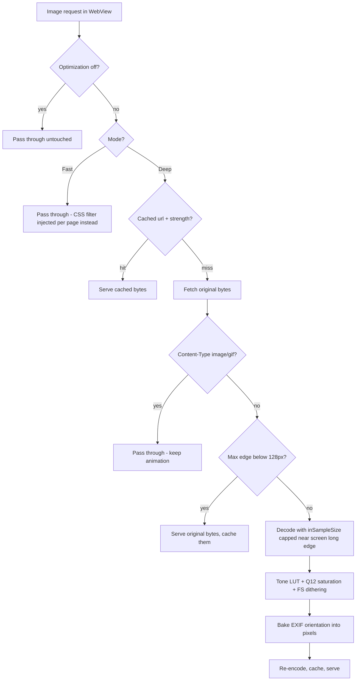

2026-07-11

# EinkBro: E-ink Image Pipeline Fixes and Fast (CSS) Mode

A benchmark-driven review of the E-ink Image Optimization pipeline (the
network-layer re-encoder behind the setting) surfaced two outright bugs, a
memory hazard, and a set of avoidable costs. This change fixes the Deep
pipeline and adds a second processing mode — Fast — that adjusts images with
an injected CSS filter at zero processing cost. Dithering stays: side-by-side
comparison on real e-ink hardware showed pre-dithered images still beat
panel-side quantization even after browser rescaling, so the earlier
"drop dithering" recommendation was rejected in favor of keeping it and
cutting cost elsewhere.

## What was broken

- **Camera photos rendered rotated.** `BitmapFactory` ignores EXIF
  orientation and `Bitmap.compress()` writes no EXIF, while WebView honors
  the tag (`image-orientation: from-image` is the Chromium default). Any
  JPEG with orientation ≠ 1 came out sideways whenever optimization was on.
  Fixed by reading the tag from the original bytes and baking the
  rotation/flip into the pixels after processing.
- **Animated GIFs froze.** `image/gif` responses were decoded (first frame
  only) and re-encoded as JPEG — served with MIME `image/gif`. Now GIFs pass
  through untouched before the body is even read, keeping animation and
  streaming.
- **Memory hazard.** A 12MP blog photo meant about 48 MB ARGB decode + a full
  `IntArray` copy + a third copy when the decode was immutable, times
  several concurrent WebView threads. Real OOM territory on 2–3 GB devices.

## Cost profile and what was done about it

Stage benchmark (exact port of the pipeline, 1600×1200 @ 50%, fast laptop
core — e-reader SoCs are about 4–6× slower): decode 25 ms, tone+saturation 9 ms,
Floyd-Steinberg dither 42 ms, JPEG q85 encode 47 ms. Decode/encode dominate
and everything scales with pixel count, so the biggest single win is
decoding less:

- **Decode cap.** A bounds-only decode picks `inSampleSize` so the longest
  edge lands in [screen long edge, 2×). The panel can't show the extra
  pixels; zooming keeps at least screen resolution. A 5000px test image now
  reaches the page at 2500px — verified via CDP `naturalWidth`.
- **Skip tiny images** (max edge < 128px): icons and sprites aren't worth
  processing and were polluting the 50 MB LRU cache.
- **Serve-original-on-skip.** When processing is skipped (tiny image, decode
  failure), the already-downloaded bytes are served and cached instead of
  returning null and forcing the WebView to re-fetch over the network.
- Smaller wins: `inMutable` decode (removes one full-bitmap copy), Q12
  fixed-point saturation (kills per-pixel double math), and a `Semaphore(2)`
  bounding concurrent processing.

## Fast mode: CSS filter instead of re-encoding

The dialog (see the earlier preview-dialog ADR) gained a mode row:
**Deep (dithering)** — the pipeline above — and **Fast (CSS filter)**, which
leaves the network layer alone and has `updateCssStyle()` inject
`img { filter: brightness(1+0.15t) contrast(1+0.2t) saturate(1+0.8t) !important }`
scaled by the strength. Fast costs nothing per image, applies at render
resolution, and covers what the interceptor fundamentally can't see —
`data:` URIs, `blob:` images, JS-generated content — but cannot dither and
only approximates the gamma curve.

Two details keep the setting honest:

- The dialog previews Fast mode with a `ColorMatrix` color filter instead of
  the bitmap pipeline. Brightness/contrast/saturate are all linear, so the
  matrix reproduces the CSS exactly; users see the real difference between
  the modes before confirming.
- The strength factors exist in two places (Kotlin CSS builder, Compose
  preview matrix); each carries a comment pointing at the other.

Verified via CDP: at 50% Fast, images compute
`filter: brightness(1.075) contrast(1.1) saturate(1.4)` with the interceptor
idle; switching to Deep re-engages the pipeline on newly loaded images.
Images already decoded in an open tab keep their old treatment until reload
(Blink memory cache) — same behavior as other display settings.

## Rejected alternative: dither at displayed size

Two-phase design (serve tone-only, measure `` size × devicePixelRatio
via injected JS, re-request a size-keyed dithered version served from cache)
would make dithering mathematically correct at 1:1 and cut its cost further.
Judged too complex for now — srcset handling, layout locking before swap,
zoom invalidation, extra e-ink repaints. The mode selector covers the
practical spectrum; the two-phase idea remains available if Deep-mode cost
on large pages becomes a complaint.
