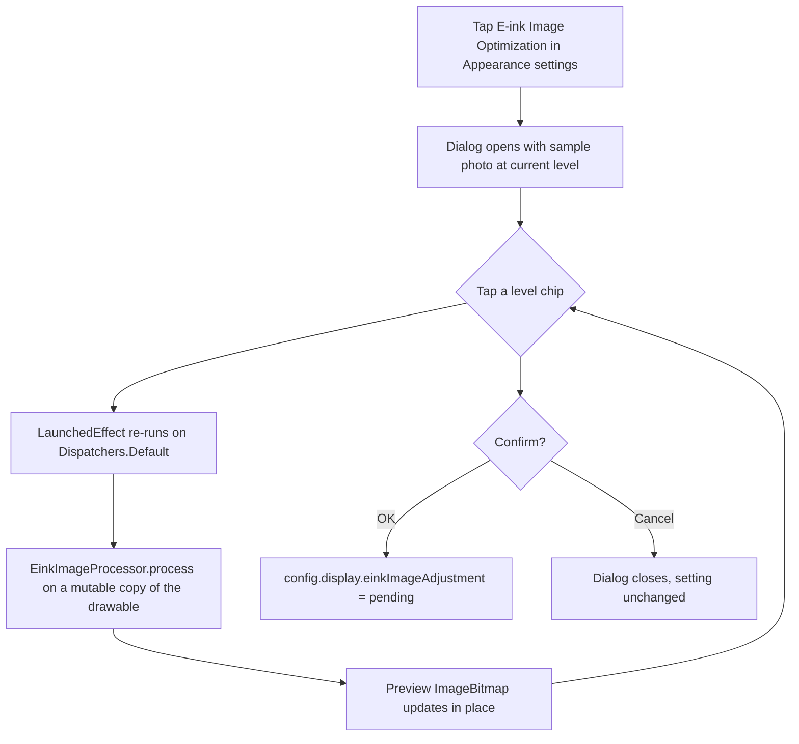

2026-07-11

# EinkBro: Live Preview Dialog for E-ink Image Optimization

The E-ink Image Optimization setting (Appearance settings) used to be a plain
option list — Off, 10%, 30%, 50%, 70%, 100% — with no way to know what any
level actually does to images. It now opens a preview dialog: a sample photo
is processed live through the real `EinkImageProcessor` at whatever level the
user taps, so the effect (brighter shadows, boosted saturation, dithering) is
visible immediately. OK persists the choice; Cancel discards it.

## How it was built

- **`EinkImageSettingItem`** (SettingComposeData.kt): a dedicated setting-item
  type, following the `ToolbarPositionSettingItem` precedent — that setting
  already had a diagram-preview dialog with OK/Cancel, so the pattern (pending
  state in the dialog, config write only on confirm) was reused as-is.
- **`EinkImageAdjustmentDialog`** (SettingComposeUi.kt): title, 240dp square
  preview image, one row of level chips (selected chip gets a bold border),
  Cancel/OK. The window dim is set to 0 like the toolbar dialog, which suits
  e-ink displays.
- **Preview asset**: a 360×360 center-cropped photo (37 KB JPEG in
  `drawable-nodpi`) with grass, red poppies, and water — saturated colors,
  fine texture, and smooth gradients, so every stage of the pipeline is
  visible. Only the original ships in the APK; processed variants are
  computed on demand.
- **Processing** runs in a `LaunchedEffect(pending)` on
  `Dispatchers.Default`, on a mutable copy so the remembered original stays
  pristine. Rapid taps cancel the previous effect at the `withContext`
  boundary.

## Design constraint discovered: M2 AlertDialog clamps tall slot content

The first implementation used Material 2 `AlertDialog` with the image in the
`text` slot. Its internal baseline layout clamps the slot's height — the
square image collapsed into a roughly 40dp full-width strip that overlapped the
title, with both `aspectRatio(1f)` and an explicit `size(240.dp)` (plain
`size` respects incoming constraints). The existing toolbar-position dialog
only escapes this because its content declares `height(280.dp)` on a Box.
Rather than fight the slot layout, the dialog is a plain
`androidx.compose.ui.window.Dialog` with a bordered Column — same visual
style, full control over layout.

## User guide

The pipeline (gamma lift → saturation boost → S-curve → shadow lift →
Floyd-Steinberg dithering to 16 levels/channel) was ported to an offline
Python script to generate before/after images at every level. Six 480×480
comparison images went into `docs/images/`, and both the English and zh-TW
guides now describe what the levels actually do plus show the comparison
gallery, reusing the site's existing `gallery__grid` style.
