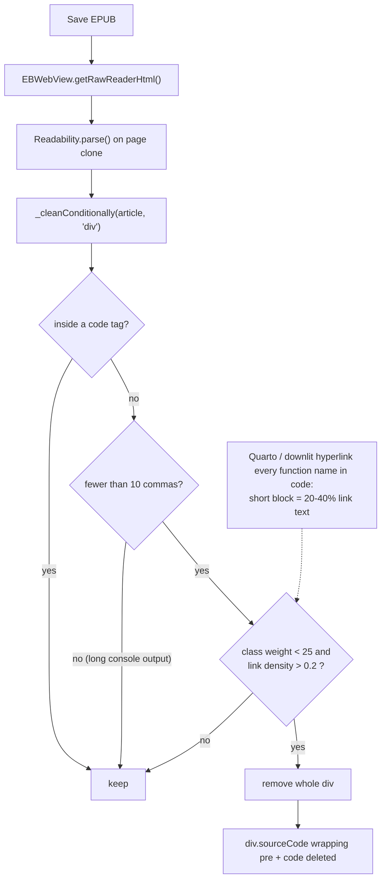

2026-07-14

# EPUB export dropped code blocks whose identifiers are hyperlinks

## What was broken

Saving certain documentation-style pages as EPUB silently dropped many of
their code blocks (GitHub issue #288). The same blocks also disappeared in
reader mode, since both go through the same extraction; Save-as-PDF was
unaffected because it prints the live page. On the reported chapter, 27 of
39 code blocks vanished from the generated EPUB.

## Root cause

EPUB export extracts the article with Mozilla Readability
(`app/src/main/assets/MozReadability.js`). Readability's
`_cleanConditionally` pass prunes "shady" `div`s, and one of its heuristics
removes any low-weight div whose text is more than about 20% link text.

Sites built with Quarto/downlit (and similar doc generators: pkgdown,
rustdoc-style references) hyperlink *every function name inside code* to
its reference documentation. A short code block wrapped in
`div.sourceCode > pre > code` is therefore 20–40% link text by construction,
so the heuristic classified it as boilerplate ("low weight and a little
linky") and deleted the whole wrapper — code included. Long blocks with
console output survived only because a second heuristic short-circuits the
check when the text contains ten or more commas.

Readability already has a guard for code — `_hasAncestorTag(node, "code")` —
but it only protects nodes *inside* a `<code>` tag, not the div that
*contains* the `<pre><code>`.



## Fix

Commit `9d19f4590`: extend the existing code guard in `_cleanConditionally`
so an element *containing* a code block is never conditionally cleaned,
mirroring the inside-`<code>` protection:

```js
if (node.querySelector && node.querySelector("pre code")) {
  return false;
}
```

## Verification

- jsdom harness running the exact bundled asset against the reported page:
  all 39 code blocks survive (was 12), including the specific block from the
  issue; no nav/sidebar chrome leaks back into the article.
- Regression check on an MDN reference page (code-heavy, lots of chrome):
  output byte-identical before and after the fix.
- On-device: debug build on the emulator, same Readability parse executed
  inside the live WebView via CDP — `{sourcePres: 39, articlePres: 39,
  navLeftovers: 0}`.

Because reader mode shares the extraction path, the fix also restores
linked code blocks there, not just in EPUB export.
