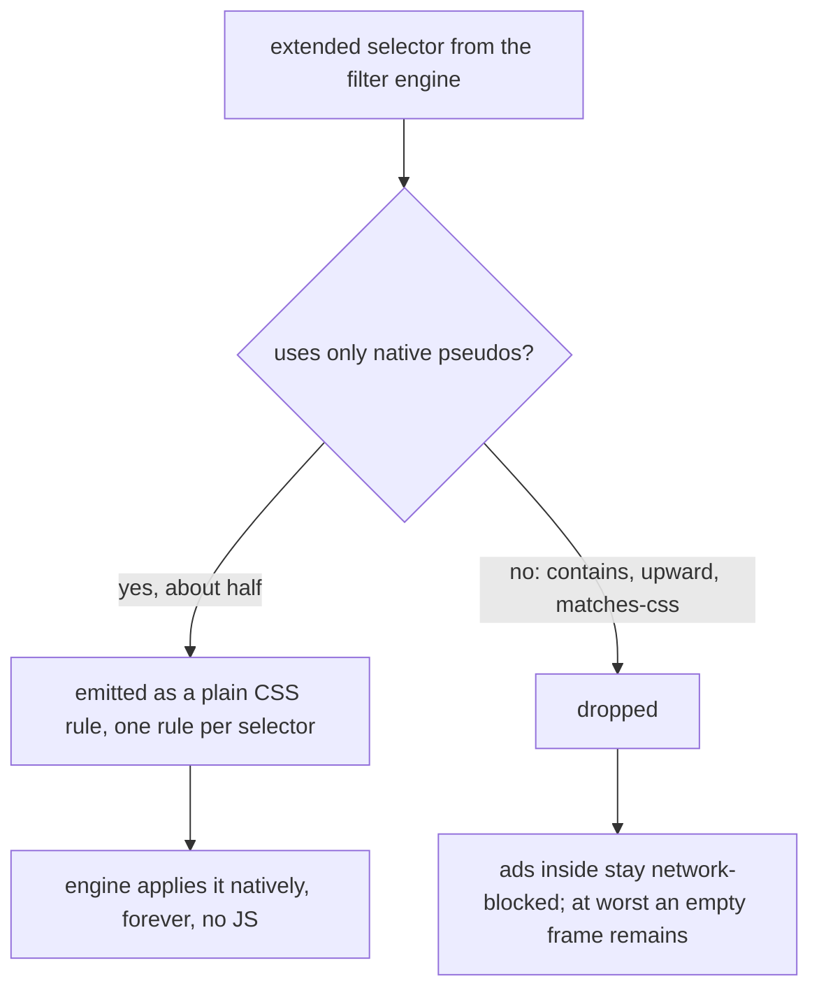

2026-09-03

# Ad-block: ExtendedCss library replaced by native CSS :has()

Commit `8733ac359`. Follows the memory/speed/size pass from the same day, where the 48 KB ExtendedCss injection had already been gated to pages that actually carry extended selectors; the maintainer then asked whether the library could go entirely.

## What extended selectors are

Filter lists carry "extended CSS" cosmetic rules — element hiding conditions plain CSS could not historically express: `:has()`, `:contains(text)`, `:matches-css()`, `:upward()` and friends. AdGuard's ExtendedCss library (48 KB of minified JS) evaluated them: it parsed the selectors itself, walked the DOM, and kept a MutationObserver re-matching everything on every DOM change. The parse cost hit once per page; the observer cost was continuous — and it ran precisely on ad-heavy pages, the worst case for a low-end e-ink CPU.

## Why it could go

Chromium supports `:has()` natively since 105. Measuring the app's default list (AdGuard Base, about 152k lines) showed 2,588 extended rules, of which **1,274 (49 percent) use only natively expressible pseudo-classes** — dominated by `:has()`. For those, native CSS is strictly better than the library: the engine applies the rules continuously at native speed with no JS matcher at all.

The other half needs pseudo-classes with no native equivalent (`:contains` text matching is the big one at about 1,000 rules, then `:upward`, `:matches-css`). Those rules are now dropped — a deliberate trade: they are site-specific cosmetic rules on a small fraction of sites, the network requests inside those containers are still blocked, so the worst outcome is an empty frame left visible. On an e-ink reader that is a far better deal than a per-mutation JS matcher.

## How

- New `NativeExtendedCss` helper classifies selectors (a blocklist of library-only pseudo markers, plus rejection of brace characters so a hostile selector cannot close its rule and smuggle arbitrary CSS) and builds the stylesheet.
- **One standalone rule per selector**, deliberately not grouped: in CSS, one invalid selector in a grouped selector list invalidates the whole rule, so grouping would have let a single unsupported `:has()` on a pre-105 WebView kill every rule in its group. Standalone rules degrade per-selector.
- `element_hiding.js` injects the converted rules as a second plain `<style>` element; the ExtendedCss construction, the library asset, and the conditional library injection in `ElementHiding.perform` are all gone.
- The ad-filter module gained its first unit tests (JUnit added as a test dependency): classification of native vs library-only selectors, brace rejection, and per-selector rule emission.

## Verification

Unit tests and lint pass. On the emulator, element hiding ran start-to-finish with no JS errors on both a restored tab and a fresh ad-heavy news site, zero crashes.

Known limitation, accepted: WebViews older than Chromium 105 (August 2022) lose extended-selector hiding entirely, where the JS library used to polyfill it — they silently drop the `:has()` rules and keep everything else. Devices stuck on such WebViews still get full network blocking and all plain hiding rules.
