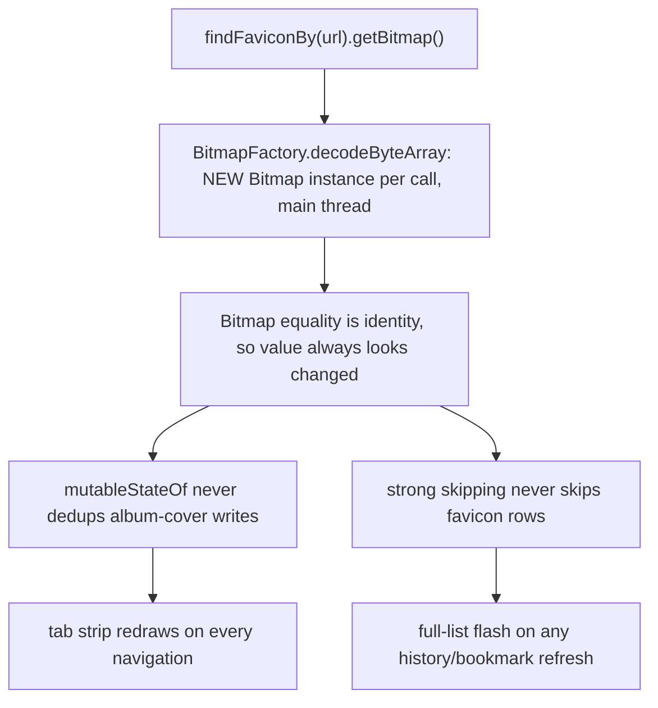

2026-07-07

# EinkBro: cache decoded favicon bitmaps for stable identity

## What was broken

A full UI audit of EinkBro's Compose layer flagged one idiom as the single
highest-leverage recomposition problem in the app: every favicon lookup went
through `bookmarkManager.findFaviconBy(url)?.getBitmap()`, and `getBitmap()`
ran `BitmapFactory.decodeByteArray` on the stored blob **every call, on the
main thread**. The idiom appeared in six places: history rows and thumbnail
grid items (inside `itemsIndexed` composition lambdas), bookmark list/grid
items, album-cover updates on every `loadUrl`, and new-tab preview setup.

The damage was not just the repeated decode. `Bitmap` has identity equality,
so every lookup produced a value that Compose considered *changed*:

- `album.bitmap` is a `mutableStateOf`; its structural-equality dedup never
  suppressed a redundant album-cover write, so **every navigation redrew the
  visible toolbar tab strip** even when the favicon was the same.
- Row composables received a never-equal `bitmap` parameter, so strong
  skipping could never skip a row. Deleting one history entry re-decoded and
  recomposed **every** row — a visible full-list flash on e-ink, where every
  redraw costs ghosting.

## Root cause

## The fix

`BookmarkManager` now owns a `LruCache<String, Bitmap>(100)` keyed by domain
and exposes `findFaviconBitmapBy(url)`: decode once, return the **same
instance** forever after. With stable identity, both consumers heal
automatically — `mutableStateOf` turns redundant writes into no-ops, and
strong skipping skips unchanged rows.

Cache coherence: `insertFavicon` and `deleteFavicon` evict the domain's entry.
`insertFavicon` also had a latent staleness bug — it appended to the in-memory
`faviconInfos` list without removing the old entry for the same domain, so
`firstOrNull` kept returning the outdated icon; it now replaces the entry.
The `FaviconInfo`-returning `findFaviconBy` became private; all callers moved
to the bitmap API. Composable call sites additionally wrap the lookup in
`remember(url)` so even the cache lookup drops out of recomposition.

## Verification

Debug build on the emulator: tab overview shows per-site favicons (Google
"G", Wikipedia "W" on a tab loaded during the session — proving the
insert-then-invalidate path), history list shows favicons with the default
icon where no favicon is stored, bookmarks dialog opens cleanly. No crashes.
