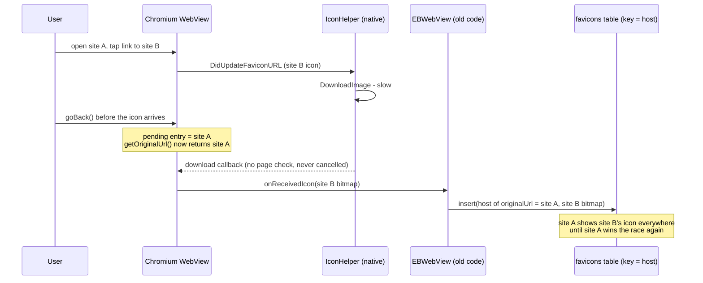

2026-08-29

# EinkBro: fetch favicons per document instead of trusting onReceivedIcon

Bookmarks, history rows, the tab bar and the start page kept showing the wrong
site's icon for some hosts, and the wrong icon stuck until that site happened to
deliver a fresh one. The icon store is keyed by host, and the row was written from
`WebChromeClient.onReceivedIcon` using whatever `WebView.originalUrl` returned at
the moment the bitmap arrived.

## Why the host was wrong

Three Chromium behaviours, all confirmed against the current source:

- `android_webview/browser/icon_helper.cc` starts one image download per icon
  candidate and calls back when it finishes. The callback has no check that the
  page is still the current one, and navigations never cancel in-flight
  downloads. A slow icon regularly arrives after the user has moved on.
- `AwContents.getOriginalUrl()` reads the navigation history's *current* entry,
  and `NavigationControllerImpl::GetCurrentEntryIndex()` returns the pending
  entry while a Back/Forward is in flight. During a Back press, `originalUrl`
  is already the destination page, so an icon arriving in that window is filed
  under the page being returned to. `WebView.url` (the visible entry) behaves the
  same way for history navigations.
- `originalUrl` is by contract the URL before server redirects. Through a
  redirector (search-result hops, link shorteners, tracker links) the destination's
  icon was stored under the redirector's host.



Once a bad row was written it perpetuated itself: every `loadUrl`, tab preview,
bookmark row and start-page tile reads the store by host and shows it immediately.

A host-comparison guard at delivery time cannot fix this: in the Back case,
`url`, `originalUrl` and the last committed host all already agree on the *new*
page. Nothing in the `onReceivedIcon` callback identifies the page the bitmap
belongs to, so the association has to come from somewhere else.

## Fix: the document names its own icon

After `onPageFinished`, a small asset script (`favicon_probe.js`) returns the
document's `location.hostname` together with its `<link rel=icon>` /
`apple-touch-icon` candidates. `FaviconFetcher` downloads the best decodable one
(nearest 48 px, SVG skipped, `/favicon.ico` as the universal fallback, `data:`
hrefs decoded inline), shrinks it to at most 64 px and stores it under that
hostname. Host and candidates come from the same document, so the association
cannot drift; a probe reporting a different host than the finished page is
dropped. One fetch per host per app session keeps the traffic to a single small
request and re-verifies every host on its next visit, which heals rows poisoned
by earlier versions.

```mermaid
flowchart TD
    A[onPageFinished url] --> B{http(s), not AI page,<br/>not error page, host not handled?}
    B -- no --> Z[skip]
    B -- yes --> C[favicon_probe.js:<br/>hostname + icon links]
    C --> D{probe host == page host<br/>or no probe}
    D -- no --> Z
    D -- yes --> E[FaviconFetcher.storeForPage]
    E --> F[order candidates:<br/>near 48px, then touch icons,<br/>then /favicon.ico]
    F --> G[download + decode + shrink to 64px]
    G -- found --> H[insert row under document host]
    H --> I[tab cover = verified icon<br/>if tab still on that host]
    G -- nothing --> J[mark host handled, no row]
```

`onReceivedIcon` is now display-only for the tab cover and is ignored once the
page's icon has been verified, so a late bitmap can no longer replace it. On a
cross-host commit (`doUpdateVisitedHistory`, the post-redirect URL) the cover
is reset to the stored icon of the new host or nothing, so a previous site's
icon no longer lingers on a page that has none.

## Repairing icons already stored wrongly

Visiting a host heals its row, but a bookmark the user rarely opens would keep
its wrong icon. The bookmark long-press menu gains **Refresh icon**: it fetches
the bookmark's page HTML, parses the icon links, downloads the icon and replaces
the stored row, ignoring the per-session guard. The bookmark list re-reads its
bitmaps through a version counter bumped on success; a toast reports when no
icon could be found.

## Context-menu cells fit the dialog

Adding a sixth action pushed the last cell of the bookmark context menu past
the dialog edge behind a horizontal scroll. The bookmark menu and the link
context menu now measure the dialog's available width and shrink cells evenly
when their natural width would overflow, so every action stays visible.

## Verification

Unit tests cover candidate parsing/ordering and the probe-result decoding. On an
emulator: a page with no icon leaves no row and its tab shows the placeholder
after returning from a site with an icon; a site's icon is stored once per
session and the refresh action re-stores it; all six bookmark actions and all
link-menu actions render inside the dialog.
