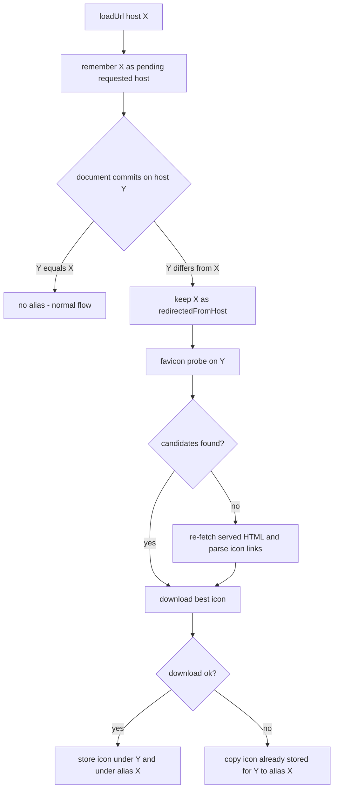

2026-09-03

# Favicons Survive Cross-Host Redirects

## What was broken

A bookmark pointing at a host that now redirects to a different host — the
motivating case being threads.net redirecting to threads.com — showed no
favicon, even after visiting the site. Separately, some single-page apps
ended up with no stored icon at all even though their served HTML declares
one.

## Root cause

Two independent holes in the favicon pipeline:

1. **Icons are keyed by host, and only the committed host was ever written.**
   Opening the bookmark loads `threads.net`, the document commits on
   `threads.com`, and the fetched icon is stored under `threads.com` only.
   The bookmark's own host never gets an entry, so its row stays blank
   forever — and `threads.net` itself serves nothing (that is exactly why it
   redirects), so no later visit can fill it in.

2. **SPA hydration races the favicon probe.** The in-page probe reads
   `<head>` for icon links after load, but a hydrating SPA can have replaced
   the head by then, so the probe returns zero candidates and the fetch was
   skipped outright.

## The fix

`EBWebView` now remembers the host the user actually asked for
(`pendingRequestedHost`, set in both `loadUrl` overloads) until the document
commits. If the commit lands on a different host, the requested host is kept
as `redirectedFromHost` — an *alias* that rides along with the next favicon
probe. Commits without a pending request (link clicks, SPA routing) carry no
alias, so ordinary navigation is unaffected.

`FaviconFetcher.storeForPage` accepts that alias and stores the downloaded
bitmap under both hosts. Two fallbacks cover the edge cases:

- If the probe delivered no candidates, the served HTML is re-fetched and
  parsed for icon links (same path `refresh()` already used), closing the
  SPA hydration race.
- If the download fails entirely, an icon already stored for the redirect
  target in an earlier session is copied over to the alias host — good
  enough for a host that serves nothing itself.

The session-level dedup (`handledHosts`) treats the alias as its own entry,
so a host already handled this session is not re-stored, but a fresh alias
still gets written even when the committed host was seen before.
