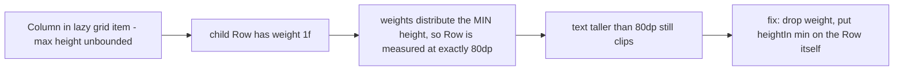
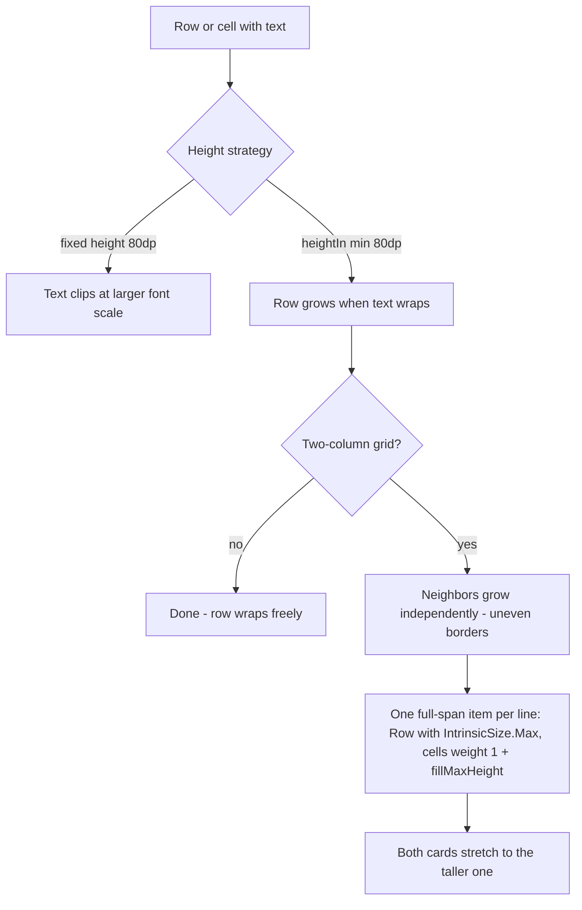

2026-07-25

# EinkBro: font-scale-adaptive settings rows and menu cells

Commit: `bfcbc0be8` — closes issue #623, supersedes PR #624.

## What was broken

Raising the Android system font size (Settings → Display → Font size) broke EinkBro's chrome: settings row summaries were clipped mid-glyph, two-column settings cards cut off long localized titles, and the toolbar menu labels were sliced to fragments. The report came from a Russian-language user, where labels are long enough to wrap even at moderate scales.

## Root cause

The Compose UI hard-coded row heights around text that scales with the system font:

- `SettingItemUi` rows were fixed at `height(80.dp)`; when the scaled title wrapped to two lines, the summary was pushed past the row bounds and clipped.
- Menu cells in `MenuDialogFragment` were fixed at 50/70/80dp with a fixed 40dp label box, tiny 8–10sp fonts, and a `-5.dp` offset hack that relied on text bleeding past the cell bounds.
- A Copilot-authored PR (#624) proposed swapping the settings heights to `heightIn(min = …)`, which is the right idiom, but it missed the menu entirely and its change to `ProgressActionSettingItemUi` was a silent no-op:

Inside a `LazyVerticalGrid` item the max-height constraint is infinite, and Compose sizes weighted children against the *min* constraint in that case — so `heightIn(min = 80.dp)` on the parent never let the weighted content row grow.

## The fix

All fixed heights around scalable text became minimums, with a second step to keep the two-column grid tidy:

- **Settings rows** (`SettingComposeUi.kt`): `heightIn(min = 80.dp)` plus vertical padding on the text column; `ProgressActionSettingItemUi` restructured to put the min height on its content `Row` instead of a `weight(1f)`.
- **Menu cells** (`MenuDialogFragment.kt`): cell and label-box heights became minimums chosen so the font-scale-1.0 geometry is pixel-identical (label min = old cell height minus icon size), the offset hack was dropped, and labels got `TextOverflow.Ellipsis` as a backstop at extreme scales.
- **Equal-height grid pairs**: `LazyVerticalGrid` measures cells independently, so once rows can grow, two-column neighbors drifted apart. The grid now emits one full-span item per line (`pairSettingLines` + `SettingLineUi`): a `Row(Modifier.height(IntrinsicSize.Max))` whose two cells get `weight(1f).fillMaxHeight()`, stretching the shorter card to the taller one so borders stay aligned. A `modifier` parameter was threaded through `SettingItemUi` and its variants so the stretch reaches the composable that actually draws the border, and the duplicated per-item-type dispatch in `SettingScreen`/`SearchSettingScreen` collapsed into a shared `SettingItemCell`.

Alternatives considered: capping the app's font scale (rejected — defeats the accessibility request itself) and scaling fixed heights by `fontScale` (rejected — wrapping is not linear in font scale, so long localized strings would still clip).

## Verification

Driven on the emulator with the app locale set to Russian: at font scale 1.3, menu labels, settings cards, and boolean-row summaries all render fully; paired cards match heights; at font scale 1.0 the layout is visually unchanged.
