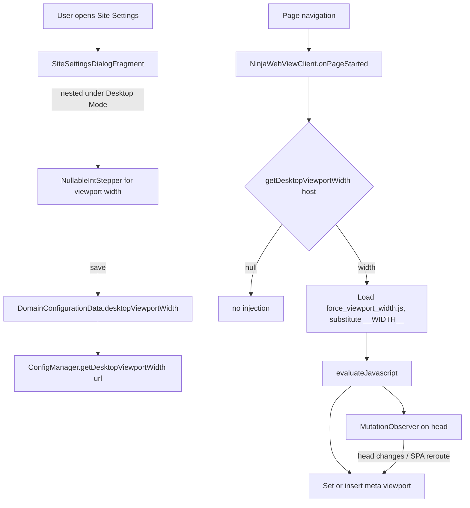

<!-- added: 2026-05-10T09:05:39Z -->
# einkbro: Per-site Force Desktop Viewport Width

## Goal
Let users force a fixed pixel viewport width on a specific site when the existing
desktop-mode toggle (UA swap + `useWideViewPort` + `loadWithOverviewMode`) isn't
enough. Some responsive sites detect screen size via JavaScript / CSS media
queries rather than the User-Agent string, and continue to serve a mobile
layout even with the desktop UA. This option lets the user pin a desktop pixel
width per host so those sites render in their desktop layout on e-ink.

## Context
EinkBro already has:
- A global `desktop` boolean preference and a per-site `desktopMode: Boolean?`
  override on `DomainConfigurationData`.
- A Site Settings dialog with reusable nullable-stepper / nullable-boolean
  rows, a "Reset All to Global" button, and an override-count badge.
- A `WebContentPostProcessor` plus `NinjaWebViewClient` that already inject
  small JS files at `onPageStarted` / `onPageFinished` (e.g.
  `disable_video_autoplay.js`, `fix_dsd_pending.js`) loaded from the `assets/`
  directory.

The feature request linked to a third-party browser's "Apply Desktop Viewport
Width" feature, which injects JS to override `<meta name="viewport">` content.
That doc itself notes "only enable if the user agent was insufficient — the
extra JS will slow the page" — i.e. it's a fallback, not a default.

## Design
**Decision: sibling option, not bundled into the existing toggle.**

Bundling viewport injection into the `desktop` toggle would silently change
behaviour for every existing happy user — sites that *do* honour viewport
would suddenly horizontally overflow on small e-ink screens, forcing pinch
zoom-out. Different e-ink devices also have different native widths (Boox
about 1404px, Kindle about 1072px, Supernote about 1404px), so a single hardcoded fallback
value would be wrong somewhere.

Instead, the option is a **nullable per-site stepper nested under Desktop
Mode** in Site Settings, mirroring how Font Boldness is already nested under
Bold Font. It only takes effect when the effective desktop mode (per-site
override or global) is on.

**Range / default**: 800–2400 px, step 80, default activation value 1280
(matches the reference doc's default and is wide enough for most "desktop"
breakpoints).

## Implementation

**Components**:
- `DomainConfigurationData.desktopViewportWidth: Int?` — nullable to express
  "no override".
- `ConfigManager.getDesktopViewportWidth(url)` — host-keyed lookup.
- `assets/force_viewport_width.js` — sets/inserts the meta tag, then
  registers a `MutationObserver` on `<head>` so SPAs and sites that rewrite
  viewport at runtime can't undo the override.
- `NinjaWebViewClient.injectForcedViewportWidth(url)` — called from
  `onPageStarted`. Reads the asset, substitutes the placeholder
  `__WIDTH__` with the configured int, and calls `evaluateJavascript`.
- `SiteSettingsDialogFragment` — added a `NestedNullableIntStepper` row,
  enabled only when the effective desktop mode is true. Extended that
  reusable composable to accept an optional `label`/`hint` (it previously
  had none — used only for font boldness).

## Key Files
- `app/src/main/assets/force_viewport_width.js`
- `app/src/main/java/info/plateaukao/einkbro/database/DomainConfiguration.kt`
- `app/src/main/java/info/plateaukao/einkbro/preference/ConfigManager.kt`
- `app/src/main/java/info/plateaukao/einkbro/browser/NinjaWebViewClient.kt`
- `app/src/main/java/info/plateaukao/einkbro/view/dialog/compose/SiteSettingsDialogFragment.kt`
- `app/src/main/res/values/strings.xml` and 30 locale files

## Future Considerations
- The viewport script runs on every navigation when the override is set;
  for sites that already render correctly, this is wasted work. Could be
  short-circuited by a "did the site honour our viewport?" check, but the
  added complexity probably isn't worth it for a per-site opt-in.
- `EXTRA_INITIAL_URI` style hints aren't relevant here, but the equivalent
  thought — "what's the friendliest default?" — drove the 1280 default.
- No telemetry on how often the option gets used; if usage is low and the
  reference-doc warning ("slows pages") proves significant for any user,
  the feature could be moved behind an "Advanced" disclosure.
