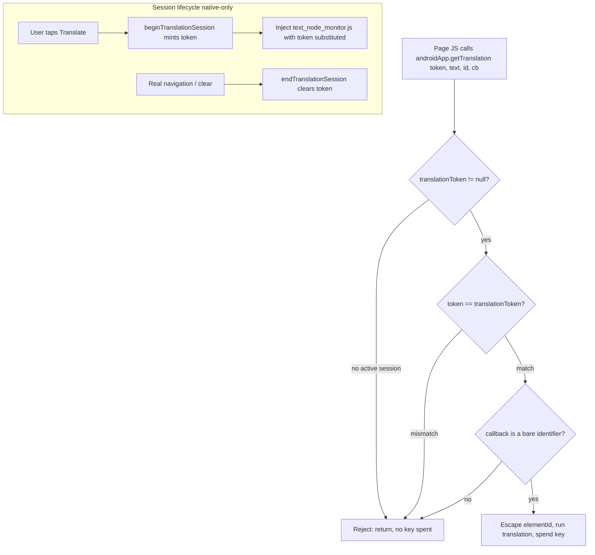

2026-09-01

# Gating getTranslation so untrusted pages can't spend the AI key

## What was exposed

EinkBro stores the user's OpenAI and Gemini API keys in SharedPreferences and
can reach those APIs from page JavaScript through a `@JavascriptInterface`
bridge (`androidApp`, `JsWebInterface`). A security review asked the direct
question: can browsing a hostile or insecure site leak or abuse those keys?

No bridge method returns a key, and the keys never cross back into page JS, so
there is no direct key-string disclosure. But one method — `getTranslation` —
was the single page-reachable bridge call that *spends* the key, and it had no
guard at all. A WebView JavaScript interface cannot be scoped to one origin, so
`androidApp` is present on every page. Any loaded site could do:

    androidApp.getTranslation("<any prompt>", "x", "cb")   // in a loop

and, when the user's translation engine was set to OpenAI or Gemini, cause real
billed API calls: unbounded quota drain, and — because the model's answer is
handed back through the page-supplied callback — a working free-inference proxy
on the user's dime with an exfiltration channel for the output. The key string
stayed secret, but the credential was fully abusable with no user interaction.

The inconsistency made the hole obvious in hindsight: the two other page-wide
bridges were already locked down — the userscript bridge (`einkbroGM`) requires
a per-injection capability token, and the start-page bridge re-checks that the
current page really is the built-in start page. `getTranslation` had neither.

A second, smaller issue sat in the same method: the page-supplied `callback` and
`elementId` were interpolated raw into an `evaluateJavascript` string. Only the
page's own context could be reached, so it was not an escalation, but it was an
unescaped-interpolation bug worth closing.

## Root cause

`getTranslation` is only ever meant to serve EinkBro's own injected translation
script (`text_node_monitor.js`, injected by the in-place paragraph translation
flow). Nothing enforced that intent: the method ran for any caller, because the
bridge object is unavoidably global to the WebView and the method trusted its
mere invocation.

## The fix

Gate the method on a per-session token that only native code can set, minted
when the user starts an in-place translation and cleared on navigation.

- `beginTranslationSession()` on `JsWebInterface` mints a random token and marks
  the session active; `endTranslationSession()` clears it. There is no JS path
  to either, so a page cannot open a session or read the flag.
- The two in-place translation injectors in `WebViewJsBridge` mint the token and
  substitute it into `text_node_monitor.js` at injection time (the same
  placeholder-substitution mechanism the CSS-slot injector already uses), so the
  app's own script — and only it — presents a valid token. The token is baked in
  as a call-site string literal, never assigned to a page-visible variable.
- `getTranslation` now takes a leading token argument and returns early unless a
  session is active *and* the token matches. A non-null token means a
  user-initiated translation is in progress.
- The session is ended on real navigation, right where the userscript bridge
  already invalidates its own per-document tokens, so a token minted for one
  document never carries to the next.

For the interpolation issue: the callback name is validated against a
bare-identifier regex (it is always the injected `"myCallback"`, so this is
lossless), and `elementId` is escaped before it is interpolated, matching the
escaping already applied to the surrounding text arguments.

## Residual risk

Because a WebView JavaScript interface shares the page's JS execution context, a
page that hooks `androidApp.getTranslation` *before* the user starts a
translation could observe the token as the app's own script passes it, then
piggyback for the duration of that active session. This is the same
context-sharing limit that constrains the userscript token model, and it is
documented in the code. It requires the user to actively trigger translation on
the hostile page *and* the page to have pre-hooked the bridge — a large step
down from the original "any page, any time, unbounded background loop." The
native session check is the load-bearing control: outside a user-initiated
session, the method is fully inert regardless of what the page does.

## Scope

The change is deliberately confined to `getTranslation` — the one page-reachable
method that touches the key. The other `JsWebInterface` methods (TTS, blob
download, scroll, anchor reporting) do not spend the key and were left alone.

## Verification

On an emulator debug build: a synthetic multi-paragraph page that auto-calls
`getTranslation` on load was rejected (`getTranslation rejected: no active
translation session`), the call returned undefined, and no request went out. The
app's own Translate action on the same content was accepted for every paragraph
and rendered the translations in place, confirming the token plumbing works
end-to-end with no functional regression. `testDebugUnitTest` and `lintDebug`
both pass.
