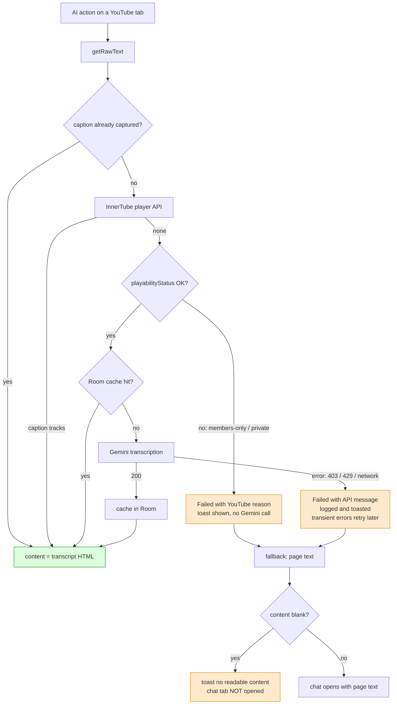

2026-08-01

# EinkBro: surface Gemini transcription failures, parse Gemini streams as SSE

Two user-visible AI bugs turned out to have small, sharp root causes, and both were
invisible because failures were swallowed silently.

## Bug 1: chat-with-web opened with no content on some YouTube videos

**What was broken.** On certain YouTube videos, running "Chat with web" (or any
NewTab AI action) opened a chat tab that clearly knew nothing about the video. The
popup (translation dialog) path appeared to work fine on other videos, which made
the new-tab plumbing look guilty.

**Root cause.** The chat plumbing was innocent — a capture of the actual LLM request
showed the full transcript flowing through whenever a transcript existed. The
failing videos were *members-only* livestreams: the viewer can watch them as a
channel member, but the Gemini API visits YouTube anonymously and its video-URL
ingestion returns `403 PERMISSION_DENIED` immediately. The fetcher swallowed every
non-200 (`catch { null }`, no logging), permanently marked the video as
"caption-less" (`noCaptionVideoId`, so even transient 429s poisoned the tab), and
fell back to Readability text extraction — which yields an empty string on a
YouTube watch page. The chat tab then opened with `webContent = ""`. The only
feedback ever shown was the optimistic "Transcribing video with Gemini…" toast, so
a 4-second silent failure looked identical to a successful minutes-long
transcription.

**Fix.** `YouTubeCaptionFetcher` now returns a typed `CaptionFetchResult`
(`Captions` / `None` / `Failed(message, transient)`):

- The InnerTube player response (already fetched for caption tracks) carries
  `playabilityStatus`; when it isn't `OK` the fetcher skips the doomed Gemini call
  entirely and surfaces YouTube's own human-readable reason ("Join this channel…"),
  localized via the request's `hl` parameter.
- Gemini HTTP errors read the error body, log it, and produce a user-showable
  message; 429/5xx/network failures are marked transient and no longer permanently
  disable transcription for the tab.
- `EBWebView` toasts the failure reason instead of silently degrading, and
  chat-with-web refuses to open a chat tab when the extracted content is blank,
  saying so in a toast.

A useful discovery along the way: videos gain auto-generated ASR captions over
time, so a video that needed Gemini transcription last week may satisfy the
InnerTube caption path today — cached transcripts and the Gemini path then never
run for it.

## Bug 2: streamed Gemini replies always ended with a dangling `",`

**What was broken.** Chat-with-web answers from Gemini looked truncated — every
response ended with `",` as if more content were coming.

**Root cause.** `geminiStream` didn't parse JSON at all: it scraped the
pretty-printed `streamGenerateContent` array line by line, extracting whatever
followed `"text": "` and trimming one trailing quote. Gemini 3 models attach a
`thoughtSignature` to the final part of the answer, so the last text line is
`"text": "",` — the trailing comma defeats `removeSuffix("\"")` and the scraper
appended a literal `",` to every response. (Non-streaming paths parse properly
and were unaffected, which is why the popup never showed the artifact.)

**Fix.** The stream now requests `streamGenerateContent?alt=sse`, where each SSE
`data:` event is one complete JSON object, parsed with the existing serializers.
Parts flagged `thought: true` are filtered out, unknown fields like
`thoughtSignature` are ignored by the parser, and any `finishReason` (STOP,
MAX_TOKENS, SAFETY) finalizes the UI message — previously only STOP did, so a
token-limited reply left the chat visually unfinished. The Gemini model classes
gained tolerant defaults (`text = ""`, `finishReason?`) so signature-only parts
decode.

## Rider: "Test connection" in Gen AI settings

Since both bugs were of the "config looks fine, failure is silent" family, each AI
engine settings screen (OpenAI / self-hosted / Gemini) gained a **Test connection**
row that fires a one-word prompt with the currently saved key and model and toasts
either "Connection OK (model)" or the concrete failure (HTTP status, parse,
network). The default Gemini model also moved to `gemini-3.5-flash-lite`.
