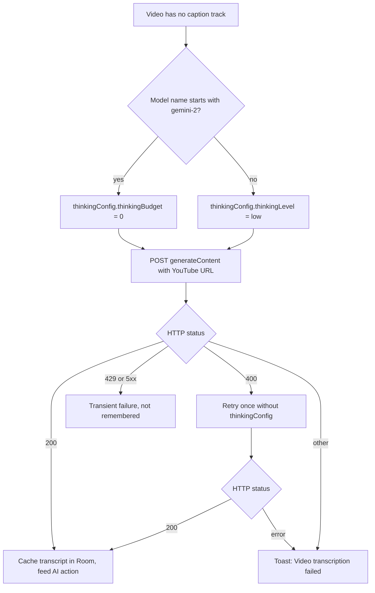

2026-09-04

# EinkBro: Gemini video transcription failed with 400, gets its own model setting

## What was broken

Summarizing a caption-less YouTube video on the Boox Go 6 ended with the toast
"Video transcription failed: Gemini (400): Request contains an invalid argument."
The transcription path had worked when it was written a few weeks earlier. The
release build carries no Timber output, so the device log showed nothing beyond
the toast text.

## Root cause

The fallback transcription in `YouTubeCaptionFetcher` sent the YouTube URL to the
user's general Gemini chat model with
`generationConfig.thinkingConfig.thinkingBudget = 0`, a deliberate choice to skip
reasoning tokens on a task that needs none. Replaying the app's exact request body
with curl reproduced the 400 on the default model, `gemini-3.5-flash-lite`, and
bisecting the body showed the budget field was the only thing it objected to.
Gemini 3.x replaced numeric budgets with `thinkingLevel`, and 3.5-flash-lite is the
first model to reject the old field outright. Probing the families the app might be
configured with gave a matrix with no single value that works everywhere:

| Model | thinkingBudget 0 | thinkingLevel minimal | thinkingLevel low |
| --- | --- | --- | --- |
| gemini-2.5-flash-lite | ok | 400 | 400 |
| gemini-3-flash-preview | ok | ok | ok |
| gemini-3.1-flash-lite | ok | ok | ok |
| gemini-3.5-flash-lite | 400 | ok | ok |
| gemini-3.5-flash | ok | ok | ok |
| gemini-3.8-flash | ok | 400 | ok |

A second finding shaped the fix. `gemini-3.5-transcribe`, the obvious candidate
for a transcription job, is audio-only: given the YouTube URL it answers "Image
input modality is not enabled for this model". The app has only the URL, never the
audio, so a general multimodal model is required.

## The fix

1. A dedicated **Gemini transcription model** setting next to the chat model in the
   Gemini section of AI settings, stored as `sp_gemini_transcribe_model` and
   defaulting to `gemini-3.5-flash`. Flash produced the more faithful transcript
   in a side-by-side check with flash-lite, and the two are far apart in cost from
   the chat model choice, which users tune for different reasons.
2. A model-aware thinking config: names starting with `gemini-2` get
   `thinkingBudget = 0`, everything else gets `thinkingLevel = "low"`, the cheapest
   value every 3.x model accepted.
3. One retry without any thinking config when the model answers 400, so an unknown
   future model degrades to its default dynamic thinking instead of failing.
4. The read timeout goes from 5 to 10 minutes, with the outer guard in
   `EBWebView` raised to match. Measured waits were not proportional to length: a
   40-minute English talk answered in about 90 seconds, while a 2-minute clip in a
   low-resource language took close to 5 minutes and tripped the old limit inside
   the app. A client-side timeout does not stop the server-side work, so the
   tokens were billed for nothing.

## Notes for next time

- Reproduce Gemini validation errors with a text-only prompt. The 400 for a bad
  thinking field is identical with or without the video part, and a text prompt
  costs nothing worth mentioning, whereas every video call is billed against the
  user's quota.
- In zsh, `$model:generateContent` is silently mangled and returns a 404 with an
  empty body from the API. Write `${model}:generateContent`.
