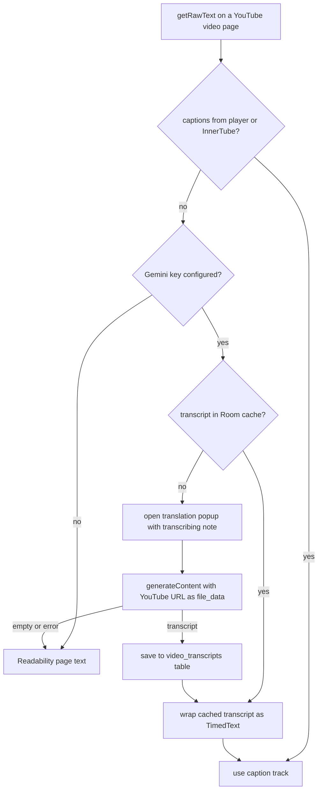

2026-07-30

# EinkBro: Gemini transcription for caption-less YouTube videos

Follow-up to the YouTube-captions-as-AI-content change: when a video has no caption track at all, EinkBro now asks Gemini to watch the video and generate the transcript, then feeds that to the AI features — instead of silently degrading to noisy watch-page text. The fallback only activates for users who have entered a Gemini API key; everyone else keeps the previous behavior.

Genuinely caption-less videos are rarer than they look — YouTube auto-captions nearly everything, and during testing a freshly uploaded video grew an ASR track within minutes. The cases that remain are uploads whose owner disabled captions, music, and very fresh uploads still in the ASR queue. For those, Gemini is the only way to get an actual transcript.

## How

The Gemini API has no dedicated transcription endpoint; the same `generateContent` call the app already uses accepts a public YouTube URL as a `file_data` part, and Google ingests the video server-side — the app downloads and uploads nothing. The request uses the user's configured Gemini model, disables thinking, and sets `mediaResolution` to low, which cuts the video-frame token cost roughly 4x — transcription only needs the audio anyway, and it keeps a half-hour video within free-tier per-request budgets. The free tier allows 8 hours of YouTube video per day, which is generous for a per-video, cached fallback.

The transcript is wrapped into the same TimedText JSON shape as real captions and stored in `dualCaption`, so everything downstream — AI content, TTS reading, EPUB export, dual-caption merge — treats it exactly like captions the player had fetched itself.

## The two UX problems transcription creates

**It is slow.** A half-hour video takes on the order of a minute to ingest; the AI action would look frozen. Before the Gemini request starts, the translation popup now opens immediately with a localized note — "No captions found. Transcribing video with Gemini… this may take a few minutes." — and the real result replaces it when ready. The popup fires a translate/LLM query unconditionally in `onCreateView`, so the note path reuses the existing task-mode guard to suppress that; the action's own setup later clears the flag. Paths that don't use the popup (chat-with-web, TTS, the agent) get a toast instead, so no caller ever waits blind. The note deliberately does not fire on cache hits.

**It is expensive to repeat.** Each transcription costs minutes of latency and API quota, and the result never changes. Generated transcripts are therefore cached permanently in a new `video_transcripts` Room table (database v11 to v12), keyed by video id. A video is transcribed exactly once per device; subsequent AI actions on it — even across app restarts — load the transcript from the database in milliseconds. Failures are not cached in the database (a later attempt may succeed once the video finishes processing), though the existing per-session negative cache prevents hammering within one page visit.

Verified end to end on the emulator: a caption-less half-hour video showed the note instantly, produced an accurate summary of the spoken content in about a minute, wrote a ~17k-character verbatim transcript to the database, and after a force-stop and relaunch the same action answered in seconds with no note — a pure cache hit. The string is translated in all 30 locale files.
