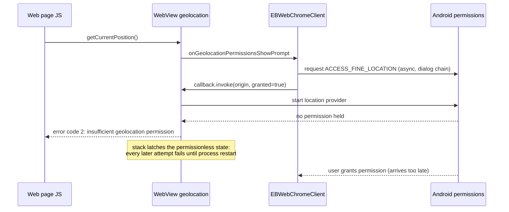
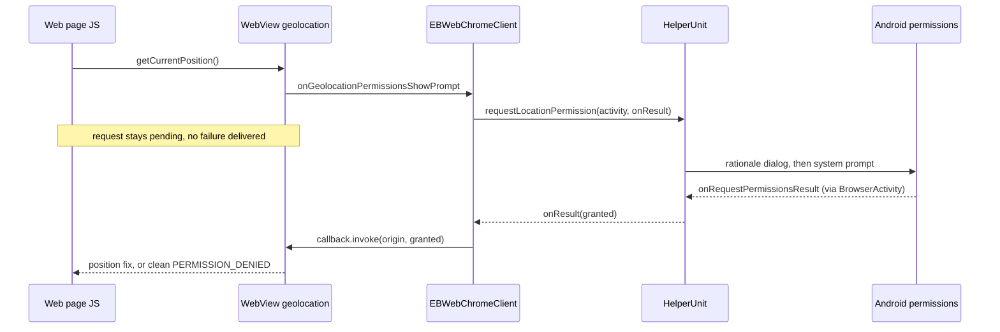

2026-07-15

# EinkBro: defer WebView geolocation grant until the runtime permission is settled

## What was broken

Issue #391 ("Hisense A5: geolocation error: User denied Geolocation") described a user for whom web geolocation stayed dead on OpenStreetMap and Google Maps no matter what they enabled, while a simple geolocation test page started working "after the second attempt" and Firefox worked fine throughout. The report sat unresolved because the maintainer could not reproduce it on the same phone model.

Reproducing the exact first-run sequence on an emulator showed the failure is real and has three layers:

1. **The literal error in the title.** EinkBro's Location site-setting defaults to off, which applies `setGeolocationEnabled(false)` to every WebView. Chromium then rejects any `getCurrentPosition()` instantly with `code=1 "User denied Geolocation"` — no prompt of any kind. This part is working as designed and is solved by enabling the setting.

2. **The real bug: a grant-before-permission race that bricks geolocation for the whole session.** Once the setting is on, `EBWebChromeClient.onGeolocationPermissionsShowPrompt` did this:

   ```kotlin
   HelperUnit.grantPermissionsLoc(activity)   // async: rationale dialog -> system prompt
   callback.invoke(origin, true, false)       // grants immediately
   ```

   The WebView-level grant fires while the app does not yet hold `ACCESS_FINE_LOCATION`, so Chromium starts its location provider permissionless and fails the request with `code=2 "application does not have sufficient geolocation permission"`. Worse, the WebView's geolocation stack latches that permissionless state: verified on the emulator that after granting the system permission, retries and even full page reloads keep failing with the same error, and only killing the app process recovers. A user who does everything right therefore has dead geolocation for the rest of the session — with no visible error, because map sites swallow the failure into their locate-control state. That also produced the reporter's odd asymmetry: pages that fire a fresh request per tap recover after an app restart, while OSM/Google Maps latch their failed state until a full page reload.

3. **The residual device layer (not fixable in the app).** The reporter's Hisense A5 has no Google Play services, so the platform network location provider that WebView relies on is typically dead, leaving GPS-only positioning; high-accuracy map requests time out indoors. Firefox is immune because Gecko uses Mozilla's WiFi-based location service instead of the platform provider. This explains "works on the maintainer's A5, not the reporter's" without either report being wrong.

## The race, before



## The fix

Never answer the WebView until the runtime permission question is settled. `HelperUnit.grantPermissionsLoc` (fire-and-forget) became `requestLocationPermission(activity, onResult)`: if `ACCESS_FINE_LOCATION` is already held it resolves immediately; otherwise it parks the callback, shows the existing rationale dialog, and requests the permission under a new dedicated request code (1235 — the old code shared 1234 with the microphone request, which would have let a mic grant cross-resolve a parked location callback). `BrowserActivity` now overrides `onRequestPermissionsResult` and forwards to `HelperUnit.handlePermissionsResult`, which resolves the parked callback. Cancelling the rationale dialog resolves as denied.



Because the position request now never starts without OS permission, the latch scenario cannot occur at all: the page's request simply stays pending while the dialogs are up (the same UX as a desktop browser permission prompt; a page-side timeout just means the site retries).

## Verification

On an emulator with the permission revoked and the Location setting freshly enabled:

- Deny path: tapping Cancel in the rationale dialog delivers an immediate, honest `code=1 "User denied Geolocation"`, and the page can re-ask.
- Grant path: after allowing the system prompt, the very next attempt in the same process returned real coordinates. With the old code this exact sequence stayed broken with `code=2` until an app restart.

Fixed in commit `fd149ea45`.
