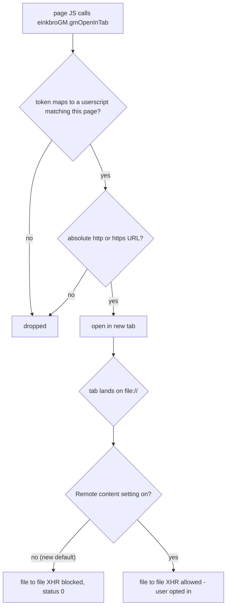

2026-08-24

# EinkBro: GM_openInTab scheme allowlist and file-origin cross access off by default

## What was reported

GHSA-rcv7-662w-4gvr (CVSS 9.3) described a two-step local file disclosure:

1. Any web page calls `window.einkbroGM.gmOpenInTab("file:///...")` to force a new
   tab onto an attacker-chosen local file.
2. That `file://` page issues an `XMLHttpRequest` to another local file — the PoC
   read `shared_prefs/info.plateaukao.einkbro_preferences.xml`, which holds an API
   key — because the WebView had `allowFileAccessFromFileURLs` and
   `allowUniversalAccessFromFileURLs` enabled.

The report was written against a pre-16.3.2 build: it calls `gmOpenInTab` with two
arguments and cites obfuscated method names. Since 16.3.2 every `einkbroGM` method
takes a per-injection capability token (see the GHSA-24mr-vq4f-xpc9 ADR), so step 1
already fails on current releases — a two-argument call does not resolve to any
method on the Java bridge, and a forged token is rejected before navigation.

Step 2, though, was still a loaded gun: anything that lands a tab on a `file://`
URL (a user opening a local HTML file, a future bridge bug) could read the app's
private storage. And `gmOpenInTab` accepting arbitrary schemes was more capability
than a userscript has any business having.

## Root cause of the remaining exposure

- `gmOpenInTab` validated the caller (token) but not the target. A userscript could
  open `file:`, `content:`, `intent:` or `javascript:` URLs — none of which
  Chromium would let page JS navigate to on its own.
- The "Remote content" setting (`sp_remote`) defaulted to **on**, and it is the
  only thing controlling `allowFileAccessFromFileURLs` /
  `allowUniversalAccessFromFileURLs`. Its label reads as "third-party content", so
  nobody would guess it meant "let local files read other local files and every
  origin". The popup WebView in `EBWebChromeClient` hard-coded both to `true`
  regardless of the setting.

Nothing in the app relies on file-origin cross access: the start page, error page
and EPUB reader render via `loadDataWithBaseURL`; the custom font is a relative
`src: url('mycustomfont...')` served by `shouldInterceptRequest` from a
`content://` URI, so it is same-origin on every page including `file://` ones; the
bundled CJK fonts are plain https imports.

## Fix

- `UserScriptBridge.gmOpenInTab` now returns unless `isWebUrl(url)` — absolute
  `http`/`https` only, parsed with `java.net.URI` so it is unit-testable. Covered by
  `UserScriptBridgeTest`.
- `BrowserConfig.enableRemoteAccess` defaults to `false`. The setting stays in the
  Start settings screen for the rare user who opens local HTML that XHRs other local
  files; users who never touched it get the safe default, users who explicitly set
  it keep their choice.
- `EBWebChromeClient.initWebView` (popup windows) hard-codes both flags to `false`;
  popups only ever host web login windows.
- `allowFileAccess` stays `true` so opening local HTML/EPUB files still works.

## Verification

On the emulator, driven over CDP with the advisory's own payloads:

- From an http page, the two-argument `gmOpenInTab` call throws
  `Error invoking gmOpenInTab: Method not found`; a three-argument call with a
  forged token opens nothing.
- With the tab navigated directly to the `file://` reader payload, the XHR to
  `shared_prefs` returns `status=0` under the new default. Flipping `sp_remote` to
  `true` as a control makes the same payload return `status=200` with the full
  preferences file — confirming both that the test exercises the real vector and
  that the default flip closes it.

## Disclosure handling

Replied on the advisory that the navigation vector was fixed in 16.3.2 and that
this commit hardens the remaining pieces; the advisory will be published with the
patched version once the release is cut.
