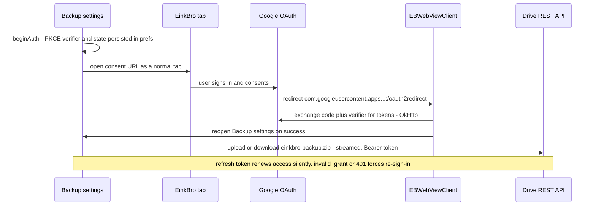

2026-07-17

# EinkBro — Google Drive backup sync via in-browser OAuth

EinkBro's Backup settings gained a **"Sync with Google Drive"** action (placed
first on the screen): one tap signs the user into Google, after which the same
tap offers *Upload backup*, *Restore backup from \<date\>*, and *Sign out*. The
payload is the existing full backup zip (all preferences, GPT settings,
bookmarks, history, database data), stored as `einkbro-backup.zip` in the
user's Drive **appDataFolder** — a hidden, app-private area of their own Drive,
so there is no developer-hosted backend and nothing visible in the Drive UI.

The design was studied from nerlan-android's Drive sync (see
`nerlan-android-hybrid-drive-auth`), which pairs a GMS sign-in with a
browser-OAuth fallback. EinkBro inverted that conclusion: since EinkBro *is* a
browser, the browser path is the only path. No Play Services, no AppAuth —
**zero new dependencies**, which keeps F-Droid builds intact and makes the
feature work on de-Googled devices (verified on a Hisense A7 whose GMS broker
is structurally dead).

## How it works

Key pieces:

- **`GoogleDriveRepository`** (`data/remote/`): PKCE generation, code exchange,
  silent refresh, and the Drive `appDataFolder` REST calls (list / streamed
  download / streamed multipart upload). A 401 on a locally-unexpired token
  triggers one forced refresh and retry; `invalid_grant` clears the session and
  surfaces a re-sign-in. Auth state is serialized JSON in `ConfigManager`.
- **`EBWebViewClient.handleUri`**: a new branch (next to `einkbro://retry`)
  intercepts the custom-scheme redirect, completes the token exchange in the
  app scope, and reopens Backup settings.
- **`SettingActivity`**: a single `launchDriveOp` wrapper gives every Drive
  operation the same two-outcome error handling (re-sign-in vs. error toast).
  Restore reuses the existing restore-category dialog and restart prompt.
- **Build config**: the OAuth client ID is a `buildConfigField`, overridable
  with `-Peinkbro.driveOAuthClientId=` for testing; the reversed-client-id
  redirect scheme is derived from it. An installed-app client ID is public by
  design, so it is committed.

## Why the OAuth runs in a browser tab, not a dedicated WebView

The first implementation opened the consent page in a dedicated bare-WebView
activity. Google's account-chooser click opens a popup window, and a bare
WebView has no `WebChromeClient` — the tap silently did nothing. EinkBro's own
browser already handles `accounts.google.com` popups (and its default user
agent already strips the `wv` / `Version/x.y` tells Google uses to reject
embedded WebViews), so the flow now opens the consent URL as a normal EinkBro
tab and the dedicated activity was deleted. The user's existing Google cookies
in EinkBro also shorten the flow.

## Google Cloud console requirements (owner setup)

- Android-type OAuth client (package + SHA-1) with **"Enable Custom URI
  scheme"** turned on in Advanced Settings — without it Google rejects the
  authorization request with `Error 400: invalid_request`.
- Scopes `drive.appdata`, `openid`, `email` (non-sensitive).
- Consent screen published to production: in Testing mode only listed test
  users can sign in (`access_denied` otherwise) and refresh tokens expire
  after 7 days.

## Known trade-offs

- The backup zip contains secrets (GPT API keys, Instapaper credentials, the
  Drive tokens themselves). It lives only in the user's private appDataFolder.
- Restoring an old backup's preferences also restores the Drive auth state
  saved inside it; a backup made before sign-in signs the device out.
- One backup file, replaced on each upload — a backup/restore model, not a
  merge sync. A cross-device merge of bookmarks / AI config / site settings is
  planned separately, along with an iOS port that reuses the same GCP project
  so both platforms share one appDataFolder.
