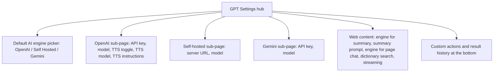
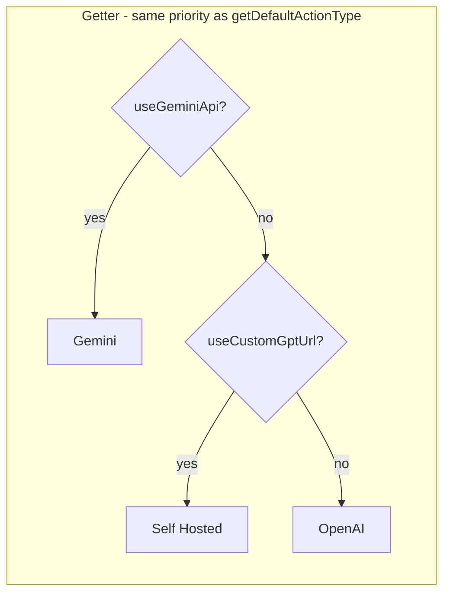

2026-07-05

# EinkBro: GPT settings restructured into a hub with provider sub-pages

The GPT settings screen had grown into a flat 18-item list that read in the
wrong order for its users: the two entries at the top (result history, action
definitions) are useless until an API key exists, while the provider sections
holding those keys sat at the very bottom. Worse, the "default" AI engine was
implicit — two independent toggles (*Use alternative server*, *Use Google
Gemini model*) could both be on at once, and a hidden priority in
`AiConfig.getDefaultActionType()` (Gemini over self-hosted over OpenAI)
decided what "Default" meant in the per-feature engine pickers. TTS options
were also buried inside the OpenAI provider section, and the two engine-picker
titles were named inconsistently ("Gpt type for summary web content" vs "Gpt
Engine").

Three rearrangements were considered — a pure reorder of the flat list, a hub
with provider sub-pages, and a task-oriented layout with conditional field
visibility — and the hub design was chosen: it fixes both the ordering and the
default-engine confusion without teaching the settings framework any new
tricks.

## The new layout

The hub opens with the one decision that governs everything else, followed by
the three places credentials live, the per-feature options, and finally the
management entries that used to crowd the top. The sub-pages are ordinary
`SettingScreen` routes — three new `SettingRoute` entries (`GptOpenAi`,
`GptSelfHosted`, `GptGemini`) registered in `SettingActivity`'s NavHost and in
the settings-search index, so searching "API key" still finds the moved items.

## Replacing two toggles with one picker, compatibly

The key design constraint was that the two booleans behind the old toggles are
load-bearing: they are stored in SharedPreferences (so they round-trip through
backup/restore), and several call sites read them directly — including agent
mode, which falls back to `useCustomGptUrl` to choose between self-hosted and
OpenAI because it cannot run on Gemini. Renaming or migrating the keys would
have broken restored backups silently.

So the picker is a *view*, not a migration: a `defaultGptEngine` property on
`AiConfig` that derives its value from the booleans with exactly the same
priority as `getDefaultActionType()`, and writes them back on selection.

One asymmetry is deliberate: selecting Gemini sets `useGeminiApi = true` but
leaves `useCustomGptUrl` untouched, mirroring what the old independent toggle
did. That keeps agent mode's self-hosted fallback working for users who had a
custom server configured before switching their default to Gemini.

The self-hosted URL itself needed no gating change — `OpenAiRepository` was
already using `gptUrl` unconditionally whenever an action's type resolves to
`SelfHosted`, so removing the toggle from the UI removes no capability.

## Naming cleanup across locales

The two per-feature pickers now sit adjacent under one section, which made
their inconsistent titles glaring. They were renamed to "AI engine for
summary" and "AI engine for page chat", and the new "Default AI engine"
string was added — in English and, per the project's no-translation-service
policy, hand-translated in all 30 locale files (a scripted edit with a
per-locale translation table; Santali kept its existing picker title and only
gained the new string, composed from vocabulary already present in that file).

Verified end-to-end on the emulator: all three sub-pages render with correct
titles, and the picker round-trip OpenAI to Self Hosted and back flips
`sp_use_custom_gpt_url` / `sp_use_gemini_api` exactly as the old toggles did.
