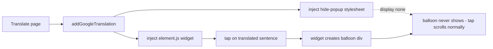

2026-07-15

# EinkBro: Suppress Google's "Original text" popup in in-place translation

## What was broken

In Google in-place translation mode (issue [#462](https://github.com/plateaukao/einkbro/issues/462)), every tap on a translated sentence popped up Google's "Original text / Rate this translation" balloon. On an e-ink device, where taps are the primary way to scroll, the balloon appeared constantly, covered content, and made text selection nearly impossible.

## Root cause

In-place mode works by injecting Google's Translate Element widget (`translate_a/element.js`) into the current page via `WebViewJsBridge.addGoogleTranslation()`. The widget itself attaches a tap handler to each translated sentence that highlights it and shows the balloon — a `div#goog-gt-tt` it inserts into the page. This is the widget's built-in behavior, not something EinkBro opted into, and the widget offers no option to turn it off.

## The fix

The issue reporter surveyed three community workarounds; the one that fits in-place mode is a CSS suppression of the balloon element. EinkBro now injects a small stylesheet right after the widget-injection JS (commit `06347bceb`):

- `#goog-gt-tt, .goog-te-balloon-frame` → `display: none` (the balloon, current and legacy markup)
- the tap-highlight classes (legacy `.goog-text-highlight` plus the current obfuscated `VIpgJd-…` names) → background and box-shadow removed, so nothing flashes on e-ink

The CSS lives in a new asset, `app/src/main/assets/hide_google_translate_popup.js`, following the project convention of keeping injected JS in `assets/` rather than inline Kotlin strings. Injection order doesn't matter: the widget loads asynchronously and creates the balloon lazily on first tap, but a stylesheet added up front applies whenever the element eventually appears — so there is no timing race, unlike a node-removal approach.

## Decisions

- **Always on, no setting.** The balloon has no value on e-ink (the reader can re-translate or open the original page to see source text), and a toggle would have meant a config flag, settings UI, and strings in 25+ locales for marginal benefit.
- **Scoped to in-place mode.** The same balloon exists on `translate.goog` proxy pages (the two-pane Google URL mode), but there the original text is visible in the other pane anyway; extending the suppression there is a trivial follow-up if wanted.
- **Graceful degradation.** If Google renames the balloon's id/classes in a future widget version, the selectors silently stop matching and the popup returns — nothing breaks.
