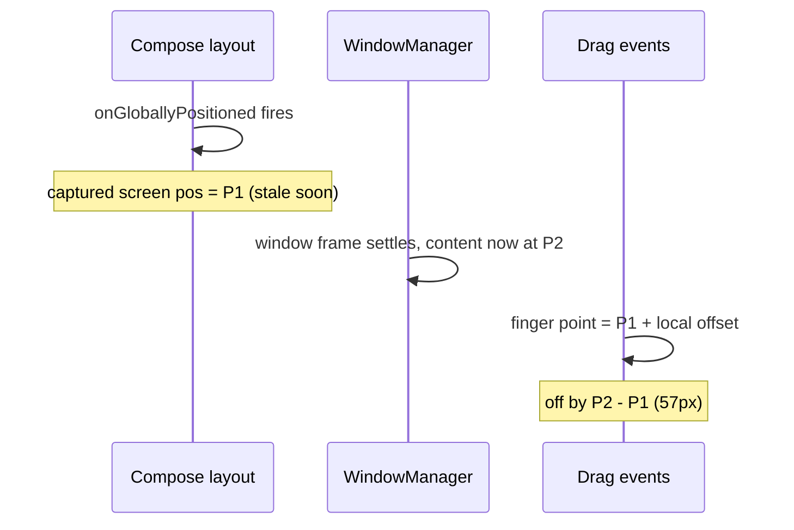

2026-07-23

# Hover dot offset in bookmark context menu: stale window position

Right after shipping the bookmark grid drag-to-action feature, the hover dot in the bookmark context menu tracked the finger with a noticeable vertical offset — while the url context menu, using the same bounds-based hit-testing, was pixel-precise.

## Root cause

The bookmark flow reconstructs the finger's screen position as `grid item positionOnScreen() + local drag offset`, with the item position captured once in `onGloballyPositioned`. But the bookmarks dialog is a bottom-gravity, wrap-content window: its frame can settle after the compose layout pass that fires the callback, so the captured position describes where the item *was*, not where it is. Measured on an emulator by injecting drag events at known screen coordinates, the computed point was exactly 57px below the injected one — the distance the window shifted after layout. Only Y was affected because the dialog spans the full screen width.

The url context menu never had the problem because its finger positions come from the WebView's `MotionEvent.rawX/rawY` in the stable activity window — no reconstruction involved.

## Fix

Never cache a screen position at layout time — keep the `LayoutCoordinates` and call `positionOnScreen()` when the event arrives, at which point the window has settled and the coordinates reflect reality:

- The grid item stores `boxCoordinates` and converts drag positions to screen points per event.
- Both context menus store item `LayoutCoordinates` (guarded by `isAttached`) and build each item's screen rect per hit-test instead of caching rects. The popups are wrap-content dialog windows too, so they carried the same latent bug even though it hadn't surfaced.

After the fix, injected coordinates and computed hit-test points match exactly, including probes right at item edges.

## Takeaway

`LayoutCoordinates.positionOnScreen()` is only trustworthy at the moment it's called. Inside a dialog window — especially wrap-content or gravity-positioned ones — treat any screen position captured during layout as perishable, and resolve coordinates lazily at use time.
