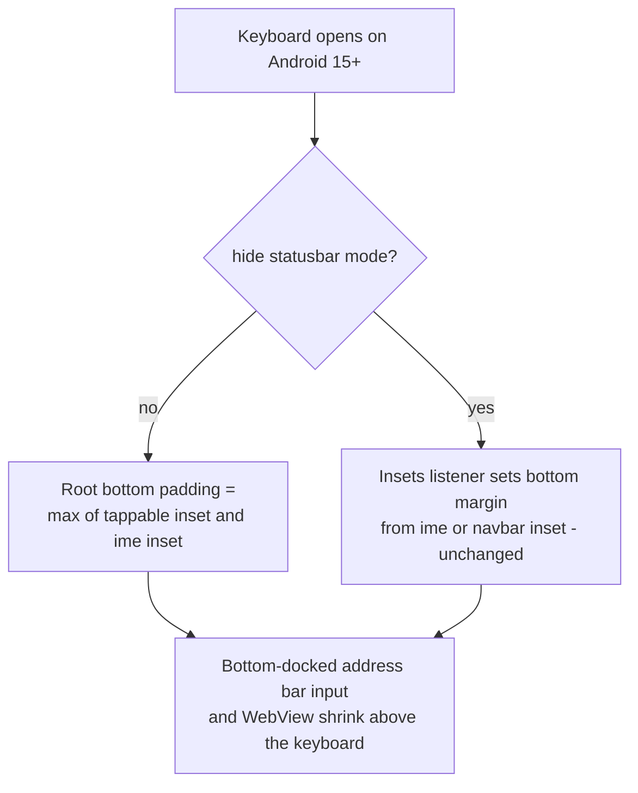

2026-08-09

# EinkBro: Address bar input opened behind the soft keyboard on Android 15+

Follow-up report on the #628 edge-to-edge fix: with the toolbar at the bottom, focusing the address bar opened the keyboard — but the input field stayed docked at the very bottom of the screen, completely hidden behind the keyboard. You could type blind, but never see the field.

## Root cause

targetSdk 36 forces every window edge-to-edge on Android 15+, and that disables more than `statusBarColor`: **`windowSoftInputMode="adjustResize"` is ignored too**. Pre-36, the decor consumed the ime inset and resized the window, which is what used to push the bottom-docked input above the keyboard. The #628 fix compensated for the system bars — status bar top padding, tappable-element bottom padding for the 3-button navbar — but not for the keyboard, so the ime inset went entirely unhandled in normal mode. (Hide-statusbar mode was unaffected: its insets listener already applies an ime-aware bottom margin.)

## Fix

One-liner in concept: fold the ime inset into the same bottom padding the navbar already uses. The root's bottom padding is now `max(tappableElement.bottom, ime.bottom)`, recomputed by the existing insets listener and layout-pass hook, so the whole layout — address bar input, suggestion list, WebView form fields — shrinks above the keyboard exactly like `adjustResize` used to do.

Pre-15 devices keep the decor-managed behavior (the code path is gated to Android 15+), and hidden-bar modes still report zero bar insets, so nothing else moves.

## Emulator IME testing notes

Reproducing this needed a *docked* soft keyboard on the API 36 emulator, which fights back in two ways worth remembering: Gboard sits in "hardware keyboard" mode (only a toolbar pill shows) until `settings put secure show_ime_with_hard_keyboard 1`, and it then comes up as a floating island / stylus-handwriting pill that reports no ime inset at all — `pm clear` on Gboard plus `settings put secure stylus_handwriting_enabled 0` gets the normal docked keyboard back. Verified by typing through the on-screen keys: before the fix the input was invisible behind the keyboard; after, it sits above the keyboard with the typed text and caret visible.
