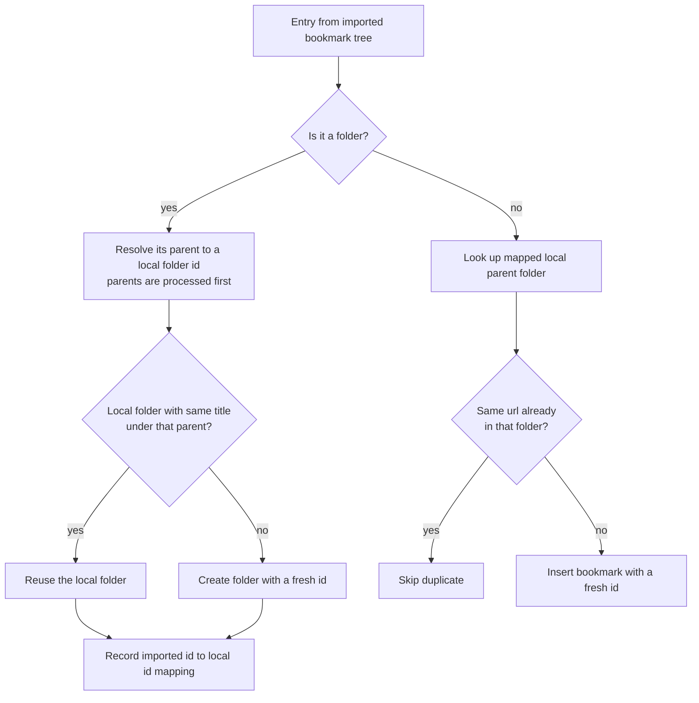

2026-08-09

# EinkBro: Backup restore merges into local data instead of replacing it

Restoring a backup — whether from Google Drive sync or a local zip import (both share the same restore path in `BackupUnit`) — used to be destructive for nearly every category: delete everything local, then insert what the backup holds. Anything created on the device after the backup was taken (a new AI chat, a tweaked site setting, a locally installed userscript, a bookmark) silently vanished on restore. Daniel asked for restore to be incremental: appended, never overriding locally created data.

Restore is now a merge. Nothing local is ever deleted, and restoring the same backup twice adds nothing (every rule below is idempotent).

## Merge rule per data type

| Data | Identity key | On conflict |
|---|---|---|
| AI query results | date + url + model + selectedText | already present → skip |
| Site settings | domain | local wins |
| Whitelist / JS / cookie domains | domain (primary key) | union |
| Video transcripts | videoId | local wins (each one cost a Gemini run) |
| AI chat sessions | session UUID | newer `lastUpdated` wins |
| Userscripts | @name | backup version updates in place; local-only scripts untouched |
| Bookmarks | folder path + url | already present → skip |
| Favicons | domain | local wins |
| Articles + highlights | url + date; (article, content) | already present → skip |
| Saved pages | filePath | already present → skip |

History and "All preferences" (whole shared-prefs files) keep replace semantics, as does the standalone "Import bookmarks" menu action — only the backup-restore path changed.

## Ids don't travel between devices

The core design constraint: autoincrement row ids are per-device, so a backup's ids mean nothing on the restoring device and can collide with local rows. Merged rows are therefore always inserted with `id = 0`, which Room treats as "unset" and assigns a fresh id — a restore can never clobber a local row by id. Two structures need more than that:

- **Articles + highlights**: highlights reference their article by id (with a cascade foreign key). Each backup article resolves to a local article id — matched on url + date, or freshly inserted — through an id map, and highlights are rewritten through that map. A highlight whose article can't be mapped is skipped rather than tripping the foreign key.
- **Bookmarks** are a tree linked by parent ids, so the whole tree is remapped:

The folder walk processes parents before children; a parent reference that doesn't resolve (possible only in a corrupted zip) falls back to the root folder instead of dropping the subtree. The whole bookmark merge runs in one Room transaction.

## Notable details

- **Chat sessions**: backups deliberately never carry `webContent` (the captured page text, potentially hundreds of KB per session). When a backup's newer copy of a session replaces the local row, the local `webContent` is grafted onto it so the session keeps answering about its page.
- **Dedup keys are structural, not string-joined**: the AI-query key is a `List(date, url, model, selectedText)`, because a `"|"`-joined string key is ambiguous when the url or selected text itself contains the delimiter — a review pass caught that a distinct query could otherwise be silently dropped as a "duplicate".
- **Userscripts** previously had two restore modes: the backup restore wiped all scripts first, while the standalone userscript import merged by @name. The wipe path (and `UserScriptManager.deleteAllScripts`) is gone; every restore now merges, so no zip can remove local scripts.
- `BookmarkDao.insert` now returns the generated row id (needed to parent newly created folders); the `BookmarkManager` wrapper got an explicit return type so the DAO signature can't silently propagate again.
